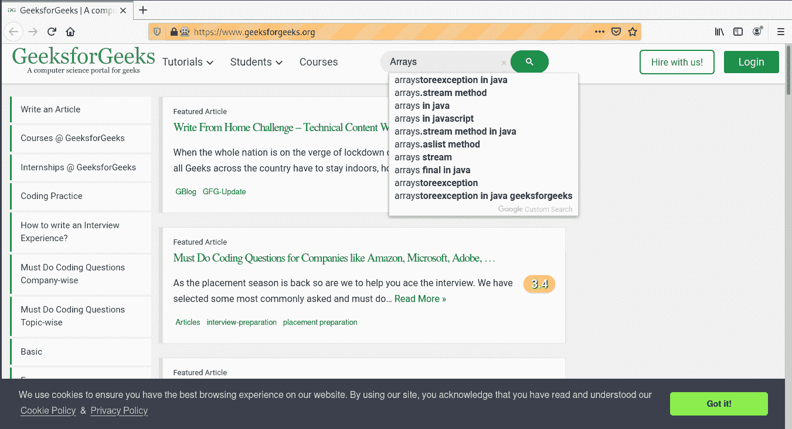

# 与网页互动——硒蟒

> 原文:[https://www . geesforgeks . org/interactive-with-网页-selenium-python/](https://www.geeksforgeeks.org/interacting-with-webpage-selenium-python/)

Selenium 的 Python 模块是为使用 Python 执行自动化测试而构建的。硒 Python 绑定提供了一个简单的应用编程接口，可以使用硒网络驱动程序编写功能/验收测试。要使用硒 Python 打开网页，请使用 get 方法-硒 Python 签出–[导航链接。仅仅能够去一些地方并没有多大用处。我们真正想做的是与页面交互，或者更具体地说，与页面中的 HTML 元素交互。首先，我们需要找到一个。WebDriver 提供了许多查找元素的方法。例如，给定一个定义为:
的元素](https://www.geeksforgeeks.org/navigating-links-using-get-method-selenium-python/)

## 超文本标记语言

```py
<input type="text" name="passwd" id="passwd-id" />
```

要找到一个元素，需要使用一种定位策略，例如

```py
element = driver.find_element_by_id("passwd-id")
element = driver.find_element_by_name("passwd")
element = driver.find_element_by_xpath("//input[@id='passwd-id']")

```

同样，要找到多个元素，我们可以使用–

```py
elements = driver.find_elements_by_name("passwd")

```

人们也可以通过它的文本来寻找链接，但是要小心！文本必须完全匹配！在 WebDriver 中使用 XPATH 时也应该小心。如果有多个元素与查询匹配，那么将只返回第一个。如果找不到任何内容，将引发 NoSuchElementException。
WebDriver 有一个**“基于对象”的 API** ，我们用同一个接口表示所有类型的元素。这意味着，尽管人们可能会看到许多可能的方法，当人们点击集成开发环境的自动完成组合键时可以调用这些方法，但并不是所有的方法都有意义或有效。要检查所有方法，请查看[定位器策略–硒蟒](https://www.geeksforgeeks.org/locator-strategies-selenium-python/)
获得元素后，接下来会发生什么？可能需要在字段中输入文本，例如

```py
element.send_keys("some text")

```

可以使用“键”类来模拟按下箭头键:

```py
element.send_keys(" and some", Keys.ARROW_DOWN)

```

另外请注意，可以在任何元素上调用 send_keys，这使得测试像 Gmail 上使用的键盘快捷键成为可能。
可以用清除方法
轻松清除文本字段或文本区域的内容

```py
element.clear()

```

**项目示例–**
让我们尝试在极客博客
**程序–**
中自动搜索一些东西

## 蟒蛇 3

```py
# import webdriver
from selenium import webdriver

# create webdriver object
driver = webdriver.Firefox()

# get geeksforgeeks.org
driver.get("https://www.geeksforgeeks.org/")

# get element
element = driver.find_element_by_id("gsc-i-id1")

# send keys
element.send_keys("Arrays")
```

**输出-**

