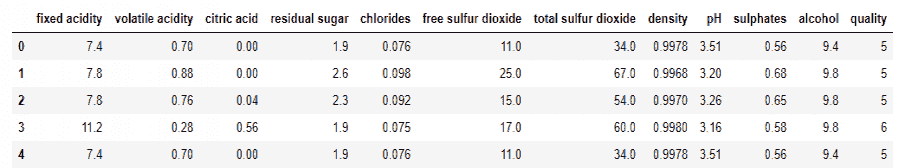
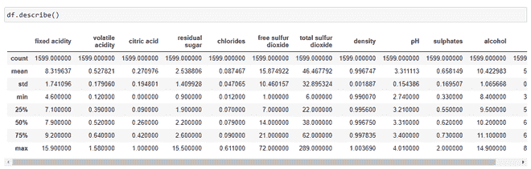
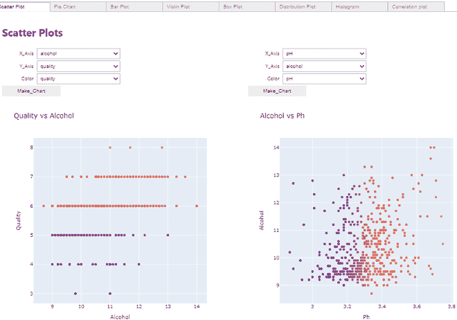
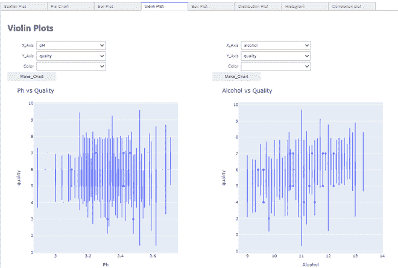
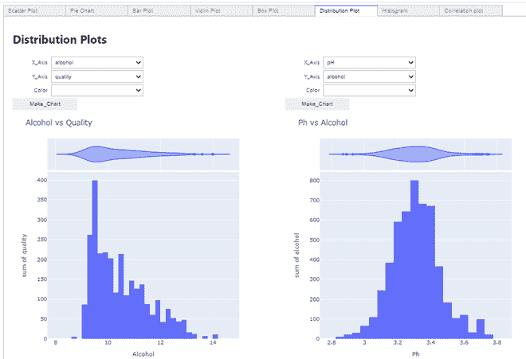
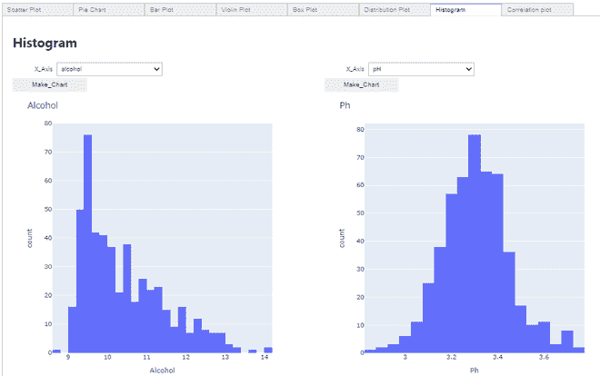
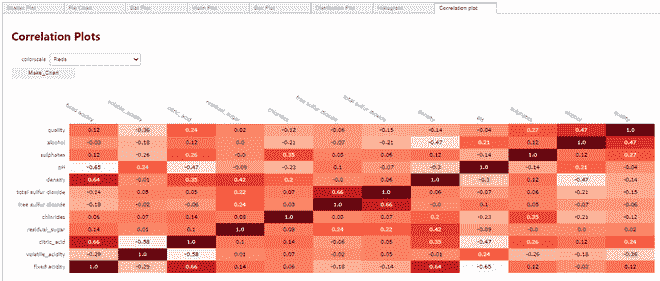

# 使用 Pywedge 包的交互式图表

> 原文:[https://www . geesforgeks . org/interactive-charts-use-py wedge-package/](https://www.geeksforgeeks.org/interactive-charts-using-pywedge-package/)

在机器学习和数据科学中，最困难的工作之一是理解原始数据，并使其适合对其应用不同的模型来进行预测。出于理解的目的，我们使用不同的过程，如检查统计数字，如平均值、中位数、模式、找出特征之间的关系、查看某些特征的分布等。这一切往往被归为**探索性数据分析(EDA)** 一词。根据经验丰富的 ML 和 DS 从业者的说法，EDA 是最有价值的任务之一，在分析数据集时，其重要性不容忽视。它帮助从业者选择合适的数据预处理技术。

检查统计数字是很好的，但是比用图片可视化这些统计数据更好的是，人们常说图片是理解的更强大的工具，而不仅仅是数字。我们可以通过制作不同的图表，直观地得出对数据更清晰的理解。在机器学习和数据科学中，我们使用不同类型的图表/图来可视化特征中的不同模式，其中一些特征是:直方图、条形图、箱线图、配对图、饼图、小提琴图等。但是手动为所有这些图表编写代码似乎是一个累人的过程，而且我们更容易在代码中出现不准确和错误/错误。因此，我们的救星来了，一个 python 包，它可以轻松高效地绘制这些图形，而代码中没有任何这样的错误。

在本文中，我们将阅读关于使用 pywedge python 包制作交互式图表的内容。Pywedge 是一个开源的 python 包，可用于自动化大多数机器学习问题解决任务。它还为我们提供了用几行代码绘制交互式图形的功能。

Pywedge 库有一个*制作 _charts* 的方法，提供给我们制作 8 种不同类型的图表，命名如下:

*   散点图
*   圆形分格统计图表
*   条形图
*   小提琴情节
*   箱线图
*   分布图
*   柱状图
*   相关图

让我们看一个如何使用 pywedge 库绘制交互式图的示例:

#### 导入库和加载数据集:

## 计算机编程语言

```py
import pandas as pd
import numpy as np
import matplotlib.pyplot as plt
import seaborn as sns
import warnings
warnings.filterwarnings("ignore")

df = pd.read_csv("https://www.shortto.com/WineDataset",sep=";")
```

加载数据集后，我们将查看数据集的外观，这可以通过使用 head 方法打印数据集中的前 5 行看出:

## 计算机编程语言

```py
df.head()
```



## 计算机编程语言

```py
print("Shape of our dataframe is: ",df.shape)
```

```py
Shape of our dataframe is:  (1599, 12)
```

因此，正如我们可以注意到的，我们在数据集中总共有 1599 行和 11 个要素，以及一个名为“质量”的目标要素。

检查数据集的一些统计数据总是更好，我们可以使用 description()方法，如下所示:

## 计算机编程语言

```py
df.describe()
```



关于数据集的统计信息

只看统计数据，我们就能推断出

*   每个柱的平均值大于中值，例如，酸碱度的平均值为 3.311113，而中值为 3.310000。同样，酒精的平均值为 10.422，而中位数为 10.20。
*   我们可以注意到预测因子“残余糖”、“游离二氧化硫”、“总二氧化硫”的第 75 百分位值和最大值之间有很大差异。这表明这 3 个变量中的一些值与一般范围的值相差甚远(高达 75%)。因此，我们可以得出结论，在我们的数据集中存在极端值，即异常值。

#### 列重命名和数据集拆分:

## 计算机编程语言

```py
df.rename(columns={'ficxed acidity':'fixed_acidity','citric acid':'citric_acid',
                   'volatile acidity':'volatile_acidity','residual sugar':'residual_sugar',
                   'free sulphur dioxide':'free_sulphur_dioxide',
                   'total sulphur dioxide': 'total_sulphur_dioxide'},inplace=True)

# Splitting data into features and labels set
X = df.iloc[:,:11]
y = df.iloc[:,-1]
```

#### 使用 Pywedge 库制作图表:

## 计算机编程语言

```py
import pywedge as pw
charts = pw.Pywedge_Charts(df, c=None, y = 'quality')
# Calling the make_charts method
plots = charts.make_charts()
```

执行时的“制作图表”方法会产生一个窗口，为我们提供 8 种不同类型的图表选项，我们可以选择所需的功能来绘制图表并可视化结果。

**绘制散点图:**



散点图

#### 制作小提琴情节:



小提琴情节

#### 制作分布图:



分布图

#### 制作直方图:



柱状图

#### **绘制相关图:**



相关图

因此，我们可以看到使用 pywedge 包只需几行代码就可以高效地绘制这几个图，而无需为所有这些图显式编写代码。