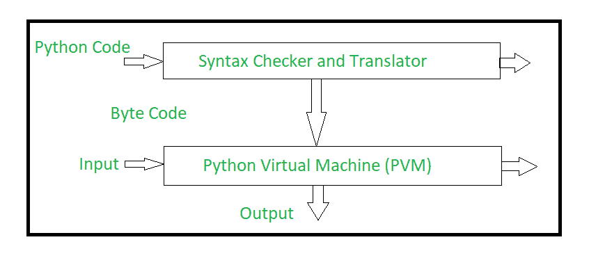

# Python 内部工作

> 原文:[https://www.geeksforgeeks.org/internal-working-of-python/](https://www.geeksforgeeks.org/internal-working-of-python/)

**Python** 是一种类似 Java 的面向对象编程语言。Python 被称为解释语言。Python 使用可互换的代码模块，而不是函数式编程语言标准的单一长指令列表。python 的标准实现叫做“cpython”。它是 Python 的默认实现，并且被广泛使用。
Python 不会将其代码转换成机器代码，这是硬件可以理解的。它实际上把它转换成一种叫做字节码的东西。因此，在 python 中，编译发生了，但它只是没有变成机器语言。它被转换成字节码(。pyc 或。pyo)并且该字节代码不能被 CPU 理解。所以我们需要一个名为 python 虚拟机的解释器来执行字节码。

**Python 源代码通过以下步骤生成可执行代码:**

*   **第一步:**python 编译器读取 python 源代码或指令。然后，它会验证指令的格式是否正确，即它会检查每一行的语法。如果遇到错误，它会立即停止翻译并显示错误消息。
*   **步骤 2:** 如果没有错误，也就是说，如果 python 指令或源代码格式良好，那么编译器会将其翻译成称为“字节码”的中间语言的等效形式。
*   **第三步:**字节码随后被发送到 python 虚拟机(PVM)，它是 Python 解释器。PVM 将 python 字节码转换成机器可执行代码。如果在解释过程中出现错误，则转换会因错误消息而暂停。

**参考文献:**
[【https://leanpub.com/insidethepythonvirtualmachine/read】](https://leanpub.com/insidethepythonvirtualmachine/read)
[http://higher ed . mheducation . com/sites/9387067572/information _ center _ view 0/index . html](http://highered.mheducation.com/sites/9387067572/information_center_view0/index.html)