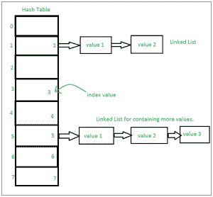

# Python 中 Set 的内部工作

> 原文:[https://www . geesforgeks . org/python 内部工作集/](https://www.geeksforgeeks.org/internal-working-of-set-in-python/)

**集合及其工作**
[集合在 Python 中](https://www.geeksforgeeks.org/sets-in-python/)可以定义为集合的物品。在 Python 中，这些基本上用于包括成员资格测试和消除重复条目。这里使用的数据结构是[哈希](https://www.geeksforgeeks.org/hashing-data-structure/)，这是一种流行的技术，平均在 O(1)中执行插入、删除和遍历。哈希表的操作类似于链表。python 中的集合是移除了重复元素的无序列表。

**集合上的基本方法是** :-
**创建集合** :-在 Python 中，集合是通过 Set()函数创建的。将创建一个空列表。请注意，不能通过{}创建空集合，它会创建字典。

**检查项目是否在:**此操作的时间复杂度平均为 O(1)。然而，在最坏的情况下，它可能变成 0(n)。

**添加元素** :-通过 set.add()函数完成集合的插入，在这里创建一个合适的记录值存储在哈希表中。与检查项目相同，即平均为 0(1)。然而，在最坏的情况下，它可能变成 0(n)。

:-可以使用 Union()函数或|运算符合并两个集合。通过对哈希表值执行合并操作来访问和遍历这两个哈希表值，以组合元素，同时删除重复的元素。其时间复杂度为 O(len(s1) + len(s2))，其中 s1 和 s2 是需要进行并集的两个集合。

**[路口](https://www.geeksforgeeks.org/intersection-function-python/)** :-这可以通过路口()或&操作符完成。公共元素被选中。它们类似于散列列表上的迭代，并在两个表上组合相同的值。时间复杂度为 O(min(len(s1)，len(s2))，其中 s1 和 s2 是需要进行并集的两个集合。

**[差异](https://www.geeksforgeeks.org/python-set-difference/)** :-找出集合之间的差异。类似于在链表中查找差异。这是通过 difference()或–运算符完成的。求差 S1–S2 的时间复杂度为 O(len(s1))

**[【对称差】](https://www.geeksforgeeks.org/python-set-symmetric_difference-2/)** :-在两个集合中寻找除公共元素之外的元素。使用了^算子。s1^s2 时间复杂度为 O(len(s1))

**[对称差更新](https://www.geeksforgeeks.org/python-set-symmetric-difference-update/)** :返回一个包含两组对称差的新集合。时间复杂度为 0(len(S2))

**清除** :-清除集合或哈希表。

时间复杂度来源: [Python Wiki](https://wiki.python.org/moin/TimeComplexity)

如果多个值出现在同一个索引位置，则该值被追加到该索引位置，以形成一个链表。在中，CPython 集合使用带有虚拟变量的字典来实现，其中键是对时间复杂度进行了更大优化的成员集合。

集合实现:- 

对单个哈希表进行大量操作的集合:-


示例:

```py
# empty set, avoid using {} in creating set or dictionary is created
x = set() 

# set {'e', 'h', 'l', 'o'} is created in unordered way
B = set('hello') 

# set{'a', 'c', 'd', 'b', 'e', 'f', 'g'} is created
A = set('abcdefg') 

# set{'a', 'b', 'h', 'c', 'd', 'e', 'f', 'g'} 
A.add('h')    

fruit ={'orange', 'banana', 'pear', 'apple'}

# True  fast membership testing in sets
'pear' in fruit      

'mango' in fruit     # False

A == B       # A is equivalent to B

A != B       # A is not equivalent to B

A <= B    # A is subset of B A <B>= B    

A > B     # A is proper superset of B

A | B        # the union of A and B

A & B     # the intersection of A and B

A - B        # the set of elements in A but not B

A ˆ B        # the symmetric difference

a = {x for x in A if x not in 'abc'}   # Set Comprehension

```