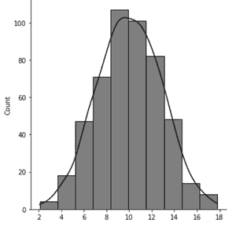
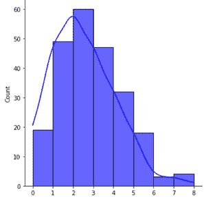
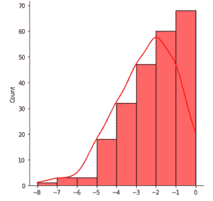
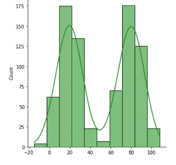
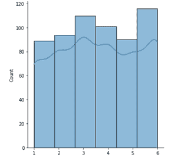
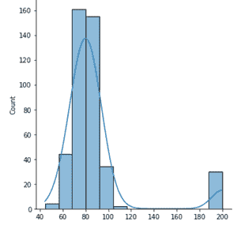

# 直方图的解释

> 原文:[https://www.geeksforgeeks.org/interpretations-of-histogram/](https://www.geeksforgeeks.org/interpretations-of-histogram/)

直方图是条形图的变体，其中数据值被分组在一起并放入不同的类别。这种分组使您能够看到每个类中的数据在数据集中出现的频率。

直方图以图形方式显示了以下内容:

*   数据集中不同数据点的频率。
*   数据中心的位置。
*   数据集的分布。
*   数据集的偏斜度/方差。
*   数据集中异常值的存在。

这些特征提供了数据中适当分布模型的有力指示。概率图或拟合优度检验可用于验证分布模型。

直方图包含以下轴:

*   **纵轴**:每个仓的频率/计数。
*   **横轴**:箱/类列表。

#### **直方图的解释:**

*   **正常直方图:**是经典的钟形直方图，大部分频率计数集中在中间，尾部递减，相对于中值对称。由于正态分布在现实场景中最常见，因此您最有可能找到这些。在正态分布直方图中，平均值几乎等于中值。
*   **非正态短尾/长尾直方图:**在短尾分布中，当我们从数据中值移动时，尾部非常快地接近 0，在长尾直方图中，当我们远离中值时，尾部缓慢地接近 0。这里，我们称尾部为直方图中的极端区域，其中大部分数据不集中，这是在峰值的两侧。
*   **双峰直方图:**一种数据模式代表直方图中最常见的值(即直方图的峰值。双峰直方图表示直方图中有两个峰值。直方图可以用来测试数据的单峰性。数据集中的双峰(或者例如非单峰)表示过程有问题。双峰直方图具有两个特征中的一个或两个:双峰正态分布和对称分布
*   **倾斜左/右直方图:**倾斜直方图是单侧尾巴明显比另一侧尾巴长的直方图。向右倾斜的直方图意味着峰的右侧尾部比其左侧更伸展，反之亦然。在左偏直方图中，平均值总是小于中值，而在右偏直方图中，平均值大于直方图。
*   **均匀直方图:**在均匀直方图中，每个仓包含大致相同数量的计数(频率)。均匀直方图的例子是这样的，一个模具被轧制 n (n > > 30)次并记录不同结果的频率。
*   **具有异常值的正态分布:**该直方图类似于正态直方图，除了它包含异常值，其中结果的计数/概率是实质性的。这主要是由于过程中的一些系统错误，导致产品的错误生成等。

#### **实施**

*   在这个实现中，我们将使用 Numpy、Matplotlib 和 Seaborn 绘图库。这些库都是预装在 colab 中的，不过对于本地环境，你可以用 ***pip install*** 命令轻松安装这些。

## 蟒蛇 3

```
# Imports
import numpy as np
import matplotlib.pyplot as plt
import seaborn as sns

# Normal histogram plot
data = np.random.normal(10.0, 3, 500)
sns.displot(data, kde= True, bins=10, color='black')

# Left-skewed Histogram
wc_goals =[0]* 19 + [1]*49 + [2]*60 + [3] *47 + [4]*32 + [5]* 18+ [6]*3 + [7]*3 + [8]
sns.displot(wc_goals, bins=8, kde= True, alpha =0.6,color='blue')

# Right-skewed Histogram
wc_goals_conc =
    [0]* 19 + [-1]*49 + [-2]*60 + [-3] *47 + [-4]*32 + [-5]* 18+ [-6]*3 + [-7]*3 + [-8]
sns.displot(wc_goals_conc, kde = True,bins=8,  alpha=0.6, color='red')

# Bi-modal histogram
N=400
mu_1, sigma_1 = 80, 10
mu_2, sigma_2 = 20, 10
# Generate two normal distributios of given mean sdand concatenate
X_1 = np.random.normal(mu, sigma, N)
X_2 = np.random.normal(mu2, sigma2, N)
X = np.concatenate([X1, X2])
sns.displot(X,bins=10,kde=True , color='green')

# Uniform histogram (an example of die roll with N=600)
die_roll =  [1]*89 + [2]*94 + [3]*110 + [4]*101 + [5]*90 +[6]*116
sns.displot(die_roll, kde=True, bins =6)

# Normal distribution with an outlier
X_1 = np.random.normal(mu, sigma, N)
X_1 =np.concatenate([X1, [200]*30])
sns.displot(X_1, kde= True, bins=13)
```



正态直方图



向左倾斜直方图



向右倾斜直方图



双模直方图



均匀直方图



具有异常值的正常