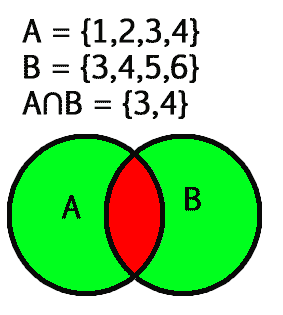

# 交集()函数 Python

> 原文:[https://www.geeksforgeeks.org/intersection-function-python/](https://www.geeksforgeeks.org/intersection-function-python/)

**Python 交集()函数**返回一个新的集合，该集合包含所有集合共有的元素

两个给定集合的交集是包含两个集合共有的所有元素的最大集合。两个给定集合 A 和 B 的交集是由 A 和 B 共有的所有元素组成的集合。



### **相交示例:**

> **输入:**让集合 A = {2，4，5，6}
> 
> 并设置 B = {4，6，7，8}
> 
> **输出:** {4，6}
> 
> 说明:取两个集合中的公共元素，我们得到{4，6}作为两个集合的交集。

### **Python 交集()语法:**

> 集合 1 .交集(集合 2，集合 3，集合 4…)
> 在参数中，可以给出任意数量的集合

### **Python 交集()** **返回值:**

> 函数的作用是:返回一个集合，集合中的所有集合(集合 1，集合 2，集合 3…)都与集合 1 相交。只有在没有传递参数的情况下，它才会返回 set1 的副本。

## **Python 交集()示例**

### 示例 1:集合交集的工作()

## 蟒蛇 3

```py
# Python3 program for intersection() function
set1 = {2, 4, 5, 6}
set2 = {4, 6, 7, 8}
set3 = {4, 6, 8}

# union of two sets
print("set1 intersection set2 : ",
      set1.intersection(set2))

# union of three sets
print("set1 intersection set2 intersection set3 :",
      set1.intersection(set2, set3))
```

**输出:**

```py
set1 intersection set2 :  {4, 6}
set1 intersection set2 intersection set3 : {4, 6}
```

### **例 2: Python 集合交集运算符(& )**

我们也可以使用&运算符获得交集。

## 蟒蛇 3

```py
# Python3 program for intersection() function
set1 = {2, 4, 5, 6}
set2 = {4, 6, 7, 8}
set3 = {1, 0, 12}

print(set1 & set2)
print(set1 & set3)

print(set1 & set2 & set3)
```

**输出:**

```py
{4, 6}
set()
set()
```

### 示例 3: Python 将交集设置为相反

symmetric_difference()与 set.intersection()方法相反。

## 蟒蛇 3

```py
# Python3 program for intersection() function
set1 = {2, 4, 5, 6}
set2 = {4, 6, 7, 8}
set3 = {1, 0, 12}

print(set1.symmetric_difference(set2))
print(set1.symmetric_difference(set3))
print(set2.symmetric_difference(set3))
```

**输出:**

```py
{2, 5, 7, 8}
{0, 1, 2, 4, 5, 6, 12}
{0, 1, 4, 6, 7, 8, 12}
```

### 示例 4: Python 将交集设置为空

## 蟒蛇 3

```py
set1 = {}
set2 = {}

# union of two sets
print("set1 intersection set2 : ",
      set(set1).intersection(set(set2)))
```

**输出:**

```py
set1 intersection set2 :  set()
```