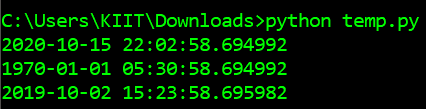
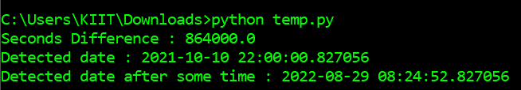

# Python 中报警时间模块介绍

> 原文:[https://www . geesforgeks . org/introduction-to-alaramtime-module-in-python/](https://www.geeksforgeeks.org/introduction-to-alaramtime-module-in-python/)

**报警时间**是 python 中的一个 python 模块，用来玩日期和时间，使用 python 默认的*日期时间*模块。Python 中的日期本身不是一种数据类型，但是我们可以导入一个名为 *datetime* 的模块，将日期作为日期对象。它具有查找日期之间的差异(以天、小时或秒为单位)的功能。这个模块能够从字符串文本中找到日期，比如以字符串格式提到未来 10 天的日期。

**安装:**

```
pip install AlarmTime
```

**方法(主要功能):**

> **DateTimeDetect :** 它从字符串
> 中检测日期 **hour_diff_from_now :** 它以小时为单位给出日期之间的差异
> T6】毫秒 _diff_from_now: 它以毫秒为单位给出日期之间的差异
> **分钟 _diff_from_now :** 它以分钟为单位给出日期之间的差异
> **秒 _diff_from_now :** 它以秒为单位给出日期之间的差异

**示例 1:**
在本例中，我们将创建一个*检测日期*对象来打印日期

## 蟒蛇 3

```
# import the detectdate class from alarmtime module
from AlarmTime.AlarmTime import DetectDate

# create a detectdate object for current date & time
# by passing parameter as 0 will give current date & time
current = DetectDate(0)

# printing the current date&time
# now attribute for date&time
print(current.now)

# creating another detectdate object
# passing 1 as argument i.e 1second after default date
another = DetectDate(1)

# printing date & time of another variable
print(another.now)

# creating another detectdate object
# after 1570010023345 seconds
another2 = DetectDate(1570010023345)

# printing date & time
print(another2.now)
```

**输出:**



**示例 2:**
这里我们将使用各种主要功能与*检测日期*对象。

## 蟒蛇 3

```
# import the detectdate class from alarmtime module
from AlarmTime.AlarmTime import DetectDate

# creatingdetectdate object
# after 1570010023345 seconds
first_date = DetectDate(1570010023345)

# create a detectdate object for current date & time
# by passing parameter as 0 will give current date & time
current = DetectDate(0)

# getting two dates difference in seconds
seconds = current.second_diff_from_now("after 10 days")

# printing the seconds value
print("Seconds Difference : " + str(seconds))

# detecting the date & time  using string
target_time = current.DateTimeDetect(
    'detect the time and date on October 10 10 p.m')

# printing the detected date
print("Detected date : " + str(target_time))

# detecting date after some time
target_time2 = current.DateTimeDetect(
    'after 6 month 500 days 10 hours 15 minutes')

# printing the detected date & time
print("Detected date after some time : " + str(target_time2))
```

**输出:**

