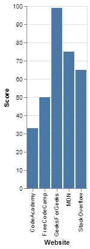
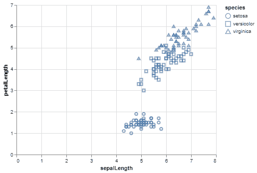

# Python 中的牛郎星介绍

> 原文:[https://www . geesforgeks . org/introduction-to-Altair-in-python/](https://www.geeksforgeeks.org/introduction-to-altair-in-python/)

**牛郎星**是 Python 中的统计可视化库。它本质上是声明性的，基于 Vega 和 Vega-Lite 可视化语法。它正迅速成为人们寻找快速有效的方法来可视化数据集的首选。如果你使用过像 matplotlib 这样的命令式可视化库，你将能够正确地理解阿尔泰的能力。

它被正确地视为声明性可视化库，因为当可视化阿尔泰中的任何数据集时，用户只需要指定数据列如何映射到编码通道，即声明数据列和编码通道(如 x 轴和 y 轴、行、列等)之间的链接。简单的框架，一个声明性的可视化库允许你专注于“什么”而不是“如何”部分，在没有用户帮助的情况下处理其他情节细节。

相反，诸如 *matplotlib* 这样的命令库迫使你指定可视化的“如何”部分，该部分将焦点从数据和它们之间的关系上移开。这也使得代码冗长且耗时，因为您必须自己指定细节，如图例和轴名。

### 装置

与任何其他 python 库一样，以下命令可用于安装 Altair:

```
pip install altair

```

我们将使用来自 *vega_datasets* 包的数据集。要安装，应使用以下命令:

```
pip install vega_datasets

```

**注意-** 应该使用 Jupyter Notebook 来执行代码，因为可视化需要一个 Javascript 前端来显示图表。可以参考以下文章了解如何使用 Jupyter 笔记本:[Jupyter 笔记本入门](https://www.geeksforgeeks.org/getting-started-with-jupyter-notebook-python/)。您还可以使用 JupyterLab、Zeppelin 或任何其他支持笔记本的笔记本环境或 IDE。

### 牛郎星图的基本要素

所有的牛郎星图都需要三个基本要素:数据、标记和编码。也可以通过仅指定数据和标记来制作有效的图表。

所有牛郎星图的基本格式是:

> 表示“另类的”图表(数据)。mark_bar()。编码(
> 
> encoding1 = 'column1 '，
> 
> 编码 2 = '列 2 '，
> 
> )

*   做个图表。
*   传入一些数据。
*   指定您想要的标记类型。
*   指定编码。

现在，让我们详细看看基本要素。

#### 数据

数据集是传递给图表的第一个参数。阿尔泰中的数据是围绕熊猫数据框架构建的，因此编码变得非常简单，它能够检测编码中所需的数据类型，但是您也可以使用以下数据:

*   数据或相关对象，如 UrlData、InlineData、NamedData
*   json 或 csv 格式的文本文件或 url
*   支持 __geo_interface__ 的对象(例如 Geopandas GeoDataFrame、GeoJSON 对象)

使用数据框将使过程更容易，因此您应该尽可能使用数据框。

#### 标记

Mark 属性指定数据应如何在绘图上表示。在牛郎星中有许多类型的标记方法，其格式如下:

```
mark_markname()

```

一些基本标记包括区域、条、点、文本、刻度和线条。阿尔泰还提供了一些复合标记，如方框图、误差带和误差条。这些标记方法也可以接受可选参数，如颜色和不透明度。

使用牛郎星的一个主要优点是，只需更改标记类型就可以更改图表类型。

#### 编码

可视化中最重要的事情之一是将数据映射到图表的视觉属性。这种在牛郎星的映射称为编码，通过 *Chart.encode()方法实现。*阿尔泰有各种类型的编码通道:位置通道、标记属性通道、超链接通道等。其中最常用的是位置通道的 x(x 轴值)和 y(y 轴值)以及标记属性通道的颜色和不透明度。

### 优势

1.  对于所有类型的图，基本代码保持不变，用户只需更改标记属性即可获得不同的图。
2.  该代码比其他命令式可视化库更短，编写更简单。用户可以专注于数据列之间的关系，而忘记不必要的绘图细节。
3.  面向和交互性非常容易实现。

### 例子

**程序 1 :** (简单条形图)

## 蟒蛇 3

```
# Importing altair and pandas library
import altair as alt
import pandas as pd

# Making a Pandas DataFrame
score_data = pd.DataFrame({
    'Website': ['StackOverflow', 'FreeCodeCamp',
                'GeeksForGeeks', 'MDN', 'CodeAcademy'],
    'Score': [65, 50, 99, 75, 33]
})

# Making the Simple Bar Chart
alt.Chart(score_data).mark_bar().encode(
    # Mapping the Website column to x-axis
    x='Website',
    # Mapping the Score column to y-axis
    y='Score'
)
```

**输出:**



使用牛郎星的简单条形图

**程序 2 :** (散点图)

在本例中，我们将以散点图的形式可视化来自 *vega_datasets* 库的虹膜数据集。本例中散点图使用的标记方法是 mark_point()。对于这个双变量分析，我们将第十列和第十列映射到 x 轴和 y 轴编码。此外，为了区分这些点，我们将形状编码映射到物种列。

## 蟒蛇 3

```
# Importing altair
import altair as alt
# Import data object from vega_datasets
from vega_datasets import data

# Selecting the data
iris = data.iris()

# Making the Scatter Plot
alt.Chart(iris).mark_point().encode(
    # Map the sepalLength to x-axis
    x='sepalLength',
    # Map the petalLength to y-axis
    y='petalLength',
    # Map the species to shape
    shape='species'
)
```

**输出:**



使用牛郎星的散点图