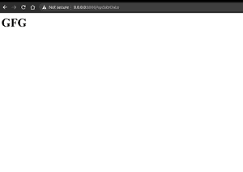

# 瓶网框架介绍——Python

> 原文:[https://www . geesforgeks . org/introduction-to-bottle-web-framework-python/](https://www.geeksforgeeks.org/introduction-to-bottle-web-framework-python/)

python 中有很多框架可以让你创建像瓶子、瓶子、django 这样的网页。在本文中，您将学习如何创建简单的应用程序瓶。瓶子是一个快速、简单、轻量级的 Python WSGI 微网络框架。它是作为单个文件模块分发的，除了 Python 标准库之外没有其他依赖项。

**路由**:支持干净动态网址的函数调用映射请求。

**模板** : Fast 和 pythonic 内置模板引擎，支持 mako、jinja2 和猎豹模板。

**实用工具**:方便访问表单数据、文件上传、cookies、头文件等 HTTP 相关元数据。

**服务器**:内置 HTTP 开发服务器，支持 paste、fapws3、bjoern、gae、cherrypy 或任何其他支持 WSGI 的 HTTP 服务器。

为了使用瓶子创建应用程序，我们必须先安装它

Windows 操作系统

```
pip install bottle
```

人的本质

```
pip3 install bottle
```

默认情况下，如果我们将模板名称传递给 SimpleTemplate，它将在扩展名为. tpl 的子目录视图中查找该名称的文件。

首先我们必须为我们的项目**测试项目**创建目录

在里面创建一个文件并命名为 **app.py**

**app.py**

## 蟒蛇 3

```
from bottle import route, run, template

@route('/')
def index():
    return template('index.tpl')

run(host='localhost', port=8080,debug=True)
```

然后创建新目录**视图**

在里面创建一个文件 **index.tpl**

## 超文本标记语言

```
<html>
    <head>
        <title>GFG</title>
    </head>
    <body>
         <h1>Welcome to GFG</h1>
    </body>
</html>
```

要运行此应用程序，请打开 cmd 或终端

Windows 操作系统

```
python app.py
```

人的本质

```
python3 app.py
```

**输出:**


为了处理瓶中的 POST 方法，我们必须编写两个函数，一个用于 GET 方法，一个用于 POST 方法。

## 蟒蛇 3

```
from bottle import get,post,request,Bottle,run,template

app = Bottle()

@app.get('/updateData')  # For GET method
def login_form():
    return template('index.tpl')

@app.post('/updateData')   #For POST method
def submit_form():
    name = request.forms.get('name')
    print(name)
    return f'<h1>{name}</h1>'

run(app, host='0.0.0.0', port=8000)
```

在**视图**目录内创建新文件**表单. tpl**

## 超文本标记语言

```
<html>
    <head>
        <title>GFG</title>
    </head>
    <body>
        <form method="post" action="/updateData">
             <input type="text" name="name">
             <button type="submit">Save</button>
        </form>
    </body>
</html>
```

要运行此应用程序，请打开 cmd 或终端

Windows 操作系统

```
python app.py
```

人的本质

```
python3 app.py
```

**输出:**

 