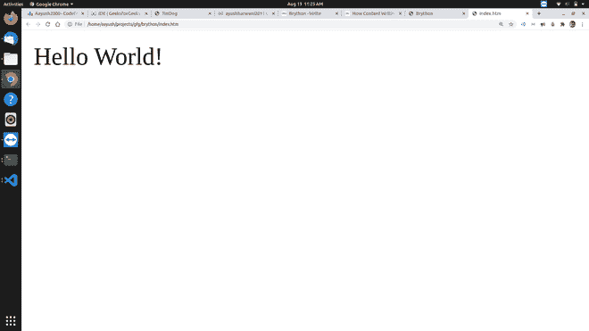
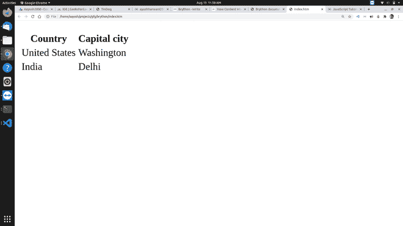
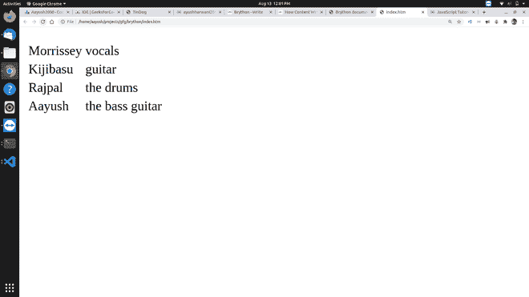

# 布莱森介绍

> 原文:[https://www.geeksforgeeks.org/introduction-to-brython/](https://www.geeksforgeeks.org/introduction-to-brython/)

我们都知道 Python 作为服务器端语言非常出色，它也可以作为客户端语言使用。我们可以在客户端使用 **Brython** 来代替 Javascript。

Brython 代表**浏览器的 Python** 。它是运行在浏览器中的 Python3 的实现。相信 Brython 的目标是取代 javascript 成为浏览器的脚本语言。大多数现代浏览器都支持 Brython，甚至智能手机也支持 Brython。

**主要特性:** Brython 支持 Python3 的大部分语法，包括理解、生成器、元类、导入等。以及 CPython 发行版的许多模块。

它包括与 DOM 元素和事件交互的库，以及与现有的 Javascript 库如 jQuery、3D、Highcharts、Raphael 等交互的库。它支持 HTML5/CSS3 的最新规范，可以使用 Bootstrap3、LESS、SASS 等 CSS 框架。

**安装:**

您可以通过在终端中运行以下 pip 命令在本地安装 Brython:

```py
pip install brython
```

您也可以使用 Brython，而无需安装任何东西，只需包含 CDN 中的 Brython 脚本:

## 超文本标记语言

```py
<script src="https://cdn.jsdelivr.net/npm/brython@3.8.9/brython.min.js">
</script>
<script src="https://cdn.jsdelivr.net/npm/brython@3.8.9/brython_stdlib.js">
</script>
```

要使用 Brython，只需:

1.  加载 brython.js 脚本。
2.  在页面加载时运行 brython()函数，如。
3.  在标签

**例 1 :** “你好世界！”使用 Brython "

## 超文本标记语言

```py
<!Doctype html>
<html>
<head>
    <meta charset = "utf-8">
    <script type = "text/javascript"
        src = "https://cdn.jsdelivr.net/npm/brython@3.8.9/brython.min.js">
    </script>
</head>

<body onload = "brython()">
<script type = "text/python">
from browser import document

document <= "Hello World!"
</script>
</body>
</html>
```

****输出:****


**示例 2 :** 使用 Brython 创建一个 HTML 表

为了创建一个表格，我们使用了 HTML 标记:table(表格)、TR(表格行)、TH(标题单元格)和 TD(单元格)。表格由行组成，每行由单元格组成，第一行通常由描述匹配列中值的“标题单元格”组成

## 超文本标记语言

```py
<!Doctype html>
<html>

<head>
    <meta charset = "utf-8">
    <script type = "text/javascript"
        src = "https://cdn.jsdelivr.net/npm/brython@3.8.9/brython.min.js">
    </script>
</head>

<body onload="brython()">

    <p id='zone'> </p>
    <script type="text/python">
    from browser import document
    from browser.html import TABLE, TR, TH, TD
    table = TABLE()

    # create a row
    row = TR() 

    # add header cells
    row <= TH("Country")
    row <= TH("Capital city")

    # add the row to the table
    table <= row 

    # add a row 1
    row = TR()
    row <= TD("United States") + TD("Washington")
    table <= row

    # add a row 2
    row = TR()
    row <= TD("India") + TD("Delhi")
    table <= row

    # erase initial content
    document['zone'].clear()

    # insert table in the element
    document['zone'] <= table
    </script>
</body>
</html>
```

**输出:**



**示例 3 :** 我们可以从列表列表中构建一个表。在这个例子中，我们将只显示 Python 脚本，周围的 HTML 代码将保持与上一个例子相同

## 超文本标记语言

```py
<script type="text/python">
    from browser import document
    from browser.html import TABLE, TR, TH, TD

    lines = [ ['Morrissey', 'vocals'],
        ['Kijibasu', 'guitar'],
        ['Rajpal', 'the drums'],
        ['Aayush', 'the bass guitar']
        ]
    t = TABLE()
    for line in lines:
        t <= TR(TD(line[0])+TD(line[1]))
    document['zone'].text = ''
    document['zone']<= t
</script>
```

**Output :**


**布莱森的未来:**

许多 Python 开发人员正在努力使它变得更好，但它可能很难取代 Javascript。Brython 中没有可用的框架。Brython 在客户端使用可能需要很多年。缺乏学习 Brython 的资源，所以人们选择了 Javascript 而不是 Brython。但是对于那些希望在服务器端和客户端使用一种语言的开发人员来说，使用 Brython 将是一个很大的优势。