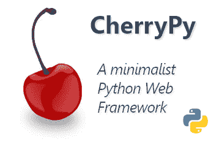

# 奇瑞派简介

> 原文:[https://www.geeksforgeeks.org/introduction-to-cherrypy/](https://www.geeksforgeeks.org/introduction-to-cherrypy/)

**CherryPy** 是一个流行的 Python 框架。使用 CherryPy，可以以更快、更可靠的方式构建网络应用程序。它也被称为**网络应用程序库**。它以其**简单性**而闻名，因为它基于**面向对象 Python 编程**，从而在更短的时间内产生更小的源代码。它是 Python 最古老的框架之一，第一个版本于 2002 年 6 月发布。该框架主要面向希望使用 Python 创建**可移植数据库驱动的网络应用程序**的开发人员，因为它提供了创建、检索、更新和删除功能。



**注意:**在继续 CherryPy 之前，您应该对模型-视图-控制器和面向对象-编程有很好的理解。

### 为什么是奇瑞皮？

众所周知，面向对象编程本身有许多优点。Python 中广泛的支持库及其开源和社区开发以及面向对象程序设计为奇瑞皮打下了坚实的基础。

1.  **简单性:**随着软件对象模型的对象化，复杂度降低，因此代码结构非常清晰。
2.  **模块化:**每个对象形成一个独立的实体，其内部工作与系统的其他部分解耦。这使我们能够持续改进我们的解决方案，并通过重用提高开发效率。
3.  **可修改性:**由于类内部的更改不会影响程序的任何其他部分，因此可以轻松地进行微小的更改。
4.  **扩展性:**可以引入新对象，也可以修改现有对象，以添加新功能或更新现有功能。
5.  **数据重用:**对象可以在其他程序中使用。
6.  **数据冗余:**如果在多个类中需要相同的功能，可以应用继承。
7.  **数据隐藏:**实现细节对其他模块隐藏，其他模块有明确定义的接口。
8.  **安全性:**使用数据隐藏和抽象，我们只提供必要的数据，这意味着我们在维护安全性。
9.  **开源:**这是一个社区维护的开源项目，托管在 Github。
10.  **部署:**它将 HTTP 协议绑定到一个 API 中，并包括自己的生产就绪 HTTP 服务器，用于以经济高效的方式托管应用程序。

项目创始人雷米·德隆希望让 CherryPy 尽可能像 Python 一样，这样开发人员就可以像使用任何常规 Python 模块一样使用该框架。

看看最基本的应用程序，一个与奇瑞比的“你好世界”程序:

```
import cherrypy

class Root(object):
    @cherrypy.expose
    def index(self):
        return "Hello World !"

if __name__ == '__main__':
   cherrypy.quickstart(Root(), '/')
```

**输出:**


CherryPy 接受一个 HTTP 请求，并找到与请求的 URL 匹配的最合适的 Python 函数或方法。