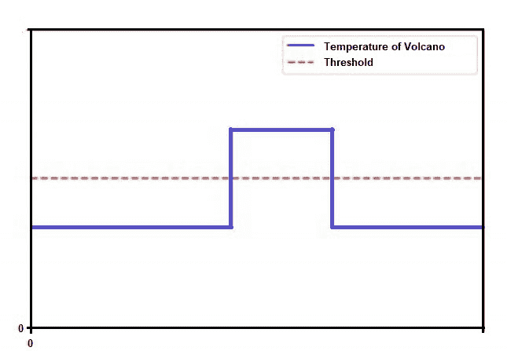
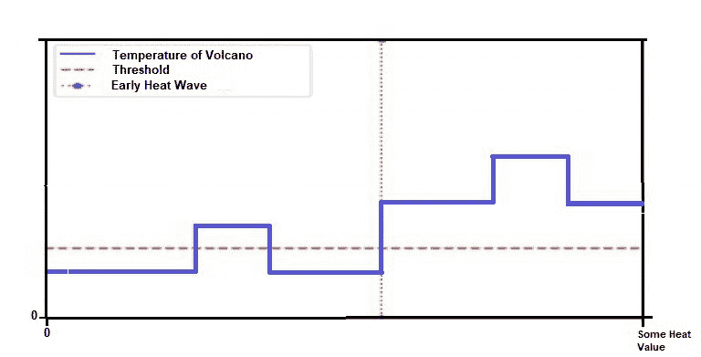
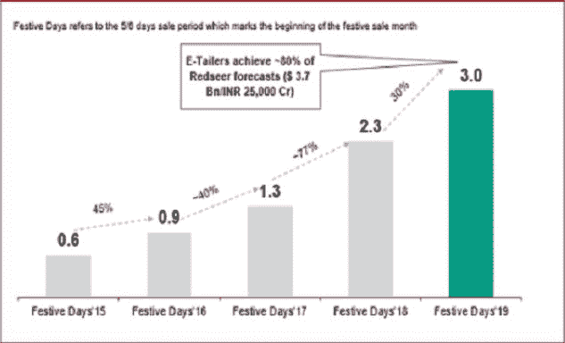

# 概念漂移介绍

> 原文:[https://www . geesforgeks . org/概念漂移介绍/](https://www.geeksforgeeks.org/introduction-to-concept-drift/)

如果我们把自己放在一个与我们通常看到的略有不同的框架中。例如:当我们进行批量学习时，即在生成给定模型的固定数据集上学习时，算法会很快变得无效，甚至适得其反。由于数据的修改或新数据的不断出现，可能会出现此问题。这个问题被称为概念漂移。

**一个正式的定义:**
概念漂移是数据的类变量——换句话说，我们想要预测的目标——的统计属性随时间变化的事件。当一个模型被训练时，它知道一个将自变量或预测值映射到目标变量的函数。换句话说，就是借助其他自变量预测目标变量。在一个静态和完美的环境中，这些预测者和目标都没有改变或进化，模型应该像第一天一样运行，因为没有变化。但是，如果预测器随着时间的推移而改变，模型可能会改变性能，因为它是用旧数据训练的，并且由于预测器的演变，根据新数据进行预测对模型来说可能很困难。
这种情况的一个例子是动态数据(例如:流数据)，其中不仅目标变量的统计属性会改变，其含义也会改变。当发生这种变化时，函数找到的映射不再适合新环境。

在机器学习和预测分析中，概念漂移意味着模型试图预测的数据目标变量的统计属性以非常不可预测的方式随时间变化。这导致了问题，因为久而久之的预测变得不那么准确了。因此没有什么用处。

让我们举例说明一个位于火山上的传感器，以收集火山随时间变化的温度。假设我们收集了几天的数据，期间只下了一场雨。了解这些数据将使我们获得以下模型(下图):超过某个阈值，我们认为火山是活动的，如果不是，它处于静止状态。

图 1:降雨期间的数据

然而，几天后，热浪来袭，发现温度分布发生了如下变化(图 2)。我们很容易看到，之前建立的模型已经不再有效，你要去适应它。

图 2:雨后数据

我们还可以在印度排灯节期间的购物中看到概念漂移的概念。在正常的日子里，购物进行得非常正常，但是在排灯节期间，购物突然增加。以下是从[这里](https://economictimes.indiatimes.com/small-biz/startups/newsbuzz/amazon-flipkart-sales-generate-rs-19000-crore-in-6-days/articleshow/71491146.cms)取的几个统计数据。

图 2:雨后数据