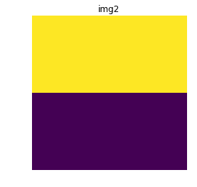
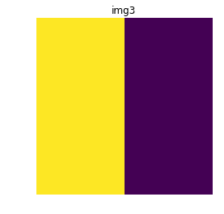

# 使用 Python 介绍卷积

> 原文:[https://www . geeksforgeeks . org/introduction-to-two-using-python/](https://www.geeksforgeeks.org/introduction-to-convolutions-using-python/)

**卷积**是**卷积神经网络**背后的关键特征之一。关于中枢神经系统的工作细节，参见[卷积神经网络介绍](https://www.geeksforgeeks.org/introduction-convolution-neural-network/)。

**特征学习**
特征工程或特征提取是从输入数据中提取有用模式的过程，这将有助于预测模型更好地理解问题的真实性质。一个好的特征学习会以一种显著提高所应用的机器学习算法的准确性和性能的方式呈现模式，而这种方式对于机器学习本身来说是不可能的或者太昂贵的。特征学习算法找到对区分想要的类很重要的公共模式，并自动提取它们。在这个过程之后，它们就可以用于分类或回归问题了。
让我们考虑一个流行的图像分类问题，人脸和非人脸对象的图像分类。在计算机视觉的早期，科学家试图通过手工编码人脸可能特征的检测算法来解决这个问题，如形状、眼睛、鼻子、嘴唇等。这种方法通常效果不佳，因为一张脸可能出现在如此多的种类中，以至于不可能解释特征中的很大一部分。仅仅是灯光或方向的一个简单改变就能带来图像的变化，以至于算法不再能够检测人脸。
1998 年， [Yann Lecun](http://yann.lecun.com/) 引入了卷积神经网络的概念，该网络能够以约 99%的准确率对手写字符图像进行分类。卷积神经网络的巨大优势在于，它们非常擅长在图像中找到在每一级之后增长的特征，最终产生高级特征。最终图层(可以是一个或多个)使用所有这些生成的要素进行分类或回归。
**卷积**
卷积是对图像执行的一种操作，通过在图像上应用称为核的较小张量，如滑动窗口，从图像中提取特征。根据卷积核中的值，我们可以从图像中提取特定的模式。在下面的例子中，我们将演示使用适当的核检测图像中的水平和垂直边缘。

## 蟒蛇 3

```
import numpy as np
import matplotlib.pyplot as plt

# let img1 be an image with no features
img1 = np.array([np.array([200, 200]), np.array([200, 200])])
img2 = np.array([np.array([200, 200]), np.array([0, 0])])
img3 = np.array([np.array([200, 0]), np.array([200, 0])])

kernel_horizontal = np.array([np.array([2, 2]), np.array([-2, -2])])
print(kernel_horizontal, 'is a kernel for detecting horizontal edges')

kernel_vertical = np.array([np.array([2, -2]), np.array([2, -2])])
print(kernel_vertical, 'is a kernel for detecting vertical edges')

# We will apply the kernels on the images by
# elementwise multiplication followed by summation
def apply_kernel(img, kernel):
    return np.sum(np.multiply(img, kernel))

# Visualizing img1
plt.imshow(img1)
plt.axis('off')
plt.title('img1')
plt.show()

# Checking for horizontal and vertical features in image1
print('Horizontal edge confidence score:', apply_kernel(img1, 
                                            kernel_horizontal))
print('Vertical edge confidence score:', apply_kernel(img1, 
                                            kernel_vertical))

# Visualizing img2
plt.imshow(img2)
plt.axis('off')
plt.title('img2')
plt.show()

# Checking for horizontal and vertical features in image2
print('Horizontal edge confidence score:', apply_kernel(img2, 
                                            kernel_horizontal))
print('Vertical edge confidence score:', apply_kernel(img2, 
                                            kernel_vertical))

# Visualizing img3
plt.imshow(img3)
plt.axis('off')
plt.title('img3')
plt.show()

# Checking for horizontal and vertical features in image3
print('Horizontal edge confidence score:', apply_kernel(img3, 
                                            kernel_horizontal))
print('Vertical edge confidence score:', apply_kernel(img3, 
                                            kernel_vertical))
```

**Output:**

> [ [ 2 2]
> [-2 -2] ]是检测水平边缘的核
> [ [ 2 -2]
> [ 2 -2] ]是检测垂直边缘的核
> 
> 水平边缘置信度得分:0
> 垂直边缘置信度得分:0
> 
> 水平边缘置信度得分:800
> 垂直边缘置信度得分:0
> 
> 水平边缘置信度得分:0
> 垂直边缘置信度得分:800