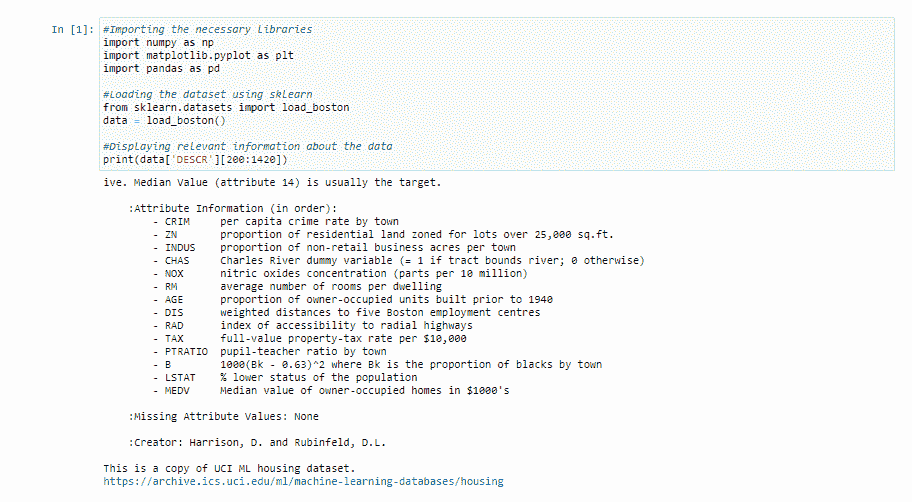
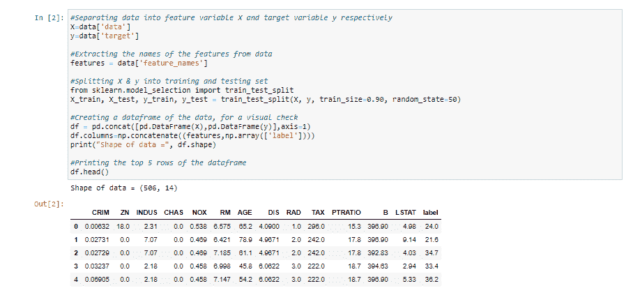
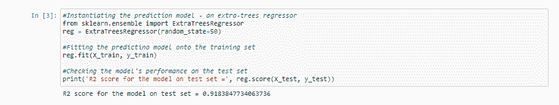
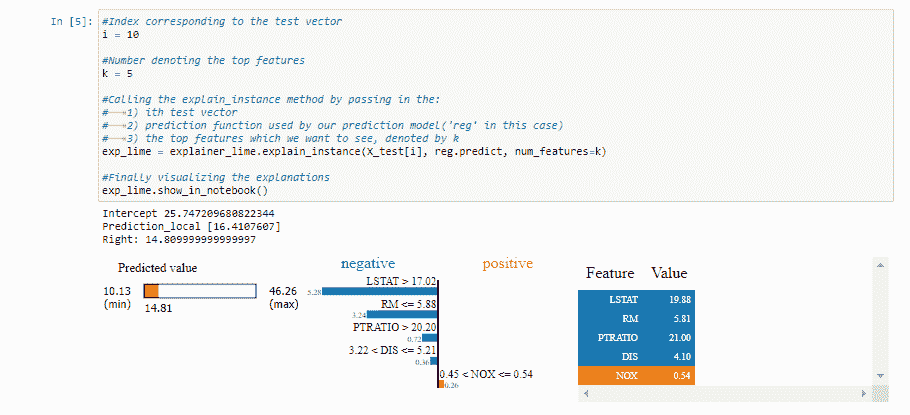
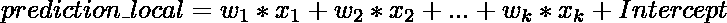
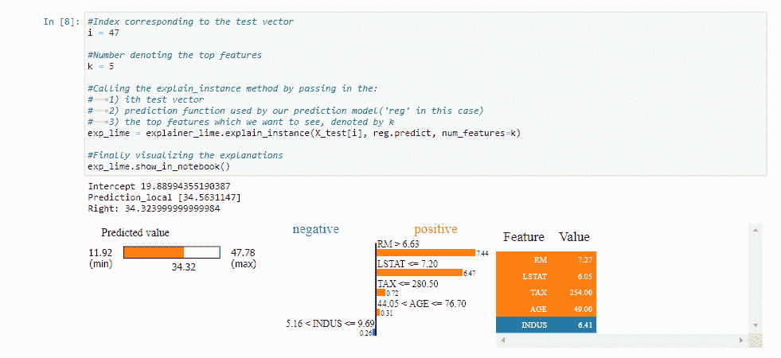

# 使用莱姆介绍可解释的人工智能(XAI)

> 原文:[https://www . geesforgeks . org/introduction-to-explained-aixai-using-lime/](https://www.geeksforgeeks.org/introduction-to-explainable-aixai-using-lime/)

**激发可解释的人工智能**

人工智能的广阔领域近年来经历了巨大的增长。随着每年更新更复杂的模型的到来，人工智能模型已经开始以一种没有人能预料到的速度超越人类的智力。但是，随着我们获得更精确的结果，解释这些模型做出复杂数学决策背后的原因变得越来越困难。这种数学抽象也不能帮助用户保持他们对特定模型决策的信任。

> 例如，假设深度学习模型获取图像，并以 70%的准确率预测患者患有肺癌。虽然模型**可能**给出了正确的诊断，但是医生不能真正自信地建议患者**，因为他/她不知道所述模型的诊断背后的**推理。****

**这就是可解释人工智能(或者更通俗地说是 XAI)的由来！可解释人工智能统称为技术或方法，有助于解释给定人工智能模型的决策过程。这个新发现的人工智能分支显示出巨大的潜力，每年都有更新更复杂的技术出现。一些最著名的 XAI 技巧包括 **SHAP(沙普利加法解释)，深度沙普，深度提升，解释和石灰。**本文详细介绍了 LIME。**

****引入 LIME(或局部可解释的模型不可知解释)****

**LIME 的美在于它的可及性和简单性。LIME 背后的核心思想虽然详尽，但却非常直观和简单！让我们深入了解一下这个名字本身代表了什么:**

*   ****模型不可知论**指的是 LIME 的性质，利用它，它可以通过将任何给定的监督学习模型单独视为“黑箱”来给出解释。这意味着 LIME 几乎可以处理任何存在于野外的模型！**
*   ****局部解释**是指 LIME 给出的解释在被解释的观察/样本的周围或附近是局部忠实的。**

**尽管 LIME 目前仅限于受监督的机器学习和深度学习模型，但它是最受欢迎和使用最多的 XAI 方法之一。凭借丰富的开源应用编程接口，可以在 R 和 Python 中找到，LIME 拥有庞大的用户群，其 [Github 存储库](https://github.com/marcotcr/lime)上有近 8k 颗星和 2k 个分叉。**

**【LIME 是如何工作的？**

**广义地说，当给定一个预测模型和一个测试样本时，LIME 会执行以下步骤:**

*   ****采样和获取替代数据集:** LIME 在被解释的实例附近提供了局部忠实的解释。默认情况下，它按照正态分布生成特征向量的 5000 个样本(参见 *num_samples* 变量)。然后，它使用预测模型获得这 5000 个样本的目标变量，并试图解释其决策。**
*   ****从替代数据集进行特征选择:**获得替代数据集后，它会根据每一行与原始样本/观察的接近程度对其进行加权。然后使用像**套索**这样的特征选择技术来获得最重要的特征。**

**LIME 还使用仅使用获得的特征对样本进行岭回归模型。输出的预测理论上应该与原始预测模型输出的预测在幅度上相似。这样做是为了强调这些获得的特征的相关性和重要性。**

**在本文中，我们不会真正深入到石灰内部的技术和数学细节。不过，如果你感兴趣的话，你可以浏览一下基础研究论文。现在，进入更有趣的部分，代码！**

****安装石灰****

**来到安装部分，我们可以使用 **pip** 或者 **conda** 在 Python 中安装 LIME。**

```py
pip install lime
```

**或者**

```py
conda install -c conda-forge lime
```

**在继续之前，这里有一些关键的提示，有助于更好地理解围绕着莱姆的整个工作流程。**

### **数据集描述:**

**当前状态的莱姆只能解释以下类型的数据集:**

1.  ****表格数据集**(石灰 _ 石灰表格。例如:回归、分类数据集**
2.  ****影像相关数据集** (lime.lime_image。lime image 解释器)**
3.  ****文本相关数据集** (lime.lime_text。LimeTextExplainer)**

**由于这是一篇介绍性文章，我们将保持简单并继续使用表格数据集。更具体地说，我们将使用**波士顿房价数据集**进行分析。我们将使用 Scikit-Learn 工具加载[数据集](https://scikit-learn.org/0.16/modules/generated/sklearn.datasets.load_boston.html#sklearn.datasets.load_boston)。**

### **使用的预测模型:**

**由于 LIME 本质上是模型不可知的，它可以处理几乎任何扔给它的模型。为了强调这个事实，我们将使用一个通过 Scitkit-learn 实用程序的[额外树回归器](https://scikit-learn.org/stable/modules/generated/sklearn.ensemble.ExtraTreesRegressor.html)作为我们的预测模型，我们试图研究它的决策。**

### **LimeTabularExplainer 简介**

**如上所述，我们将使用表格数据集进行分析。为了处理这样的数据集，莱姆的应用编程接口提供了莱姆白板。**

> ****语法:**lime . lime _ table。LimeTabularExplainer(训练数据、模式、特征名称、详细)**
> 
> ****参数:****
> 
>  ***   **训练数据–**由训练数据集组成的二维数组
> *   **模式–**视问题而定；“分类”或“回归”
> *   **feature _ name–**与训练数据集中的列相对应的标题列表。如果没有提到，它使用列索引。
> *   **详细–**如果为真，则仅使用获得的特征打印在样本上训练的回归模型的局部预测值**

**一旦实例化，我们将使用来自已定义的解释器对象的方法来解释给定的测试样本。**

> ****语法:** explain_instance(data_row，predict_fn，num_features=10，num_samples=5000)**
> 
> ****参数:****
> 
> *   ****data _ row–**1d 数组，包含与解释的测试样本相对应的值**
> *   ****预测模型使用的预测函数****
> *   ****数量 _ 特征–**解释中出现的特征的最大数量**
> *   ****num _ samples–**学习线性模型的邻域大小**

**为了简洁明了，上面两种语法中只提到了一些论点。其余的参数，大部分默认为一些巧妙优化的值，感兴趣的读者可以在[官方石灰文档](https://lime-ml.readthedocs.io/en/latest/)中查看。**

****工作流程****

1.  **数据预处理**
2.  **在数据集上训练额外树回归器**
3.  **获取给定测试样本的解释**

****分析****

### ****1。从 Scikit-learn 实用程序中提取数据****

## **计算机编程语言**

```py
# Importing the necessary libraries
import numpy as np
import matplotlib.pyplot as plt
import pandas as pd

# Loading the dataset using sklearn
from sklearn.datasets import load_boston
data = load_boston()

# Displaying relevant information about the data
print(data['DESCR'][200:1420])
```

****输出:****

**

上面代码的木星笔记本输出** 

### ****2。提取特征矩阵 X 和** **目标变量 y，进行训练测试分割****

## **计算机编程语言**

```py
# Separating data into feature variable X and target variable y respectively
from sklearn.model_selection import train_test_split
X = data['data']
y = data['target']

# Extracting the names of the features from data
features = data['feature_names']

# Splitting X & y into training and testing set
X_train, X_test, y_train, y_test = train_test_split(
    X, y, train_size=0.90, random_state=50)

# Creating a dataframe of the data, for a visual check
df = pd.concat([pd.DataFrame(X), pd.DataFrame(y)], axis=1)
df.columns = np.concatenate((features, np.array(['label'])))
print("Shape of data =", df.shape)

# Printing the top 5 rows of the dataframe
df.head()
```

****输出:****

**

上面代码的木星笔记本输出** 

### ****3。实例化预测模型，并在(X_train，y_train)** 上进行训练**

## **计算机编程语言**

```py
# Instantiating the prediction model - an extra-trees regressor
from sklearn.ensemble import ExtraTreesRegressor
reg = ExtraTreesRegressor(random_state=50)

# Fitting the predictino model onto the training set
reg.fit(X_train, y_train)

# Checking the model's performance on the test set
print('R2 score for the model on test set =', reg.score(X_test, y_test))
```

****输出:****

**

上面代码的木星笔记本输出** 

### ****4。实例化解释器对象****

## **计算机编程语言**

```py
# Importing the module for LimeTabularExplainer
import lime.lime_tabular

# Instantiating the explainer object by passing in the training set, and the extracted features
explainer_lime = lime.lime_tabular.LimeTabularExplainer(X_train,
                                                        feature_names=features,
                                                        verbose=True, mode='regression')
```

### ****5。通过调用** ***解释 _ 实例()*** **方法**获取解释**

*   **假设我们想探究预测模型对第 I 个测试向量 给出的预测背后的推理。**
*   **而且，说我们要可视化 ***顶 k 特征*** **从而引出了这个推理**。**

#### **在这篇文章中，我们对 i & k **:** 的两种组合进行了解释**

#### ****5.1 解释 i=10，k=5 的决策****

> **我们基本上是要求莱姆通过显示 ***前 5 个特征*****来解释 ***第 10 个测试向量*** 的预测**背后的**决定，这些特征对所述模型的预测有贡献。****

## **计算机编程语言**

```py
# Index corresponding to the test vector
i = 10

# Number denoting the top features
k = 5

# Calling the explain_instance method by passing in the:
#    1) ith test vector
#    2) prediction function used by our prediction model('reg' in this case)
#    3) the top features which we want to see, denoted by k
exp_lime = explainer_lime.explain_instance(
    X_test[i], reg.predict, num_features=k)

# Finally visualizing the explanations
exp_lime.show_in_notebook()
```

****输出:****

**

上面代码的木星笔记本输出** 

****解释输出:****

**LIME 输出了大量的信息！让我们一步一步来解读它想要传达的信息**

*   **首先，我们在可视化上方看到三个值:

    1.  **右:**这表示由我们的预测模型(在这种情况下是额外的树回归器)为给定的测试向量给出的预测。
    2.  **Prediction_local:** 这表示由在扰动样本上训练的线性模型输出的值(通过围绕正态分布的测试向量采样获得)，并且仅使用由 LIME 输出的前 k 个特征。
    3.  **截距:**截距是上述线性模型对给定测试向量的预测给出的预测的常数部分。** 

****

*   **来到可视化，我们可以看到颜色****和** ***橙色*** 、**分别描绘** ***阴性*** 和 *阳性*T22、**关联。**

    *   对以上结果进行解读，我们可以得出结论:给定向量所描绘的房屋**相对较低的价格值**(由左侧的一条横条描绘)可以归因于以下社会经济原因:
        *   ***LSTAT*** 的**高**值表明一个社会在教育和失业方面的**较低的地位**
        *   **的**高值表示**的**高值**每位教师的学生人数******
        *   *****DIS*** 的**高**值表示**离就业中心距离的高值。****
        *   ****RM** 的**低**值表示**每套住宅的房间数量较少****
    *   **我们还可以看到**的**低**值表明空气中**低量的一氧化氮浓度**已经将房子的价值提高到了一个**小**的程度。******** 

> ****我们可以看到，以一种可交互且有意义的方式将相对复杂的预测模型(额外树回归器)所做的决策关联起来变得多么容易。让我们在另一个测试向量上尝试这个练习！****

#### ****5.2 解释 i=47，k=5 的决策****

> ****在这里，我们再次要求莱姆通过显示 ***前 5 个特征*****来解释第 47 个测试向量** 的预测 ***背后的**决定，这些特征对所述模型的预测**有贡献*******

## **计算机编程语言**

```py
# Index corresponding to the test vector
i = 47

# Number denoting the top features
k = 5

# Calling the explain_instance method by passing in the:
#    1) ith test vector
#    2) prediction function used by our prediction model('reg' in this case)
#    3) the top features which we want to see, denoted by k
exp_lime = explainer_lime.explain_instance(
    X_test[i], reg.predict, num_features=k)

# Finally visualizing the explanations
exp_lime.show_in_notebook()
```

****输出:****

**

上面代码的木星笔记本输出** 

****解释输出:****

*   **从可视化中，我们可以得出结论，给定向量所描绘的房屋的**相对较高的价格值**(由左侧的一个条所描绘)可以归因于以下社会经济原因:

    *   ***LSTAT*** 的**低**值表明一个社会在教育和就业能力方面的**显赫地位**
    *   *的**高**值表示**每个住所的房间数量高***
    *   ****税*** 的**低**值表示该房产的**低税率***
    *   ***的低**值描绘了机构**的**新鲜感******* 
*   *****我们还可以看到 ***印度河*** 的**平均**值，这表明社会附近的**低非零售数量已经**将房子的**值降低到了一个**小**的程度。*******

*****总结:*****

***本文简要介绍了在 Python 中使用石灰的可解释人工智能(XAI)。显而易见，在给定黑盒模型的决策过程背后，LIME 可以给我们一种深刻得多的直觉，同时提供对固有数据集的坚实见解。这对人工智能研究人员和数据科学家来说都是一个有用的资源！***

*****参考文献:*****

1.  ***https://lime-ml.readthedocs.io/en/latest/***
2.  ***https://scikit-learn.org/stable/modules/generated/sklearn.ensemble.ExtraTreesRegressor.html***
3.  ***https://scikit-learn.org/0.16/modules/generated/sklearn.datasets.load_boston.html#sklearn.datasets.load_boston***
4.  ***马尔科·图利奥·里贝罗、萨梅尔·辛格和卡洛斯·盖斯特林。“我为什么要相信你？”:解释任何分类器的预测。在第 22 届 ACM SIGKDD 知识发现和数据挖掘国际会议记录中，第 1135-1144 页。计算机械协会，2016 年。***