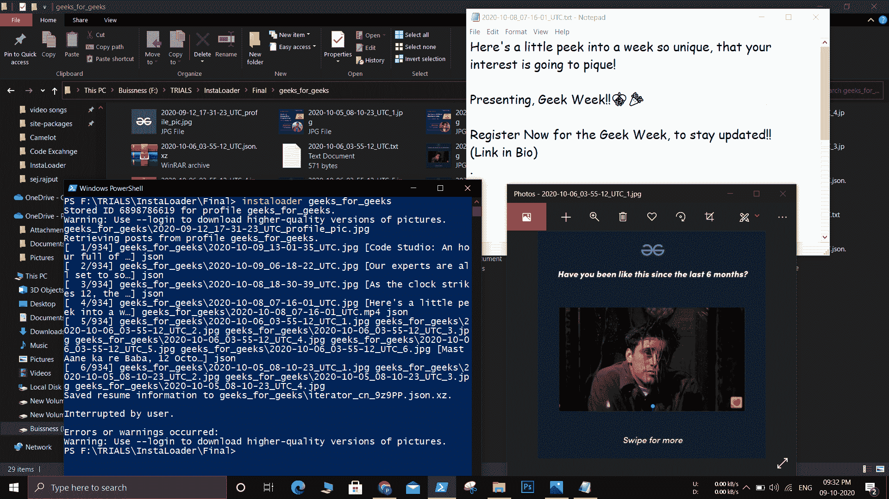
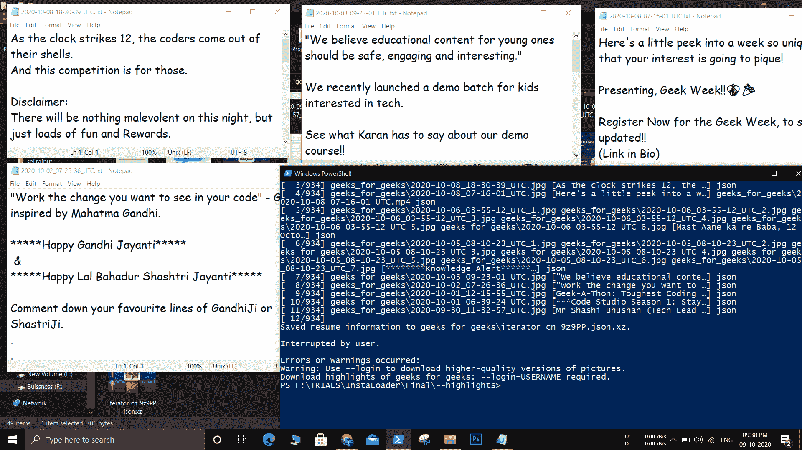
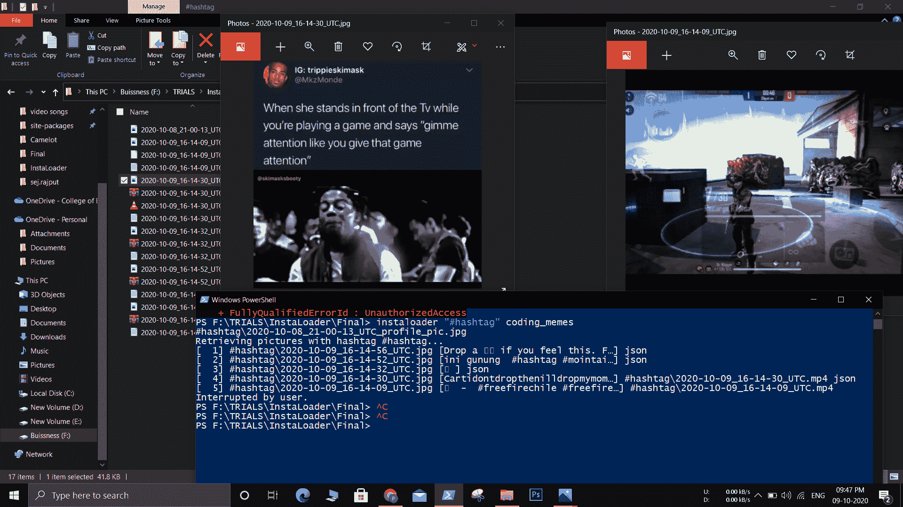
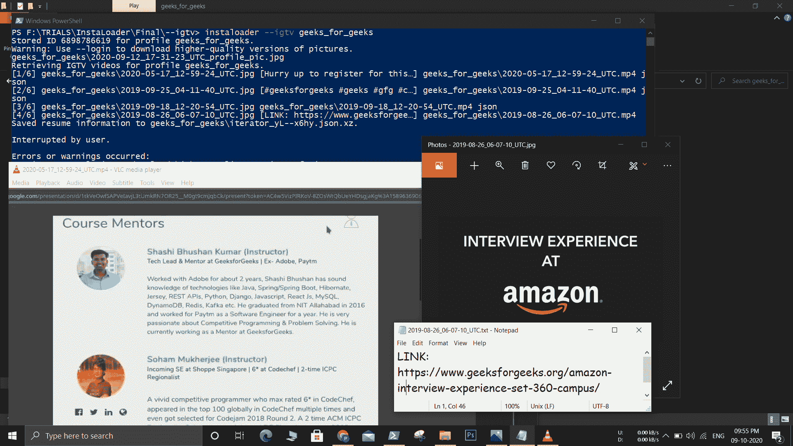

# Python 中 Instaloader 模块介绍

> 原文:[https://www . geesforgeks . org/introduction-to-insta loader-module-in-python/](https://www.geeksforgeeks.org/introduction-to-instaloader-module-in-python/)

Instaloader 模块是一个 Python 包，有很好的功能来废弃 instagram，它的功能可以用作命令行工具。Instaloader 密钥用于下载:

*   公共/私人帐户的职位
*   故事
*   IGTV(电视节目)
*   帖子评论
*   档案信息
*   故事集锦

instaloader 模块可以用来下载 profile/Instagram 用户的一切，你需要通过 CONTROL+C 中断来杀死进程。但是，下载私人账号的文件，必须登录，不强制使用公共账号。此外，注释在 json 文件中，该文件被压缩为一个文件夹。

### 安装:

```py
 pip install instaloader
```

## 实施:

### **下载个人资料的所有内容:**

> instaloader 极客 _ for _ 极客

使用这个命令，你的程序将下载所有关于配置文件的信息。对于公众账号，它将下载故事，发布，突出新闻。对于私人，它只下载个人资料照片和其他关于个人资料的公共信息。

**输出:**



### **下载特定档案的重点:**

> insta loader–为极客突出极客

**输出:**



上述命令下载特定配置文件的公共亮点

### **通过 Hashtag 下载:**

> insta loader“# hashtag”编码 _memes

**输出:**



上面的命令下载具有给定 Hashtag 的帖子。

### **下载 IGTV 视频**

> insta loader–igtv 极客 _ for _ 极客

**输出:**



上述命令用于下载 instagram 上. mp4 格式的特定配置文件的视频。

## 配置文件类可用于访问配置文件的元数据

## 蟒蛇 3

```py
import instaloader

# Get instance
loader = instaloader.Instaloader()

# Login using the credentials
loader.login(USER, PASSWORD)

# Use Profile class to access metadata of account
profile = instaloader.Profile.from_username(loader.context,
                                            'geeks_for_geeks')
```

## 配置文件类的属性:

### **追随者**

返回给定账户后的账户数

## 蟒蛇 3

```py
# returns iterator to list of followers of given profile
followers = profile.get_followers()

for follower in followers:
    print(follower)
```