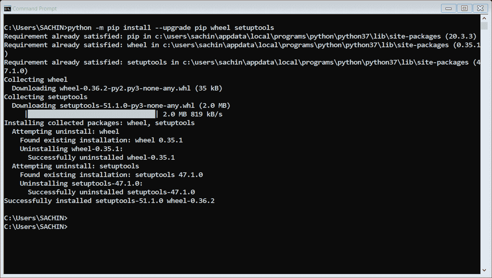
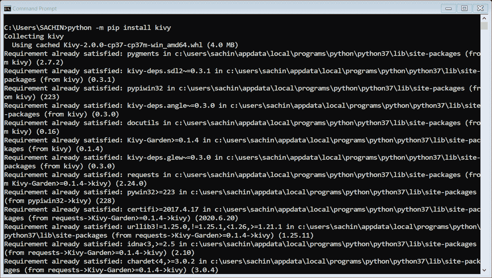
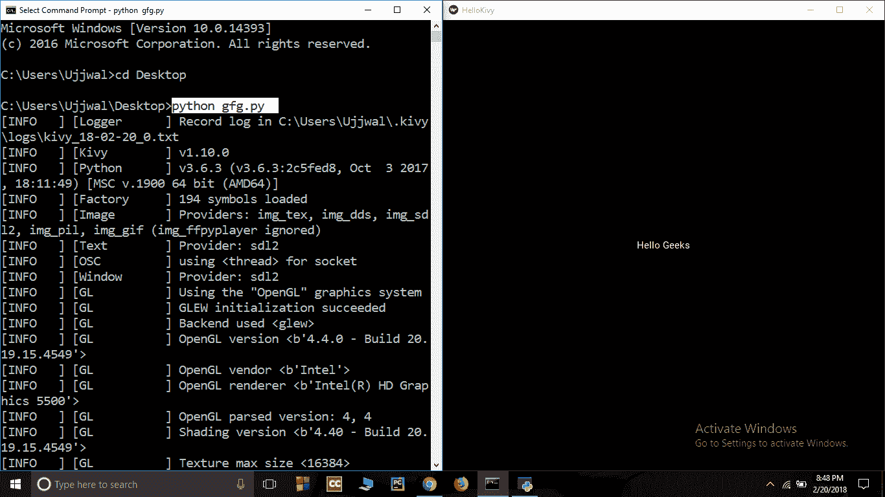

# 基维介绍；跨平台 Python 框架

> 原文:[https://www.geeksforgeeks.org/introduction-to-kivy/](https://www.geeksforgeeks.org/introduction-to-kivy/)

Kivy 是一个图形用户界面开源 Python 库，允许您在 Windows、macOS、Android、iOS、Linux 和树莓 Pi 上开发多平台应用程序。kivy 最好的一点是，它的性能比 HTML5 跨平台替代品更好。

请注意，您的机器上必须有 Python 3 才能使用该库。

### **安装在窗户上:**

*   **步骤 1:** 在 cmd-
    中输入该命令，在安装 kivy 之前更新 pip 和车轮

```py
python -m pip install --upgrade pip wheel setuptools
```



*   **步骤 2:** 安装依赖项-

```py
python -m pip install docutils pygments pypiwin32 kivy.deps.sdl2 kivy.deps.glew
python -m pip install kivy.deps.gstreamer
python -m pip install kivy.deps.angle
```

*   **步骤 3:** 安装 kivy。

```py
python -m pip install kivy
```

它将产生如下图所示的结果:



### **在 Linux 中安装:**

*   **步骤 1:** 在终端-
    输入该命令，添加 PPA

```py
 sudo add-apt-repository ppa:kivy-team/kivy
```

*   **步骤 2:** 使用您的包管理器更新您的包列表-

```py
sudo apt-get update
```

*   **步骤 3:** 安装 Kivy

```py
sudo apt-get install python3-kivy
```

### **创建应用程序**

使用 kivy 创建应用程序有三个步骤:

1.  继承基维的应用程序类，它代表了我们小部件的窗口
2.  创建一个 **build()** 方法，它将显示小部件的内容。
3.  最后调用 **run()** 方法。

**示例:**
这是 python3 代码，用于制作一个简单的应用程序，在系统屏幕上显示所需的文本:

## 蟒蛇 3

```py
import kivy
kivy.require('1.10.0')

from kivy.app import App
from kivy.uix.button import Label

# Inherit Kivy's App class which represents the window
# for our widgets
# HelloKivy inherits all the fields and methods
# from Kivy
class HelloKivy(App):

    # This returns the content we want in the window
    def build(self):

        # Return a label widget with Hello Kivy
        return Label(text ="Hello Geeks")

helloKivy = HelloKivy()
helloKivy.run()
```

要运行此代码，请打开 cmd(Linux 中的终端)并浏览保存代码的目录，然后键入以下命令-

```py
python file_name.py
```

