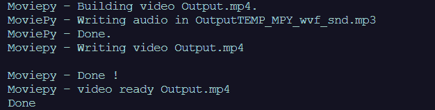
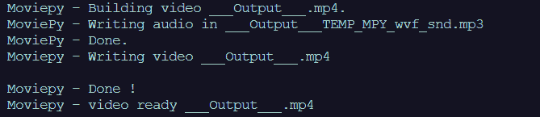

# 电影简介

> 原文:[https://www.geeksforgeeks.org/introduction-to-moviepy/](https://www.geeksforgeeks.org/introduction-to-moviepy/)

**MoviePy** 是一个用于视频编辑的 Python 模块，可用于基本操作(如剪切、拼接、标题插入)、视频合成(又称非线性编辑)、视频处理或创建高级效果。它可以读写最常见的视频格式，包括 GIF。
**安装**
要安装电影编辑器库，打开终端，写:

```
pip install moviepy
```

**注意:**本模块自动安装 FFmpeg。但是，在某些情况下，您可能会提示安装。
即使安装了 MoviePy，也有一些功能不能使用，除非安装 ImageMagick，比如在视频或 gif 上添加文本。
**安装 ImageMagick**
**ImageMagick**并不是严格要求的，只有用户想写文字的时候才需要。它也可以用作 gif 的后端，尽管用户可以在没有 ImageMagick 的情况下使用 MoviePy 制作 gif。以下是下载 ImageMagick
的链接

```
https://imagemagick.org/script/download.php
```

安装后，除了在 Windows 上，ImageMagick 将被 MoviePy 自动检测到。Windows 用户必须进入 moviepy/config_defaults.py 文件，并提供名为 Magick 的 ImageMagick 二进制文件的路径。

```
IMAGEMAGICK_BINARY = "C:\\Program Files\\ImageMagick_VERSION\\magick.exe"
or for some older versions of ImageMagick it will be
IMAGEMAGICK_BINARY = "C:\\Program Files\\ImageMagick_VERSION\\convert.exe"
```

要获取文章改进时使用的视频–单击[此处](https://drive.google.com/drive/folders/1PhvmEcqKrj8Z_-YAQ9hhYI10vDB9fIHD?usp=sharing)

**示例 1**
我们将加载视频，并从整个视频中剪切一个片段，然后将视频上下颠倒旋转，在此示例中，无需安装 ImageMagick。
下面是实现

## 蟒蛇 3

```
# Import everything needed to edit video clips
from moviepy.editor import *

# loading video dsa gfg intro video
clip = VideoFileClip("dsa_geek.webm")

# clipping of the video 
# getting video for only starting 10 seconds
clip = clip.subclip(0, 10)

# rotatng video by 180 degree
clip = clip.rotate(180)

# Reduce the audio volume (volume x 0.5)
clip = clip.volumex(0.5)

# showing clip
clip.ipython_display(width = 280)
```

**输出:**

```
Moviepy - Building video __temp__.mp4.
Moviepy - Writing video __temp__.mp4

Moviepy - Done !
Moviepy - video ready __temp__.mp4
```

<video class="wp-video-shortcode" id="video-462341-1" width="640" height="360" preload="metadata" controls=""><source type="video/mp4" src="https://media.geeksforgeeks.org/wp-content/uploads/20200721003455/19.mp4?_=1">[https://media.geeksforgeeks.org/wp-content/uploads/20200721003455/19.mp4](https://media.geeksforgeeks.org/wp-content/uploads/20200721003455/19.mp4)</video>

**示例 2:**
我们将加载视频，并从整个视频中剪切一个片段，然后我们将在视频中添加文本，在本例中，我们必须安装 ImageMagick，否则它将不起作用。
以下是实施情况

## 蟒蛇 3

```
# Import everything needed to edit video clips
from moviepy.editor import *

# loading video dsa gfg intro video
clip = VideoFileClip("dsa_geek.webm")

# clipping of the video 
# getting video for only starting 10 seconds
clip = clip.subclip(0, 10)

# Reduce the audio volume (volume x 0.8)
clip = clip.volumex(0.8)

# Generate a text clip
txt_clip = TextClip("GeeksforGeeks", fontsize = 70, color = 'white')

# setting position of text in the center and duration will be 10 seconds
txt_clip = txt_clip.set_pos('center').set_duration(10)

# Overlay the text clip on the first video clip
video = CompositeVideoClip([clip, txt_clip])

# showing video
video.ipython_display(width = 280)
```

**输出:**

```
Moviepy - Building video __temp__.mp4.
Moviepy - Writing video __temp__.mp4

Moviepy - Done !
Moviepy - video ready __temp__.mp4
```

<video class="wp-video-shortcode" id="video-462341-2" width="640" height="360" preload="metadata" controls=""><source type="video/mp4" src="https://media.geeksforgeeks.org/wp-content/uploads/20200721004038/22.mp4?_=2">[https://media.geeksforgeeks.org/wp-content/uploads/20200721004038/22.mp4](https://media.geeksforgeeks.org/wp-content/uploads/20200721004038/22.mp4)</video>

**导出视频文件:**

您需要函数 write_videofile(arg1，arg2)，如果您不需要，它不会反映在硬盘文件上，因为文件是加载到内存中的。

## 蟒蛇 3

```
import moviepy.editor as me

# Our focus is on how to export video file,
# you can use any code, or just refer following code 
'''
vid= me.VideoFileClip('Video_1.mp4')
# Grabbing Object from storage

# Creating a page with 'My Title' text in red
colout with given size and background colour 
white and fontsize 30
'''
SYNTAX:
obj=me.TextClip("Text That you want", 
                color='{as string}',
                size=(as,tuple),
                bg_color='as string',
                fontsize=int )

'''

title=me.TextClip('My Title',color='red',size=(1920,1000),bg_color='white',fontsize=30)

# title.set_duration(int seconds)
title_clip_ = title.set_duration(3)
#For 3 seconds My Title willbe shown in vodeo

render=me.concatenate_videoclips([title_clip_,vid])
# Combining our manually created Video i.e My Title of 3 sec with grabbed video

'''

me.write_videofile("Name you want".mp4,endcoding)

# If successfully executor there will be file.mp4 or at path 
# If you have explicitly mentioned else in same folder as program
print("Done")
```

**输出:**



**合并视频文件–**

我们可以按照我们的要求将 2 个视频文件合并成一个文件

## 蟒蛇 3

```
import moviepy.editor 

'''
Grabbing The video's from storage
syntax:
variable_holding_video_name= moviepy.editor.VideoFileCLip("{{Filename}}.{{extension}}")

'''
clip_1= moviepy.editor.VideoFileClip("Video_1.mp4")
clip_2= moviepy.editor.VideoFileClip("Video_2.mp4")

'''
TO join the video's i.e. concatenate the videos' 
use function concatenate_videoclips(list_of_clips_to_mearged)
syntax:
variable_to_hold_mearged_video= moviepy.editor.concatenate_videclips([video_1,Video_2,. . .])
'''
Mearged_video=moviepy.editor.concatenate_videoclips([clip_1,clip_2])

# Saving File as output.mp4  in same folder 
# libx264 is encoding lib for creating video stream(H.264)
Mearged_video.write_videofile("Output.mp4",codec='libx264')

print("Done")
```

**输出:**



**要知道视频的长度:**

## 蟒蛇 3

```
import moviepy.editor as me

# Grabbing file
vid= me.VideoFileClip("Video_1.mp4")

print(str(vid.duration))     
```

**输出:**

```
9.04 
```

**电影的优势**

1.  **简单:**基本操作一行就能搞定，代码简单易学，对于新手来说很容易理解。

2.  **灵活:**用户可以完全控制视频和音频的帧，创建自己的效果就像 Py 一样容易。

3.  **便携:**代码使用了非常常见的软件，比如 Numpy 和 FFMPEG。并且可以在几乎任何机器上运行几乎任何版本的 Python。

**电影的缺点** :

1.  MoviePy 还不能流式传输视频(从网络摄像头读取，或在远程机器上实时呈现视频)

2.  它并不是真正为涉及电影中许多连续帧的视频处理而设计的(就像视频稳定一样，你需要另一个软件来实现)

3.  如果用户同时使用多个视频、音频和图像源(> 100)
    ，可能会出现内存问题