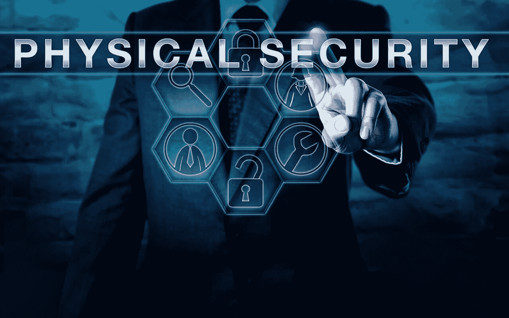

# 物理安全介绍

> 原文:[https://www . geesforgeks . org/物理安全简介/](https://www.geeksforgeeks.org/introduction-to-physical-security/)

如今，随着每一次网络攻击的宣布，关于如何加强你的网络安全的提示接踵而至。别忘了备份你的数据，修补漏洞，监控防火墙等等。非常重要的是要记住，在网络安全方面，软件不是你唯一的武器。物理网络安全是您防线中的另一层。

根据 Goldstein(2016)的说法，物理安全至关重要，尤其是对于没有太多资源投入安全人员和工具的小型企业，而不是大型公司。谈到物理安全，这里适用相同的原则:

*   识别并分类您的资产和资源。
*   识别可信的威胁。
*   确定威胁可能利用的潜在漏洞。
*   确定发生攻击时的预期成本。

### 人身安全所依赖的因素

1.  一个组织中有多少个工作场所、建筑或场所？
2.  组织的建筑规模？
3.  这个组织雇佣了多少员工？
4.  组织内有多少个出入境点？
5.  数据中心和其他机密信息的放置点。

### 物理安全层

物理安全中的层是在外围实施的，并且正在向资产方向发展。层数如下:

**1。威慑**

威慑方法的目标是让潜在的攻击者相信，由于强大的防御，成功的攻击是不可能的。例如:通过将你的钥匙放在一个高度安全的钥匙控制系统中，该系统由像钢这样的重金属组成，你可以帮助阻止攻击者获得对资产的访问。*威慑手段分为 4 类:*

*   **物理障碍:**包括围栏、墙壁、车辆障碍等。它们还通过界定设施的周界，使入侵看起来更加困难，起到心理威慑的作用。
*   **组合壁垒:**这些壁垒旨在击败确定的威胁。这是建筑规范和消防规范的一部分。
*   **自然监视:**在这种情况下，架构师寻求构建对授权用户和安全人员更加开放和可见的场所，以便攻击者在不被发现的情况下无法执行未经授权的活动。例如，减少茂密高大的植被数量。
*   **安全照明:**门、大门或其他入口应照明良好，因为入侵者不太可能进入照明良好的区域。切记以一种难以篡改的方式放置照明。

**2。检测**

如果您正在使用手动钥匙控制系统，您无法知道未授权用户请求钥匙或超过其时间限制的确切时间戳。检测方法可以有以下几种:

*   **报警系统和传感器:**可以安装报警系统，以便在试图未经授权进入时提醒安全人员。它们由周边传感器、运动传感器等传感器组成。
*   **视频监控:**如果攻击已经发生，并且在攻击点放置了摄像头，则可以使用监控摄像头进行检测。可以使用录制的视频

**3。访问控制**

这些方法用于监控通过特定接入点的流量。访问控制包括以下方法:

*   **机械门禁系统:**包括大门、门、锁等。
*   **电子访问控制:**这些用于监控和控制更大的人群，控制用户生命周期、日期和个人访问点。
*   **识别系统和进入策略:**这些包括使用策略、程序和流程来管理进入禁区。

**4。安保人员**

它们在所有安全层中发挥着核心作用。它们执行许多功能，例如:

*   管理电子访问控制。
*   回应警报。
*   监控和分析视频片段以及更多

### **对策和保护技术**

**1。防止垃圾箱搜索**

垃圾箱搜索是从垃圾中找到一些关于该人或企业的有用信息的过程，这些信息后来可用于黑客目的。因为信息在垃圾桶里，所以它对所有者没用，但对拾荒者有用。为了防止这种情况，您需要遵循某些措施:

*   确保所有重要文件都已粉碎，并且仍然安全。
*   销毁任何包含个人数据的光盘/DVD。
*   确保没有人能走进你的大楼，偷你的垃圾，并且应该有安全的处理政策。
*   防火墙可用于防止可疑用户访问丢弃的数据。

**2。员工意识培训**

疏忽的员工可能是网络安全漏洞的主要原因之一。在这种情况下，员工意识培训会有所帮助。员工意识培训应关注一个基本主题- *避免 SEP-别人的问题领域。*

**3。现场访问控制**

如果一个错误的人进入并访问敏感信息，缺乏访问控制可能会造成极大的破坏。幸运的是，现在您有许多现代工具可以帮助您优化访问控制。

*   **特使**是一个工具，将帮助你以可控的方式扩大与客人的接触。
*   **开放路径**是一个移动系统，只允许使用智能手机和其他设备访问目录内的有限人群。

**4。保护您的窗户**

如果你有黑客喜欢得到的数据，他们会尝试任何方法，可能只是透过窗户看。确保您知道放置屏幕和其他设备的视角。从不同的视角俯瞰看到你的凭据被称为 *肩冲浪*T5。

**5。安全网络打印机**

网络打印机是一个非常方便的选项，允许办公室中的任何人连接，而不需要额外的布线。不幸的是，它们也有潜在的安全风险。有时，由于默认设置，它们提供开放的 WiFi 访问，从而允许任何人进入并在此过程中打开漏洞。

*   只把那些真正需要的连接到互联网上。
*   对于只有办公室人员使用打印机的情况，远程访问不是必需的。
*   如有必要，您可以向连接添加密码。

**6。保护您的备份**

物理备份对于业务连续性至关重要，可帮助您在发生灾难、停机等情况时防止数据丢失。大多数企业都保护自己的服务器，但他们忘记了备份也同样重要。他们持有与服务器相同级别的敏感数据。像对待敏感信息一样对待您的备份并保护它们。

**7。建立安全的客人无线网络**

当您有客人或访客时，客人 WiFi 是一个自然的解决方案。以下是一些帮助保护您的资源免受外部用户攻击的技巧:

*   分割您的网络-这样，它将来宾无线网络与您的内部设备和数据隔离开来。
*   加密您的无线信号并更改网络上所有设备的默认密码。

**8。锁定您的服务器**

组织中存储数据的任何区域都需要得到保护。锁上门，确保服务器区域得到额外的保护。

**9。丢失或被盗设备的核算**

随着设备的移动性越来越强，它们被盗或从某人口袋中掉出的可能性也越来越大。移动设备管理可以帮助您管理此类情况，并采取必要的预防措施。在这种情况下，最好的解决方案是简单地锁定并远程擦除组织中任何丢失或被盗的设备。

**10。实施视频系统**

为了实现更安全的场所，建议使用视频监控系统。

*   仅仅有摄像头就能阻止潜在的攻击者。
*   视频镜头的可用性允许您对整个场所进行持续监控。
*   如果发生攻击，您可以检查录制的视频，轻松协调过程并抓住肇事者。