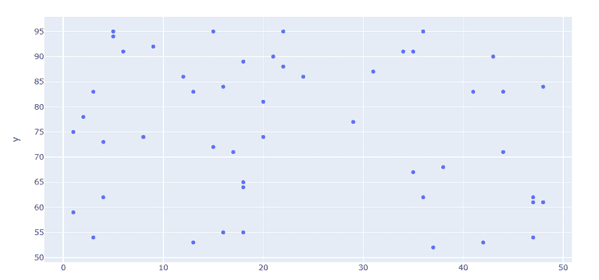

# 使用 Python 进行 Plotly 在线介绍

> 原文:[https://www . geesforgeks . org/introduction-to-plotly-online-use-python/](https://www.geeksforgeeks.org/introduction-to-plotly-online-using-python/)

情节上图书馆是一个交互式开源图书馆。这对于数据可视化和简单容易地理解数据是非常有用的工具。Plotly graph 对象是易于使用的高级绘图界面。它可以绘制各种类型的图形和图表，如散点图、折线图、条形图、箱线图、直方图、饼图等。

Python 还能够在线上传创建的图形，供网站使用。在这篇文章中，创建了一个简单的散点图用于网站，这个图是在一个特殊的网站上工作，这就是 plotly 和 chart-studio 的美。

### **安装:**

```
pip install plotly
pip install chart-studio 
```

### 方法:

**A 部分:**创建图表

*   导入模块
*   创建数据
*   创建绘图
*   显示图表

**B 部分:**在线取图

*   在[图表工作室登录/注册。](https://chart-studio.plotly.com/)
*   登录后，在设置部分找到您的用户名和 API 密钥。(转到配置文件>设置>重新生成密钥)
*   现在在您的 python 脚本中
    *   再次导入模块
    *   传递应用编程接口密钥和用户名
    *   将所有必要的信息传递给 plot()函数
*   返回的输出是一个链接，在这里可以实时看到图形。

下面是实现。

## 蟒蛇 3

```
# importing required libraries
import numpy as np
import plotly
import chart_studio
import plotly.express as px

# assigning values to x and y
x = np.random.randint(low=1, high=50, size=50)
y = np.random.randint(low=51, high=100, size=50)

# creating and displaying graph
fig = px.scatter(x=x, y=y)
fig.show()
```

**输出:**



在绘图中生成的 X 和 Y 之间的图形

现在当我们的图表被创建时。是时候在网站上在线使用它了。

## 蟒蛇 3

```
import chart_studio
username =  # 'your username'
api_key =  # 'your api key'

chart_studio.tools.set_credentials_file(username=username, api_key=api_key)

py.plot(fig, filename='your filename', auto_open=False, sharing='public')
```

**输出:**

> https://plotly . com/~ username/graph number/'