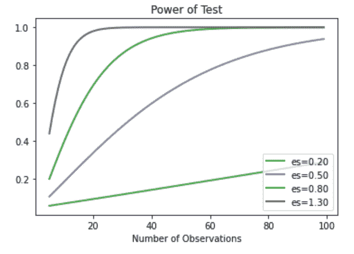

# Python 中的功率分析介绍

> 原文:[https://www . geesforgeks . org/python 中的电源分析简介/](https://www.geeksforgeeks.org/introduction-to-power-analysis-in-python/)

要理解什么是幂分析，我们必须先看一看统计假设检验的概念。A **统计假设检验**在给定的假设(零假设)下计算某个量，检验的结果让我们可以解释假设是否有效，或者假设是否被违反。违反测试的假设通常被称为第一假设或替代假设。p 值和临界值是统计测试中最常见的结果，可以用不同的方式来解释。

将 **p 值**与**显著性水平、** 进行比较(实验前指定，其值取决于实验种类和业务需求)。典型的显著性水平度量是 0.10 或 10%、0.05 或 5%和 0.01 或 1%。

*   如果 p 值<= :拒绝零假设(显著结果)。
*   如果 p 值>:拒绝无效假设失败(结果不显著)。

**所有统计假设检验都有可能出现以下类型的错误:**

*   **第一类错误:**不正确地拒绝真的零假设或**假阳性**。
*   **第二类错误:**错误接受假零假设或**假阴性**。

**统计力:**只有当零假设为假时才相关。假设检验的统计能力是正确拒绝一个无效假设的概率，或者接受另一个假设的可能性，如果它是真的。因此，给定测试的统计能力越高，产生第二类(假阴性)错误的概率就越低。

在进行统计功效分析之前，您需要了解的最后一个概念是**效果大小**。它是一个实验群体中出现的结果或效果的量化幅度，通常通过特定的统计方法来衡量，例如两组平均值的差异的皮尔逊相关或科恩 d。科恩 d 通常接受的小、中、大和超大效果尺寸分别为 0.20、0.50、0.80 和 1.3。效果大小或“预期效果”是从试点研究、类似研究的发现、现场定义的效果或有根据的猜测中确定的。

**功效分析:**由效应大小、显著性水平、功效、样本量 4 个变量构建而成。所有这些变量都是相互关联的，因为改变其中一个变量会影响另外三个变量。根据这种关系，当其他三个变量已知时，功率分析包括确定第四个变量。它是实验设计的有力工具。例如，在实验之前，给定不同的期望显著性水平、效应大小和功率，可以估计检测特定效应所需的样本量。或者，一项研究的发现可以得到验证。通过使用给定的样本量、效应量和显著性水平，可以确定统计能力，从而有助于从决策的角度推断犯第二类错误的概率是否可以接受。

## **使用 Python 进行功率分析**

Python 中 **statsmodels** 包的**stats.power** 模块包含对最常用的统计测试(如 t 检验、基于正态的检验、f 检验和卡方拟合优度检验)进行功率分析所需的功能。它的 **solve_power** 函数将上述 4 个变量中的 3 个作为输入参数，并计算剩余的第 4 个变量。

考虑一个学生 t 检验，这是一个统计假设检验，用于比较两个高斯变量样本的平均值。在两组变量的试点研究中，N1 = 4，均值 1 = 90，SD1 = 5；N2 = 4，平均值 2 = 85，SD2 = 5。测试的假设或零假设是样本总体具有相同的平均值。由于α通常设置为 0.05，幂设置为 0.80，因此研究人员主要需要关注样本大小和效果大小。让我们确定测试所需的样本量，其中 80%的*幂*是可接受的，5%的*显著性水平*和预期的*效应大小*将通过试点研究来发现。

**例 1:**

首先，导入相关库。使用科恩的 d 计算效应大小。TTestIndPower 函数对两个独立样本的 t 检验进行统计幂计算。同样，也有 f 检验、Z 检验和卡方检验的函数。接下来，初始化用于功率分析的变量。然后使用 solve_power 函数，我们可以得到所需的缺失变量，在这种情况下是样本大小。

**代码:**

## 计算机编程语言

```
# import required modules
from math import sqrt
from statsmodels.stats.power import TTestIndPower

#calculation of effect size
# size of samples in pilot study
n1, n2 = 4, 4

# variance of samples in pilot study
s1, s2 = 5**2, 5**2

# calculate the pooled standard deviation 
# (Cohen's d)
s = sqrt(((n1 - 1) * s1 + (n2 - 1) * s2) / (n1 + n2 - 2))

# means of the samples
u1, u2 = 90, 85

# calculate the effect size
d = (u1 - u2) / s
print(f'Effect size: {d}')

# factors for power analysis
alpha = 0.05
power = 0.8

# perform power analysis to find sample size 
# for given effect
obj = TTestIndPower()
n = obj.solve_power(effect_size=d, alpha=alpha, power=power, 
                    ratio=1, alternative='two-sided')

print('Sample size/Number needed in each group: {:.3f}'.format(n))
```

**输出:**

```
Effect size: 1.0
Sample size/Number needed in each group: 16.715
```

因此，建议每组所需的最小样本数为 17，以便在 t 检验中具有显著的 p 值。如果我们在进行功率分析之前进行推理性 t 检验，我们可能会发现一个不显著的 p 值，即使有很大的影响，这可能是由于样本量较小(4)。

**例 2:**

或者，我们可以测试特定建议样本量的能力。

**代码:**

## 计算机编程语言

```
from statsmodels.stats.power import TTestPower

power = TTestPower()
n_test = power.solve_power(nobs=40, effect_size = 0.5,
                           power = None, alpha = 0.05)
print('Power: {:.3f}'.format(n_test))
```

**输出:**

```
Power: 0.869
```

这告诉我们，最小样本量为 40 将导致 0.87 的幂。

**例 3:**

我们还可以绘制功率曲线。功率曲线是显示效果大小和样本大小的变化如何影响统计测试功率的线图。plot_power()函数可用于创建功率曲线。“dep_var”参数指定因变量(x 轴)，可以是“nobs”、“effect_size”或“alpha”。这里，“nobs”是样本大小，采用数组值。因此，为效果大小的每个值创建一条曲线。

让我们假设显著性水平为 0.05，并使用科恩的 d 标准低、中和高效果大小来探索样本大小在 5 到 100 之间的变化。

**代码:**

## 计算机编程语言

```
# import required libraries
import numpy as np
import matplotlib.pyplot as plt
from statsmodels.stats.power import TTestIndPower

# power analysis varying parameters
effect_sizes = np.array([0.2, 0.5, 0.8,1.3])
sample_sizes = np.array(range(5, 100))

# plot power curves
obj = TTestIndPower()
obj.plot_power(dep_var='nobs', nobs=sample_sizes,
               effect_size=effect_sizes)

plt.show()
```

**输出:**

