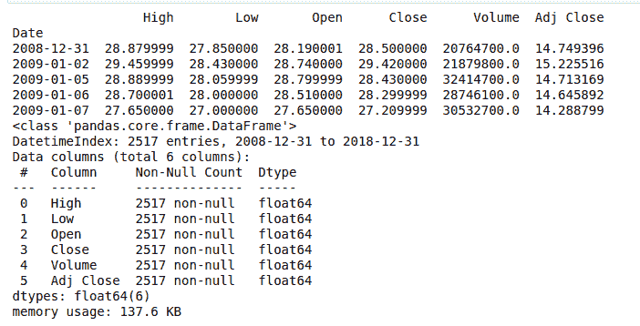
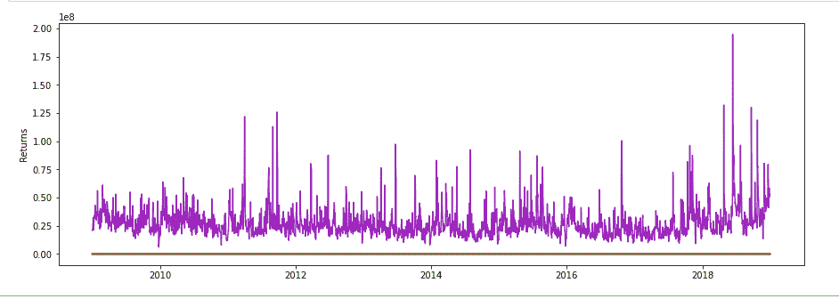

# Python 中 PyFlux 的介绍

> 原文:[https://www . geesforgeks . org/introduction-to-py flux-in-python/](https://www.geeksforgeeks.org/introduction-to-pyflux-in-python/)

我们都很清楚 Python 提供的各种类型的库。我们将告诉你一个这样的库，叫做 **PyFlux** 。机器学习领域中最常遇到的问题是时间序列分析。

PyFlux 是 Python 中的一个开源库，它是为处理统计问题而显式构建的。该图书馆有大量最新的统计模型。PyFlux 还使用户能够使用概率方法，优点是它给出了更完整的不确定性图像，这对预测等时间序列任务很重要。

### **安装**

Python 3.5 支持最新版本的 PyFlux。

```
pip install pyflux

```

### **应用界面**

PyFlux 应用编程接口非常简洁，只需最少的步骤就可以完成模型构建过程。

**例 1:时间序列入门**

## 蟒蛇 3

```
import pandas as pd
import datetime
from pandas import Series, DataFrame
import pandas_datareader
import pandas_datareader.data as web
import pyflux as pf
import matplotlib.pyplot as plt

pandas_datareader.__version__

start = datetime.datetime(2009, 1, 1)
end = datetime.datetime(2019, 1, 1)
df = web.DataReader('T', "yahoo", start, end)

print(df.head())
df.info()
```

**输出:**



**示例 2:可视化数据**

## 蟒蛇 3

```
plt.figure(figsize=(15, 5))
plt.ylabel("Returns")
plt.plot(df)
plt.show()
```

**输出:**

