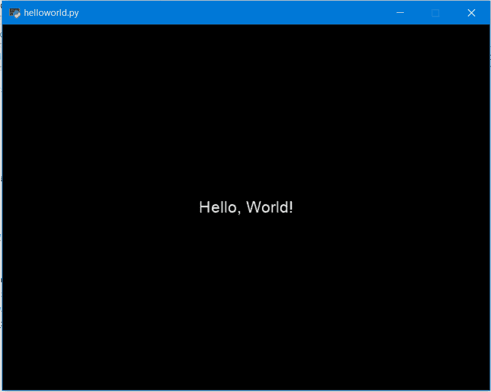

# Python 游戏开发 pyglet 库介绍

> 原文:[https://www . geeksforgeeks . org/introduction-to-pyglet-library-for-game-development-in-python/](https://www.geeksforgeeks.org/introduction-to-pyglet-library-for-game-development-in-python/)

**Pyglet** 是一个易于使用但功能强大的库，用于在 Windows、Mac OS 和 Linux 上开发视觉丰富的 GUI 应用程序，如游戏、多媒体等。这个库完全是用 Python 创建的，它支持许多功能，如窗口、用户界面事件处理、操纵杆、OpenGL 图形、加载图像和视频以及播放声音和音乐。`pyglet`是在 BSD 开源许可下提供的，允许你在很少限制的情况下将其用于商业和其他开源项目。

#### 特征

*   **无外部依赖或安装要求:**对于大多数应用程序的开发，pyglet 不需要任何外部库或软件包安装，这有助于简化分发和安装
*   **利用多窗口和多显示器桌面:**有时多显示器桌面设置用于游戏开发，pyglet 的设计方式让您可以根据需要使用任意多个窗口，并允许全屏游戏和应用程序在多个屏幕上运行。
*   **加载几乎任何格式的图像、声音、音乐和视频**
*   **pyglet 是在 BSD 开源许可**下提供的，允许你在很少限制的情况下将其用于商业和其他开源项目。
*   它支持 Python 2 和 Python 3 的开发

#### 装置

由于 pyglet 完全是用 Python 创建的，因此安装时不需要执行特殊任务。pyglet 可以通过多种方式安装，最基本的安装需要在终端中键入以下命令:

```py
pip install pyglet
```

**示例:**

```py
import pyglet

new_window = pyglet.window.Window()

label = pyglet.text.Label('Hello, World !',
                          font_name ='Cooper',
                          font_size = 16,
                          x = new_window.width//2, 
                          y = new_window.height//2,
                          anchor_x ='center', 
                          anchor_y ='center')

@new_window.event
def on_draw():
    new_window.clear()
    label.draw()

pyglet.app.run()
```

**输出:**



#### 说明

1.  通过导入库开始程序:

    ```py
     import pyglet 
    ```

2.  使用默认构造函数，我们可以创建显示应用内容的窗口:

    ```py
     new_window = pyglet.window.Window() 
    ```

3.  标签被创建来显示文本你好，世界！:

    ```py
    label = pyglet.text.Label('Hello, World !',
                              font_name ='Cooper',
                              font_size = 16,
                              x = new_window.width//2, 
                              y = new_window.height//2,
                              anchor_x ='center', 
                              anchor_y ='center')

    ```

4.  `on_draw()`事件用于将其内容绘制到窗口上。pyglet 库提供了几种将事件处理程序附加到对象的方法；一个简单的方法是使用装饰器:

    ```py
    @new_window.event
    def on_draw():
        new_window.clear()
        label.draw()

    ```

5.  最后，为了运行应用程序，在源代码的末尾添加了下面一行:

    ```py
    pyglet.app.run()

    ```