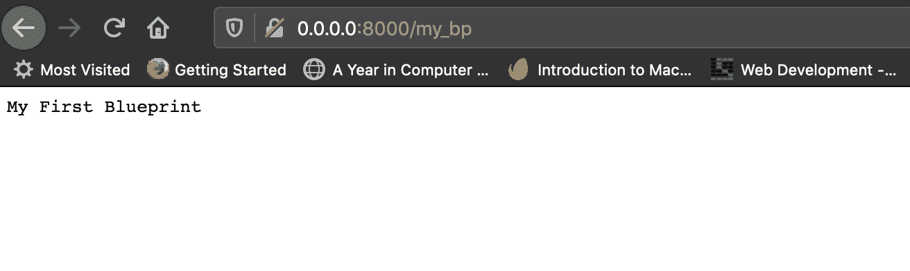
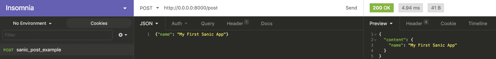
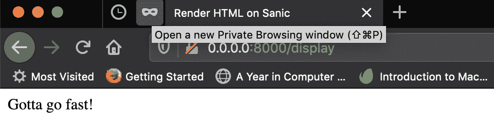
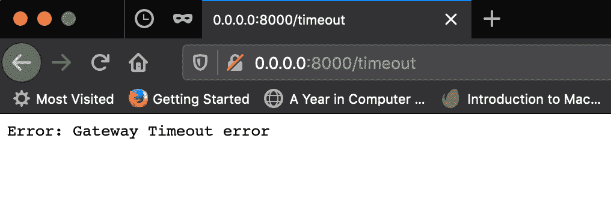

# Sanic Web 框架介绍——Python

> 原文:[https://www . geesforgeks . org/introduction-to-sanic-web-framework-python/](https://www.geeksforgeeks.org/introduction-to-sanic-web-framework-python/)

**什么是 SANIC？**

Sanic 是 Python 3.5+的一个异步 web 框架和 web 服务器，它被编写得非常快。Sanic 是在 MagicStack 开发的，基于他们的 uvloop 事件循环，这是 Python asyncio 默认事件循环的替代，从而让 Sanic 变得极快。句法上类似于烧瓶。
Sanic 可以作为 Django 或 Flask 的替代品，构建高度可扩展、高效且性能极快的 web 应用。

**BUILDING OUR FIRST SANIC APP!**

***第一步:***

最好在 Python 中使用虚拟环境来创建具有特定于项目的依赖关系的隔离环境。由于 Sanic 19.6+版本不支持 Python 3.5，我们将使用 Python 3.6+。
要在 Python 虚拟环境中安装 sanic，我们将执行以下命令–*pip 3 安装 sanic*

***第二步:***

让我们创建一个名为 *sanic_demo* &的目录，在其中创建一个名为 *main.py* 的文件，代码如下–

```
from sanic import Sanic
from sanic import response

app = Sanic("My First Sanic App")

# webapp path defined used route decorator
@app.route("/")
def run(request):
    return response.text("Hello World !")

# debug logs enabled with debug = True
app.run(host ="0.0.0.0", port = 8000, debug = True)
```

***第三步:***

我们可以从 IDE 运行 *main.py* ，或者通过执行以下命令从终端运行文件–*python 3 main . py*

Sanic 网络服务器位于我们的“本地主机”的 8000 端口上。


***第四步:***

从我们的网络浏览器导航到 **http://0.0.0.0:8000/** 呈现“你好世界！”。


**配置**

Sanic app 对象的*配置*属性用于配置参数。应用程序配置对象可以按如下方式分配键值对:

```
from sanic import Sanic
from sanic import response

app = Sanic("My First Sanic App")

app.config["SECURITY_TOKEN"] = [{"ApiKeyAuth": []}]
```

配置参数的完整列表可在官方文档页面–[Sanic Config](https://sanic.readthedocs.io/en/latest/sanic/config.html)获得

**路线和蓝图**

Sanic 支持*路由*装饰器将处理函数映射到 HTTP 请求。我们可以在“路由”装饰器中使用一个名为*方法*的可选参数来处理列表中的任何一个 HTTP 方法。
*蓝图*是一个概念，用于将子路由从大型应用程序的子模块插入到 Sanic 应用程序中。蓝图必须注册到 Sanic 应用程序对象中。使用蓝图还可以避免在整个应用程序中传递 Sanic 应用程序对象。

让我们修改原始的 *main.py* 文件，以演示路线和蓝图的使用–

```
# this is our 'main.py' file
from sanic import Sanic
from sanic import response
from sanic.log import logger
from controller import my_bp

app = Sanic("My First Sanic App")

# registering route defined by blueprint
app.blueprint(my_bp)

# webapp path defined used 'route' decorator
@app.route("/")
def run(request):
    return response.text("Hello World !")

@app.route("/post", methods =['POST'])
def on_post(request):
    try:
        return response.json({"content": request.json})
    except Exception as ex:
        import traceback
        logger.error(f"{traceback.format_exc()}")

app.run(host ="0.0.0.0", port = 8000, debug = True)
```

让我们创建一个名为 *controller.py* 的新文件来声明我们的蓝图–

```
# this is our 'controller.py' file
from sanic import response
from sanic import Blueprint

my_bp = Blueprint('my_blueprint')

@my_bp.route('/my_bp')
def my_bp_func(request):
    return response.text('My First Blueprint')
```

让我们运行 *main.py* 并在访问 */my_bp* 端点时检查结果–



我们使用了一个名为“失眠”的网络客户端来演示我们的开机自检请求–



**渲染内容**

Sanic 路由可以提供 html 文件、json 内容、媒体文件等。为了提供像图像、pdf、静态 html 文件等静态内容，我们需要使用 *app.static()* 方法，该方法将静态文件的路径映射到由“路由”指定的端点。

让我们修改我们的主文件来演示这一点

```
# this is our 'main.py' file
from sanic import Sanic
from sanic import response
from sanic.log import logger
from controller import my_bp

app = Sanic("My First Sanic App")

# registering route defined by blueprint
app.blueprint(my_bp)
# configuring endpoint to serve an image downloaded from the web
app.static('/floral_image.jpg', 
           '/sanic_demo / ws_Beautiful_flowers_1920x1080.jpg')

# webapp path defined used 'route' decorator
@app.route("/")
def run(request):
    return response.text("Hello World !")

@app.route("/post", methods =['POST'])
def on_post(request):
    try:
        return response.json({"content": request.json})
    except Exception as ex:
        import traceback
        logger.error(f"{traceback.format_exc()}")

app.run(host ="0.0.0.0", port = 8000, debug = True)
```

运行 *main.py* 并访问*http://0 . 0 . 0 . 0:8000/flower _ image . jpg*在浏览器上渲染图像。


让我们进一步修改 *main.py* 来访问一些 html 内容–

让我们创建一个样本*index.html*文件–

```
<html>
<!DOCTYPE html>
<html lang="en">
<head>
    <meta charset="UTF-8">
    <title>Render HTML on Sanic</title>
</head>

<body>
Gotta go fast!
</body>
</html>
```

```
# this is our 'main.py' file
from sanic import Sanic
from sanic import response
from sanic.log import logger
from controller import my_bp

app = Sanic("My First Sanic App")

app.blueprint(my_bp)  # registering route defined by blueprint

app.static('/floral_image.jpg', 
           '/sanic_demo / ws_Beautiful_flowers_1920x1080.jpg')

# webapp path defined used 'route' decorator
@app.route("/")
def run(request):
    return response.text("Hello World !")

@app.route("/post", methods =['POST'])
def on_post(request):
    try:
        return response.json({"content": request.json})
    except Exception as ex:
        import traceback
        logger.error(f"{traceback.format_exc()}")

@app.route("/display")
def display(request):
    return response.file('/sanic_demo / index.html')

app.run(host ="0.0.0.0", port = 8000, debug = True)
```

运行 *main.py* 并访问*http://0 . 0 . 0 . 0:8000/display*在浏览器上呈现以下内容–



**异常处理**

可以在 Sanic 请求处理程序中显式引发异常。异常将消息作为第一个参数，还可以包含状态代码。@app.exception 装饰器可以用来处理 Sanic 异常。让我们通过调整我们的主文件来演示

```
# this is our 'main.py' file

from sanic import Sanic
from sanic import response
from sanic.log import logger
from controller import my_bp
from sanic.exceptions import ServerError, NotFound

app = Sanic("My First Sanic App")

app.blueprint(my_bp)  # registering route defined by blueprint

app.static('/floral_image.jpg', 
           '/sanic_demo / ws_Beautiful_flowers_1920x1080.jpg')

# raise Exception
@app.route('/timeout')
async def terminate(request):
    raise ServerError("Gateway Timeout error", status_code = 504)

@app.exception(NotFound)
async def ignore_5xx(request, exception):
    return response.text(f"Gateway is always up: {request.url}")

# webapp path defined used 'route' decorator
@app.route("/")
def run(request):
    return response.text("Hello World !")

@app.route("/post", methods =['POST'])
def on_post(request):
    try:
        return response.json({"content": request.json})
    except Exception as ex:
        import traceback
        logger.error(f"{traceback.format_exc()}")

@app.route("/display")
def display(request):
    return response.file('/sanic_demo / index.html')

app.run(host ="0.0.0.0", port = 8000, debug = True)
```

浏览器上呈现异常–



最常用的是 NotFound(当未找到路由的请求处理程序时引发)和 ServerError(由于服务代码问题引发)。

**异步支持**

Web 应用程序的特点是与外部资源对话，如数据库、队列、外部应用程序接口等，以检索处理请求所需的信息。Sanic 是一个 Python 网络框架，其中预先嵌入了 Python 3.5+的 asyncio 库的异步/等待语法，是设计大规模输入/输出绑定项目的理想选择，这些项目可以与许多连接一起工作。这使得 webapp 的请求能够以非阻塞和并发的方式得到处理。
Python 3.5 引入了 asyncio，这是*一个使用异步/等待语法*编写并发代码的库(来源:[https://docs.python.org/3/library/asyncio.html](https://docs.python.org/3/library/asyncio.html))。asyncio 库提供了一个运行异步输入输出功能的事件循环。Sanic 提供对*异步/等待*语法的支持，从而使请求处理无阻塞且超快。将 *async* 关键字添加到请求处理程序函数中，可以使函数异步处理代码，从而利用 Sanic 的性能优势。
代替 asyncio 的事件循环，Sanic 使用 MagicStack 专有的 *uvloop* ，比 asyncio 的事件循环更快，速度极快。但是，在 Windows 操作系统上，由于 Windows 上的 uvloop 问题，Sanic 在兜帽下恢复到 asyncio 的事件循环。

参考:[三安公文](https://sanic.readthedocs.io/en/latest/)。