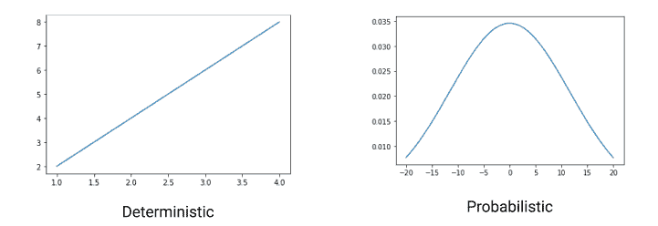
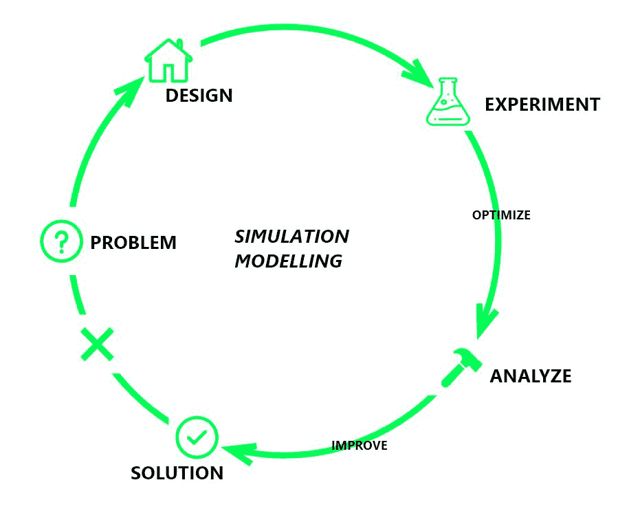
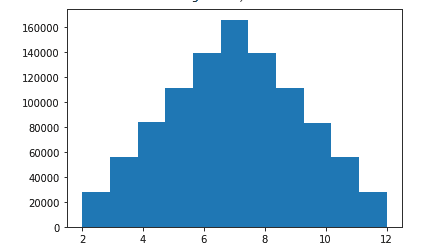

# Python 仿真建模入门

> 原文:[https://www . geesforgeks . org/introduction-to-simulation-modeling-in-python/](https://www.geeksforgeeks.org/introduction-to-simulation-modeling-in-python/)

模拟是模仿系统内发生的操作来研究其行为。分析和创建系统模型以预测其性能被称为仿真建模。

模拟模拟现实生活中的过程，以确定或预测整个系统的反应。这有助于理解系统每个部分的依赖性、它们之间的关系和相互作用。现实生活中的模拟过程可能成本很高。因此，我们建立了一个模型来有效地解决昂贵和复杂的想法。在机构或组织中建立模拟模型可以增加利润。

模型是原始/真实事物的复制品。模型可以是确定性的，也可以是概率性的。确定性模型是一种不涉及任何随机性的模型。对于给定的初始条件，你总是得到相同的最终条件。

概率模型包括元素的随机性。比如:抛硬币，可以是正面也可以是反面。



现在让我们一口气了解仿真模型。

假设你要开一家披萨店，知道需要多少员工才能经营好。不同的披萨需要不同的准备时间。此外，订单不会随着时间的推移而统一到来。你想在保持预算的情况下为他们提供最好的服务。你不能雇佣然后解雇员工来找到设计模拟模型所需的最佳人数。我们可以通过以下方式构建模拟模型来解决上述找到最佳员工数量的问题:

*   **设计:**查看公司提供的各种服务，以及各种工作所需的不同类型的员工。
*   **实验:**工作日、周末和特殊场合顾客到达的趋势，因此需要相应的员工。
*   **优化:**通过查看实验，优化永久雇佣的员工数量。
*   **分析:**如果给那些人就业实惠或者要求员工加班，就能在节日季得到额外的工人。
*   **改进:**进一步减少可视化分析结果的工作量。



模拟模型是在建立新系统或改变现有系统之前建立的，以优化系统的性能并减少失败的机会。当今场景中领先的模拟模型之一是**蒙特卡罗模拟。**

## 蒙特 卡罗模拟

蒙特卡罗模拟是一种数学技术，有助于估计各种事件结果的概率分布。基于这些概率，风险分析团队决定他们是否准备好承担风险。这种技术反复地在最小和最大极限之间取随机数，并预测其结果。通常，采样是大规模进行的，所以我们得到了所有可能的结果。然后，我们绘制了风险分析师用来计算风险概率的概率分布图。

例如，让我们考虑上面的例子，客户的到达可以在特定的范围内变化。我们可以创建一个模型，在最大值和最小值之间拍摄一个随机数，并相应地可视化所需的工人范围。

让我们再举一个简单的例子，通过掷骰子来理解蒙特卡罗模拟。假设我们掷出两个骰子，我们想预测得到和的概率为 12。

下面是实现的 python 代码，为了更好地理解，请添加注释:

## 蟒蛇 3

```
# importing the required libraries
import random
import numpy as np
import matplotlib.pyplot as plt

# function to generate a random number
def roll():
    return random.randint(1, 6)

# rolling dice 1000000 times and 
# storing in list
val = []
for i in range(0, 1000000):
    sum_of_roll = roll()+roll()
    val.append(sum_of_roll)

# plotting the graph
plt.hist(val, bins=11, density=True)
```

**输出:**



从上面的概率分布曲线，我们得到概率值为 0.025，得到一个 12。同样，我们可以应用蒙特卡罗技术来解决各种问题。