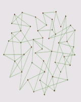
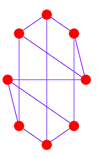

# Python 中使用 NetworkX 的社交网络简介

> 原文:[https://www . geesforgeks . org/简介-社交网络-使用-网络 x-in-python/](https://www.geeksforgeeks.org/introduction-to-social-networks-using-networkx-in-python/)

**先决条件–**[蟒蛇基础知识](https://www.geeksforgeeks.org/python-tutorial/)**T5】**

有没有想过最受欢迎的社交网站脸书是如何运作的？仅仅使用脸书，我们是如何与朋友建立联系的？因此，脸书和其他社交网站开发了一种叫做社交网络的方法。社交网络主要用于所有社交媒体网站，如脸书、Instagram 和 LinkedIn 等。吸引顾客对营销人员来说有着重要的影响。社交网络使用图表来创建网络。他们的节点是人，边缘是他们彼此之间的联系。两个边相连的节点是朋友。现在让我们来看一个理解什么是社交网络的例子。

一个班 50 名学生的网络



50 人的网络

社交网络中最重要的 python 库是 [**Networkx。**T3】](https://www.geeksforgeeks.org/networkx-python-software-package-study-complex-networks/)

## **网络 X**

NetworkX 是一个图形包，用于创建和修改不同类型的图形。它为协作、多学科项目提供了快速开发环境。

#### 安装:

```
pip install networkx
```

启动 python 后，我们必须导入 networkx 模块:

```
import networkx as nx
```

#### 基本的内置图形类型有:

*   **图:**这种类型的图存储节点和边，边是无向的。它可以有自循环，但不能有平行边。
*   **Di-Graph:** 这种类型的图是有向图的基类。它可以有节点和边，边本质上是有方向的。它可以有自循环，但在双向图中不允许有平行边。
*   **多图:**这种类型的图是无向图类，可以存储多条或平行边。它也可以有自循环。多边是两个节点之间的多条边。
*   **多向图:**这种类型的图是可以存储多条边的有向图类。它也可以有自循环。多边是两个节点之间的多条边。

#### 图形创建示例:

## 蟒蛇 3

```
# import networkx library
import networkx as nx

# create an empty undirected graph
G = nx.Graph()

# adding edge in graph G
G.add_edge(1, 2)
G.add_edge(2, 3, weight=0.9)
```

#### 图表绘制:

绘图可以使用 Matplotlib.pyplot 库完成。

## 蟒蛇 3

```
# import matplotlib.pyplot library
import matplotlib.pyplot as plt

# import networkx library
import networkx as nx

# create a cubical empty graph
G = nx.cubical_graph()

# plotting the graph
plt.subplot(122)

# draw a graph with red
# node and value edge color
nx.draw(G, pos = nx.circular_layout(G),
        node_color = 'r',
        edge_color = 'b')
```

**输出:**



圆形图

#### **图形边缘去除:**

要从图形中移除边，请使用图形对象的 **remove_edge()** 方法。

> **语法:** G.remove_edge(u，v)
> 
> **参数:**
> 
> *   **u:** 第一个节点
> *   **v:** 第二节点
> 
> **返回**:无

**图形节点移除:**

要从图形中移除节点，请使用图形对象的 **remove_node()** 方法。

> **语法:** G.remove_node(u)
> 
> **参数:**要移除的节点
> 
> **返回:**无

#### 显示相邻顶点:

## 蟒蛇 3

```
# import networkx library
import netwokx as nx

# create an empty undirected graph
G = nx.Graph()

# add edge to the graph
G.add_edge('1', '2')
G.add_edge('2', '3')

# print the adjacent vertices
print(G.adj)
```

**输出:**

```
{'1': {'2': {}}, '2': {'1': {}, '3': {}}, '3': {'2': {}}}
```