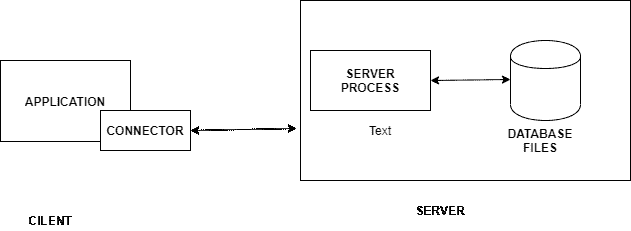
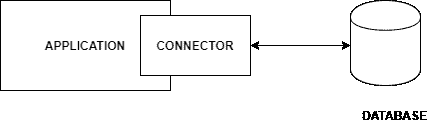
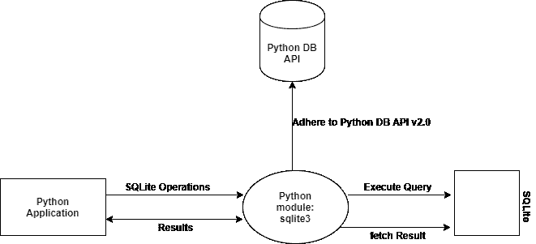

# Python 中 SQLite 的介绍

> 原文:[https://www . geesforgeks . org/introduction-to-SQLite-in-python/](https://www.geeksforgeeks.org/introduction-to-sqlite-in-python/)

数据库提供了许多功能，通过这些功能，人们可以通过网络轻松管理大量信息，并通过文本文件等典型文件输入和输出大量数据。SQL 是一种查询语言，在数据库中非常流行。很多网站都用 MySQL。SQLite 是一个“轻量级”版本，其语法与 SQL 非常相似。

SQLite 是一个独立、高可靠性、嵌入式、全功能、公共域的 SQL 数据库引擎。它是万维网上使用最多的数据库引擎。Python 有一个用来访问 SQLite 数据库的库，名为 sqlite3，用于处理这个自 2.5 版本以来就包含在 Python 包中的数据库。

SQLite 具有以下功能。

1.  无服务器
2.  独立的
3.  零配置
4.  事务性的
5.  单一数据库

### 无服务器

一般是一个 RDBMS，比如 MySQL、PostgreSQL 等。，需要单独的服务器进程来操作。想要访问数据库服务器的应用程序使用 TCP/IP 协议来发送和接收请求，这被称为客户端/服务器架构。

SQLite 不需要运行服务器。SQLite 数据库与访问数据库的应用程序连接在一起。SQLite 数据库直接读写存储在磁盘上的数据库文件，应用程序与该 SQLite 数据库交互。

### 独立的

SQLite 是独立的，这意味着它不需要任何外部依赖，如操作系统或外部库。SQLite 的这一特性尤其有助于 iPhones、安卓手机、游戏机、手持媒体播放器等嵌入式设备。

sqlite 是使用 ANSI-C 开发的，源代码以大的 sqlite3.c 及其头文件 sqlite3.h 的形式提供，如果用户想开发一个使用 SQLite 的应用程序，用户只需要将这些文件拖放到您的项目中，然后用您的代码进行编译。

### 零配置

SQLite 是零配置，意味着不需要设置或管理。由于无服务器架构，在使用之前不需要“安装”SQLite。没有需要配置、启动和停止的服务器进程。

### 事务性的

SQLite 是事务性的，意味着它们是原子的、一致的、隔离的和持久的(ACID)。SQLite 中的所有事务都完全符合 ACID。换句话说，事务中的所有更改都完全发生或根本不发生，即使发生了意外情况，如应用程序崩溃、电源故障或操作系统崩溃。

### 单一数据库

SQLite 是单个数据库，这意味着它允许单个数据库连接同时访问多个数据库文件。这些特性带来了许多很好的特性，比如连接不同数据库中的表，或者在一个命令中在数据库之间复制数据。SQLite 还对表使用动态类型。这意味着您可以在任何列中存储任何值，而不管数据类型如何。

## 对 Python 中 SQLite 模块工作的理解

Python SQLite 用于演示如何使用 SQLite 数据库开发 Python 数据库应用程序。您将从 Python 中学习如何执行 SQLite 数据库操作。SQLite 内置了大多数计算机、移动设备和浏览器。Python 的官方 sqlite3 模块帮助我们使用 sqlite 数据库。

在这个图中，Python sqlite3 模块遵循 Python 数据库应用编程接口规范 v2.0 (PEP 249)。PEP 249 提供了一个 SQL 接口，旨在鼓励和维护用于访问数据库的 Python 模块之间的相似性。