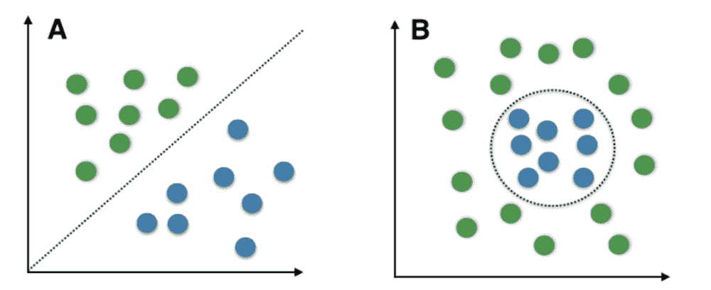
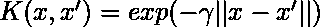

# 支持向量机介绍(SVM)

> 原文:[https://www . geesforgeks . org/支持向量机简介-svm/](https://www.geeksforgeeks.org/introduction-to-support-vector-machines-svm/)

**什么是支持向量机？**
支持向量机(SVM)是一种比较简单的**监督机器学习算法**用于分类和/或回归。它更适合分类，但有时对回归也非常有用。基本上，SVM 找到了一个超平面，在数据类型之间建立了一个边界。在二维空间中，这个超平面只是一条线。
在 SVM，我们在 N 维空间中绘制数据集中的每个数据项，其中 N 是数据中的特征/属性的数量。接下来，找到最佳超平面来分离数据。所以通过这一点，你一定已经明白，从本质上来说，SVM 只能执行二元分类(即在两个类之间进行选择)。然而，有多种技术可用于多类问题。
**多类问题的支持向量机**
为了对多类问题执行 SVM，我们可以为每类数据创建一个二进制分类器。每个分类器的两个结果将是:

*   数据点属于该类或
*   数据点不属于该类。

例如，在一类水果中，为了执行多类分类，我们可以为每个水果创建一个二进制分类器。比如‘芒果’类，会有一个二元分类器来预测它是芒果还是不是芒果。得分最高的分类器被选为 SVM 的输出。

**SVM 对于复(非线性可分)**
SVM 对于线性可分数据没有任何修改的情况下工作得非常好。**线性可分离数据**是任何可以绘制在图表中的数据，并且可以使用直线将其分成类。

a:线性可分数据 B:非线性可分数据

We use **Kernelized SVM** for non-linearly separable data. Say, we have some non-linearly separable data in one dimension. We can transform this data into two-dimensions and the data will become linearly separable in two dimensions. This is done by mapping each 1-D data point to a corresponding 2-D ordered pair.
So for any non-linearly separable data in any dimension, we can just map the data to a higher dimension and then make it linearly separable. This is a very powerful and general transformation.

一个**核**根本不是数据点之间相似性的度量。内核化的 SVM 中的**核函数**告诉你，给定原始特征空间中的两个数据点，新变换的特征空间中的点之间的相似度是多少。

有各种可用的内核函数，但其中有两个非常受欢迎:

*   **径向基函数核(RBF):** 变换特征空间中两点之间的相似度是向量与原始输入空间之间距离的指数衰减函数，如下图所示。径向基函数是 SVM 使用的默认内核。

*   **多项式核:**多项式核采用一个额外的参数“度”，控制模型的复杂性和变换的计算成本

一个非常有趣的事实是，SVM 实际上并不需要对数据点执行这种实际的变换，就可以转换到新的高维特征空间。这就是所谓的**核心绝招**。

**内核技巧:**
在内部，内核化的 SVM 可以仅根据高维特征空间中的点对之间的相似性计算来计算这些复杂的变换，其中变换后的特征表示是隐式的。
这个相似性函数，数学上是一种复点积，实际上是内核化 SVM 的内核。这使得在底层特征空间是复杂的，甚至是无限维的情况下，应用 SVM 是可行的。内核技巧本身相当复杂，超出了本文的范围。
**核化支持向量分类机中的重要参数**

1.  **内核**:内核是根据数据类型和转换类型选择的。默认情况下，内核是径向基函数内核。
2.  **Gamma** :这个参数决定了单个训练示例在变换过程中的影响程度，进而影响了决策边界最终围绕输入空间中的点的紧密程度。如果γ值很小，则相距较远的点被视为相似。因此，更多的点被组合在一起，并具有更平滑的决策边界(可能不太准确)。较大的 gamma 值会使点靠得更近(可能会导致过拟合)。
3.  **“C”参数**:该参数控制应用于数据的正则化量。C 的大值意味着低正则化，这又导致训练数据非常适合(可能导致过拟合)。较低的 C 值意味着较高的正则化，这使得模型对误差的容忍度更高(可能导致较低的精度)。

**内核化 SVM 的优点:**

1.  它们在一系列数据集上表现非常好。
2.  它们是通用的:可以指定不同的内核函数，或者也可以为特定的数据类型定义自定义内核。
3.  它们适用于高维和低维数据。

**内核化 SVM 的缺点:**

1.  效率(运行时间和内存使用)随着训练集大小的增加而降低。
2.  需要对输入数据进行仔细的规范化和参数调整。
3.  不提供直接概率估计。
4.  很难解释为什么会做出预测。

**结论**
现在你已经知道了一个 SVM 是如何工作的基本知识，你可以去下面的链接学习如何使用 Python 实现 SVM 来分类项目:

[https://www . geesforgeks . org/classing-data-use-support-vector-machines-VMs-in-python/](https://www.geeksforgeeks.org/classifying-data-using-support-vector-machinessvms-in-python/)