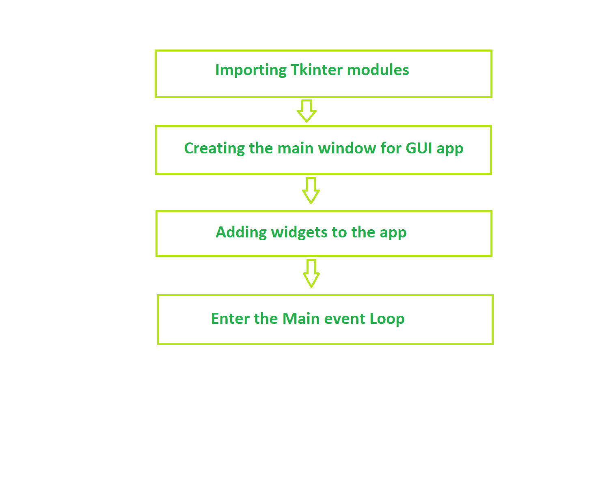
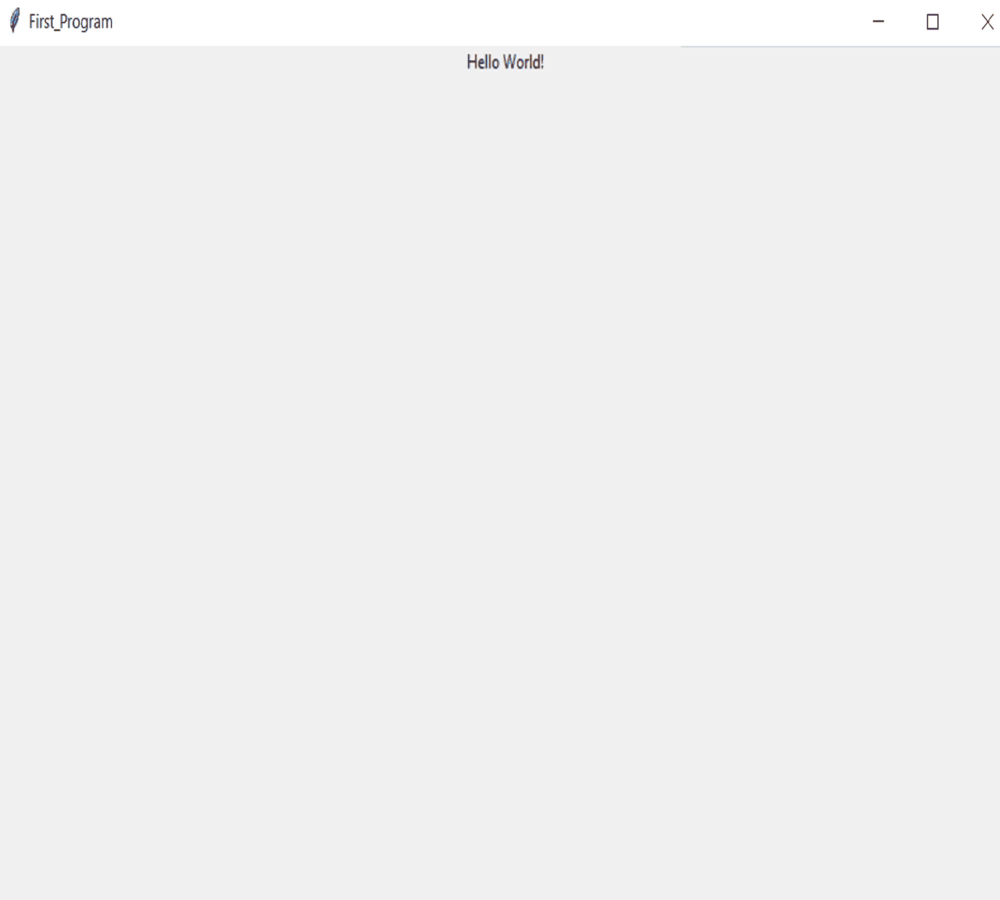

# Tkinter 介绍

> 原文:[https://www.geeksforgeeks.org/introduction-to-tkinter/](https://www.geeksforgeeks.org/introduction-to-tkinter/)

**图形用户界面(GUI)** 是一种用户界面形式，允许用户使用图标、菜单、窗口等项目通过视觉指示器与计算机进行交互。它比命令行界面(CLI)更有优势，在命令行界面中，用户仅使用键盘编写命令来与计算机交互，并且命令行界面的使用比图形用户界面更困难。

## 什么是 Tkinter？

**Tkinter** 是用于创建 GUI 应用程序的内置 python 模块。它是用 Python 创建图形用户界面应用程序最常用的模块之一，因为它简单易用。您不需要担心 Tkinter 模块的单独安装，因为它已经随 Python 一起提供了。它为 Tk GUI 工具包提供了一个面向对象的接口。

其他一些可用于创建我们自己的图形用户界面应用程序的 Python 库有

*   令人 沮丧*   Python Qt*   wxPython

    其中 Tkinter 使用最广泛

    ## 什么是小部件？

    **Tkinter 中的 Widgets** 是 GUI 应用程序的元素，它为用户提供各种控件(如标签、按钮、组合框、复选框、菜单栏、单选按钮等)与应用程序交互。

    **tkinter 程序的基本结构**

    

    **基本 Tkinter 小部件:**

    | 小工具 | 描述 |
    | 标签 | 它用于在屏幕上显示文本或图像 |
    | 纽扣 | 它用于向应用程序添加按钮 |
    | 帆布 | 它用于绘制图片和其他布局，如文本、图形等。 |
    | 组合框 | 它包含一个向下箭头，可从可用选项列表中选择 |
    | 检查按钮 | 它向用户显示许多选项作为切换按钮，用户可以从中选择任何数量的选项。 |
    | 单选按钮 | 它用于实现一对多选择，因为它只允许选择一个选项 |
    | 进入 | 它用于输入用户输入的单行文本 |
    | 基本框架 | 它被用作保存和组织小部件的容器 |
    | 消息 | 它的工作原理与标签相同，并且引用多行和不可编辑的文本 |
    | 规模 | 它用于提供一个图形滑块，允许从该比例中选择任何值 |
    | 卷动条 | 它用于向下滚动内容。它提供了一个滑动控制器。 |
    | 旋转盒 | 它允许用户从给定的一组值中进行选择 |
    | 文本 | 它允许用户编辑多行文本并格式化显示方式 |
    | 菜单 | 它用于创建应用程序使用的各种菜单 |

    **例**

    ```
    from tkinter import * 
    from tkinter.ttk import *

    # writing code needs to
    # create the main window of 
    # the application creating 
    # main window object named root
    root = Tk()

    # giving title to the main window
    root.title("First_Program")

    # Label is what output will be 
    # show on the window
    label = Label(root, text ="Hello World !").pack()

    # calling mainloop method which is used
    # when your application is ready to run
    # and it tells the code to keep displaying 
    root.mainloop()
    ```

    **输出**
    