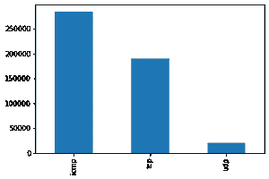
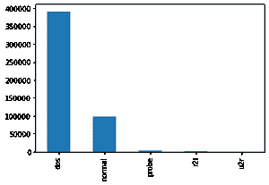
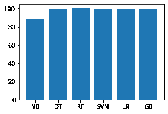
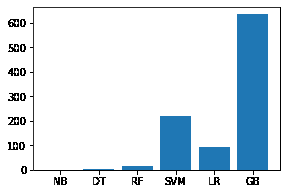
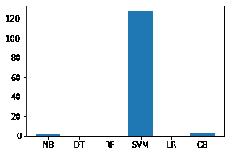

# 使用机器学习算法的入侵检测系统

> 原文:[https://www . geeksforgeeks . org/入侵检测-系统-使用-机器学习-算法/](https://www.geeksforgeeks.org/intrusion-detection-system-using-machine-learning-algorithms/)

**问题陈述:**任务是构建一个网络入侵检测器，一个能够区分**不良**连接(称为**入侵或攻击**)和**良好**正常连接的预测模型。

**简介:**
**入侵检测系统**是利用各种机器学习算法检测网络入侵的软件应用。入侵检测系统监控网络或系统的恶意活动，并保护计算机网络免受用户(可能包括内部人员)的未授权访问。入侵检测器的学习任务是建立一个能够区分“不良连接”(入侵/攻击)和“良好(正常)连接”的预测模型(即分类器)。

Attacks fall into four main categories:

*   #DOS:拒绝服务，例如 syn flood
*   #R2L:来自远程机器的未授权访问，例如猜测密码；
*   #U2R:未经授权访问本地超级用户(root)权限，例如各种“缓冲区溢出”攻击；
*   #探测:监视和另一种探测，例如端口扫描。

**使用的数据集** : [KDD 杯 1999 数据集](http://kdd.ics.uci.edu/databases/kddcup99/kddcup99.html)

**数据集描述:**数据文件:

*   功能列表。
*   kddcup.data.gz:完整的数据集
*   10%的子集。
*   kddcup . new testdata _ 10 _ percent _ unlabled . gz
*   kddcup.testdata.unlabeled.gz
*   kddcup . testdata . unlabled _ 10 _ percent . gz
*   corrected:带有修正标签的测试数据。
*   training _ attack _ types:入侵类型列表。
*   错别字更正:对数据集中已更正的错别字的简要说明

**特征:**

<figure class="table">

| 功能名称 | 描述 | 类型 |
| 期间 | 连接的长度(秒) | 连续的 |
| 协议类型 | 协议的类型，例如 tcp、udp 等。 | 分离的 |
| 服务 | 目的地的网络服务，例如 http、telnet 等。 | 分离的 |
| src_bytes | 从源到目标的数据字节数 | 连续的 |
| dst_bytes | 从目标到源的数据字节数 | 连续的 |
| 旗 | 连接的正常或错误状态 | 分离的 |
| 陆地 | 如果连接来自/去往同一主机/端口，则为 1；否则为 0 | 分离的 |
| 错误的片段 | “错误”片段的数量 | 连续的 |
| 急迫的 | 紧急数据包数量 | 连续的 |

</figure>

表 1:单个 TCP 连接的基本特征。

<figure class="table">

| 功能名称 | 描述 | 类型 |
| 热的 | “热门”指标的数量 | 连续的 |
| 失败的登录次数 | 失败的登录尝试次数 | 连续的 |
| 已登录 | 1 如果成功登录；否则为 0 | 分离的 |
| 数量已泄露 | “妥协”条件的数量 | 连续的 |
| root_shell | 如果获得根壳，则为 1；否则为 0 | 分离的 |
| su _ 尝试 | 1 如果尝试了“su root”命令；否则为 0 | 分离的 |
| num_root | “根”访问次数 | 连续的 |
| 数字 _ 文件 _ 创建 | 文件创建操作的次数 | 连续的 |
| 数字 _ 外壳 | 外壳提示的数量 | 连续的 |
| num _ access _ files | 对访问控制文件的操作数 | 连续的 |
| num_outbound_cmds | ftp 会话中出站命令的数量 | 连续的 |
| is _ hot _ 登录 | 1 如果登录属于“热门”列表；否则为 0 | 分离的 |
| is_guest_login | 1 如果登录是“客人”登录；否则为 0 | 分离的 |

</figure>

表 2:由领域知识建议的连接中的内容特征。

<figure class="table">

| 功能名称 | 描述 | 类型 |
| 数数 | 过去两秒内与当前连接到同一主机的连接数 | 连续的 |
|  | 注意:以下功能指的是这些同主机连接。 |  |
| 错误率 | 有“SYN”错误的连接百分比 | 连续的 |
| 错误率 | 有“REJ”错误的连接百分比 | 连续的 |
| 相同的 _ srv _ 速率 | 同一服务的连接百分比 | 连续的 |
| 差异 _srv_rate | 不同服务的连接百分比 | 连续的 |
| srv _ 计数 | 过去两秒钟内与当前连接相同的服务的连接数 | 连续的 |
|  | 注意:以下功能指的是这些相同服务的连接。 |  |
| srv_serror_rate | 有“SYN”错误的连接百分比 | 连续的 |
| SRV _ re error _ rate | 有“REJ”错误的连接百分比 | 连续的 |
| srv _ diff _ 主机 _ 速率 | 不同主机的连接百分比 | 连续的 |

</figure>

表 3:使用两秒时间窗口计算的交通特征。

**应用的各种算法:**高斯朴素贝叶斯、决策树、随机 Fprest、支持向量机、逻辑回归。

**使用的方法:**我在 KDD 数据集上应用了上面提到的各种分类算法，并比较这些结果来构建预测模型。

**步骤 1–数据预处理:**
 **代码:从‘kddcup . names’文件导入库和读取特征列表。**

```
import os
import pandas as pd
import numpy as np
import matplotlib.pyplot as plt
import seaborn as sns
import time

# reading features list
with open("..\\kddcup.names", 'r') as f:
    print(f.read())
```

**代码:向数据集追加列，并向数据集添加新的列名“target”。**

```

cols ="""duration,
protocol_type,
service,
flag,
src_bytes,
dst_bytes,
land,
wrong_fragment,
urgent,
hot,
num_failed_logins,
logged_in,
num_compromised,
root_shell,
su_attempted,
num_root,
num_file_creations,
num_shells,
num_access_files,
num_outbound_cmds,
is_host_login,
is_guest_login,
count,
srv_count,
serror_rate,
srv_serror_rate,
rerror_rate,
srv_rerror_rate,
same_srv_rate,
diff_srv_rate,
srv_diff_host_rate,
dst_host_count,
dst_host_srv_count,
dst_host_same_srv_rate,
dst_host_diff_srv_rate,
dst_host_same_src_port_rate,
dst_host_srv_diff_host_rate,
dst_host_serror_rate,
dst_host_srv_serror_rate,
dst_host_rerror_rate,
dst_host_srv_rerror_rate"""

columns =[]
for c in cols.split(', '):
    if(c.strip()):
       columns.append(c.strip())

columns.append('target')
print(len(columns))
```

**输出:**

```
42
```

**代码:读取‘攻击类型’文件。**

```

with open("..\\training_attack_types", 'r') as f:
    print(f.read())
```

**输出:**

```
back dos
buffer_overflow u2r
ftp_write r2l
guess_passwd r2l
imap r2l
ipsweep probe
land dos
loadmodule u2r
multihop r2l
neptune dos
nmap probe
perl u2r
phf r2l
pod dos
portsweep probe
rootkit u2r
satan probe
smurf dos
spy r2l
teardrop dos
warezclient r2l
warezmaster r2l
```

**代码:创建攻击类型字典**

```

attacks_types = {
    'normal': 'normal',
'back': 'dos',
'buffer_overflow': 'u2r',
'ftp_write': 'r2l',
'guess_passwd': 'r2l',
'imap': 'r2l',
'ipsweep': 'probe',
'land': 'dos',
'loadmodule': 'u2r',
'multihop': 'r2l',
'neptune': 'dos',
'nmap': 'probe',
'perl': 'u2r',
'phf': 'r2l',
'pod': 'dos',
'portsweep': 'probe',
'rootkit': 'u2r',
'satan': 'probe',
'smurf': 'dos',
'spy': 'r2l',
'teardrop': 'dos',
'warezclient': 'r2l',
'warezmaster': 'r2l',
}
```

**代码:**读取数据集(' kddcup.data_10_percent.gz ')并在训练数据集中添加攻击类型特征，其中攻击类型特征有 5 个不同的值，即 dos、normal、probe、r2l、u2r。

```
path = "..\\kddcup.data_10_percent.gz"
df = pd.read_csv(path, names = columns)

# Adding Attack Type column
df['Attack Type'] = df.target.apply(lambda r:attacks_types[r[:-1]])
df.head()

```

**编码:数据框的形状，获取各特征的数据类型**

```

df.shape
```

**输出:**

```
 (494021, 43)
```

**代码:查找所有特征的缺失值。**

```
df.isnull().sum()
```

**输出:**

```
duration                       0
protocol_type                  0
service                        0
flag                           0
src_bytes                      0
dst_bytes                      0
land                           0
wrong_fragment                 0
urgent                         0
hot                            0
num_failed_logins              0
logged_in                      0
num_compromised                0
root_shell                     0
su_attempted                   0
num_root                       0
num_file_creations             0
num_shells                     0
num_access_files               0
num_outbound_cmds              0
is_host_login                  0
is_guest_login                 0
count                          0
srv_count                      0
serror_rate                    0
srv_serror_rate                0
rerror_rate                    0
srv_rerror_rate                0
same_srv_rate                  0
diff_srv_rate                  0
srv_diff_host_rate             0
dst_host_count                 0
dst_host_srv_count             0
dst_host_same_srv_rate         0
dst_host_diff_srv_rate         0
dst_host_same_src_port_rate    0
dst_host_srv_diff_host_rate    0
dst_host_serror_rate           0
dst_host_srv_serror_rate       0
dst_host_rerror_rate           0
dst_host_srv_rerror_rate       0
target                         0
Attack Type                    0
dtype: int64
```

没有找到丢失的值，因此我们可以进一步进行下一步。

**代码:寻找分类特征**

```
# Finding categorical features
num_cols = df._get_numeric_data().columns

cate_cols = list(set(df.columns)-set(num_cols))
cate_cols.remove('target')
cate_cols.remove('Attack Type')

cate_cols

```

**输出:**

```
 ['service', 'flag', 'protocol_type']
```

**使用条形图**
可视化分类特征

<center>

协议类型:我们注意到，在使用的数据中，ICMP 最多，其次是 TCP 和近 20000 个 UDP 类型的数据包


log in _ in(如果成功登录，则为 1；否则为 0):我们注意到只有 70000 个数据包成功登录。

</center>

**目标特征分布:**

<center>

攻击类型(按攻击分组的攻击类型，这是我们将预测的)

</center>

**代码:数据相关性–使用热图找到高度相关的变量，忽略它们进行分析。**

```

df = df.dropna('columns')# drop columns with NaN

df = df[[col for col in df if df[col].nunique() > 1]]# keep columns where there are more than 1 unique values

corr = df.corr()

plt.figure(figsize =(15, 12))

sns.heatmap(corr)

plt.show()

```

**输出:**


**代码:**

```

# This variable is highly correlated with num_compromised and should be ignored for analysis.
#(Correlation = 0.9938277978738366)
df.drop('num_root', axis = 1, inplace = True)

# This variable is highly correlated with serror_rate and should be ignored for analysis.
#(Correlation = 0.9983615072725952)
df.drop('srv_serror_rate', axis = 1, inplace = True)

# This variable is highly correlated with rerror_rate and should be ignored for analysis.
#(Correlation = 0.9947309539817937)
df.drop('srv_rerror_rate', axis = 1, inplace = True)

# This variable is highly correlated with srv_serror_rate and should be ignored for analysis.
#(Correlation = 0.9993041091850098)
df.drop('dst_host_srv_serror_rate', axis = 1, inplace = True)

# This variable is highly correlated with rerror_rate and should be ignored for analysis.
#(Correlation = 0.9869947924956001)
df.drop('dst_host_serror_rate', axis = 1, inplace = True)

# This variable is highly correlated with srv_rerror_rate and should be ignored for analysis.
#(Correlation = 0.9821663427308375)
df.drop('dst_host_rerror_rate', axis = 1, inplace = True)

# This variable is highly correlated with rerror_rate and should be ignored for analysis.
#(Correlation = 0.9851995540751249)
df.drop('dst_host_srv_rerror_rate', axis = 1, inplace = True)

# This variable is highly correlated with srv_rerror_rate and should be ignored for analysis.
#(Correlation = 0.9865705438845669)
df.drop('dst_host_same_srv_rate', axis = 1, inplace = True)

```

**输出:**

**代码:特征映射–对特征应用特征映射，例如:“protocol _ type”&“flag”。**

```

# protocol_type feature mapping
pmap = {'icmp':0, 'tcp':1, 'udp':2}
df['protocol_type'] = df['protocol_type'].map(pmap)
```

**代码:**

```

# flag feature mapping
fmap = {'SF':0, 'S0':1, 'REJ':2, 'RSTR':3, 'RSTO':4, 'SH':5, 'S1':6, 'S2':7, 'RSTOS0':8, 'S3':9, 'OTH':10}
df['flag'] = df['flag'].map(fmap)

```

**输出:**

**编码:建模前去除‘服务’等无关特征**

```

df.drop('service', axis = 1, inplace = True)
```

**步骤 2–建模**

**代码:导入库并拆分数据集**

```

from sklearn.model_selection import train_test_split
from sklearn.preprocessing import MinMaxScaler

```

**代码:**

```

# Splitting the dataset
df = df.drop(['target', ], axis = 1)
print(df.shape)

# Target variable and train set
y = df[['Attack Type']]
X = df.drop(['Attack Type', ], axis = 1)

sc = MinMaxScaler()
X = sc.fit_transform(X)

# Split test and train data 
X_train, X_test, y_train, y_test = train_test_split(X, y, test_size = 0.33, random_state = 42)
print(X_train.shape, X_test.shape)
print(y_train.shape, y_test.shape)

```

**输出:**

```
(494021, 31)
(330994, 30) (163027, 30)
(330994, 1) (163027, 1)
```

应用各种机器学习分类算法，如支持向量机、随机森林、朴素贝叶斯、决策树、逻辑回归等，创建不同的模型。

**代码:高斯朴素贝叶斯的 Python 实现**

```

# Gaussian Naive Bayes
from sklearn.naive_bayes import GaussianNB
from sklearn.metrics import accuracy_score

clfg = GaussianNB()
start_time = time.time()
clfg.fit(X_train, y_train.values.ravel())
end_time = time.time()
print("Training time: ", end_time-start_time)

```

**输出:**

```
Training time:  1.1145250797271729
```

**代码:**

```

start_time = time.time()
y_test_pred = clfg.predict(X_train)
end_time = time.time()
print("Testing time: ", end_time-start_time)

```

**输出:**

```
Testing time:  1.543299674987793
```

**代码:**

```

print("Train score is:", clfg.score(X_train, y_train))
print("Test score is:", clfg.score(X_test, y_test))

```

**输出:**

```
Train score is: 0.8795114110829804
Test score is: 0.8790384414851528
```

**代码:决策树的 Python 实现**

```

# Decision Tree 
from sklearn.tree import DecisionTreeClassifier

clfd = DecisionTreeClassifier(criterion ="entropy", max_depth = 4)
start_time = time.time()
clfd.fit(X_train, y_train.values.ravel())
end_time = time.time()
print("Training time: ", end_time-start_time)

```

**输出:**

```
 Training time:  2.4408750534057617
```

```

start_time = time.time()
y_test_pred = clfd.predict(X_train)
end_time = time.time()
print("Testing time: ", end_time-start_time)

```

**输出:**

```
Testing time:  0.1487727165222168
```

```

print("Train score is:", clfd.score(X_train, y_train))
print("Test score is:", clfd.score(X_test, y_test))

```

**输出:**

```
Train score is: 0.9905829108684749
Test score is: 0.9905230421954646
```

**代码:随机森林的 Python 代码实现**

```

from sklearn.ensemble import RandomForestClassifier

clfr = RandomForestClassifier(n_estimators = 30)
start_time = time.time()
clfr.fit(X_train, y_train.values.ravel())
end_time = time.time()
print("Training time: ", end_time-start_time)

```

**输出:**

```
 Training time:  17.084914684295654
```

```

start_time = time.time()
y_test_pred = clfr.predict(X_train)
end_time = time.time()
print("Testing time: ", end_time-start_time)

```

**输出:**

```
Testing time:  0.1487727165222168
```

```

print("Train score is:", clfr.score(X_train, y_train))
print("Test score is:", clfr.score(X_test, y_test))

```

**输出:**

```
Train score is: 0.99997583037759
Test score is: 0.9996933023364228
```

**代码:支持向量分类器的 Python 实现**

```

from sklearn.svm import SVC

clfs = SVC(gamma = 'scale')
start_time = time.time()
clfs.fit(X_train, y_train.values.ravel())
end_time = time.time()
print("Training time: ", end_time-start_time)

```

**输出:**

```
Training time:  218.26840996742249
```

**代码:**

```

start_time = time.time()
y_test_pred = clfs.predict(X_train)
end_time = time.time()
print("Testing time: ", end_time-start_time)

```

**输出:**

```
Testing time:  126.5087513923645
```

**代码:**

```

print("Train score is:", clfs.score(X_train, y_train))
print("Test score is:", clfs.score(X_test, y_test))

```

**输出:**

```
Train score is: 0.9987552644458811
Test score is: 0.9987916112055059
```

**代码:逻辑回归的 Python 实现**

```

from sklearn.linear_model import LogisticRegression

clfl = LogisticRegression(max_iter = 1200000)
start_time = time.time()
clfl.fit(X_train, y_train.values.ravel())
end_time = time.time()
print("Training time: ", end_time-start_time)

```

**输出:**

```
Training time:  92.94222283363342
```

**代码:**

```

start_time = time.time()
y_test_pred = clfl.predict(X_train)
end_time = time.time()
print("Testing time: ", end_time-start_time)

```

**输出:**

```
Testing time:  0.09605908393859863
```

**代码:**

```

print("Train score is:", clfl.score(X_train, y_train))
print("Test score is:", clfl.score(X_test, y_test))

```

**输出:**

```
Train score is: 0.9935285835997028
Test score is: 0.9935286792985211
```

**代码:梯度下降的 Python 实现**

```

from sklearn.ensemble import GradientBoostingClassifier

clfg = GradientBoostingClassifier(random_state = 0)
start_time = time.time()
clfg.fit(X_train, y_train.values.ravel())
end_time = time.time()
print("Training time: ", end_time-start_time)

```

**输出:**

```
Training time:  633.2290260791779
```

```

start_time = time.time()
y_test_pred = clfg.predict(X_train)
end_time = time.time()
print("Testing time: ", end_time-start_time)

```

**输出:**

```
Testing time:  2.9503915309906006
```

```

print("Train score is:", clfg.score(X_train, y_train))
print("Test score is:", clfg.score(X_test, y_test))

```

**输出:**

```
Train score is: 0.9979304760811374
Test score is: 0.9977181693829856
```

**代码:分析各模型的训练和测试精度。**

```

names = ['NB', 'DT', 'RF', 'SVM', 'LR', 'GB']
values = [87.951, 99.058, 99.997, 99.875, 99.352, 99.793]
f = plt.figure(figsize =(15, 3), num = 10)
plt.subplot(131)
plt.bar(names, values)
```

**输出:**


**代码:**

```

names = ['NB', 'DT', 'RF', 'SVM', 'LR', 'GB']
values = [87.903, 99.052, 99.969, 99.879, 99.352, 99.771]
f = plt.figure(figsize =(15, 3), num = 10)
plt.subplot(131)
plt.bar(names, values)

```

**输出:**


**代码:分析每个模型的训练和测试时间。**

```

names = ['NB', 'DT', 'RF', 'SVM', 'LR', 'GB']
values = [1.11452, 2.44087, 17.08491, 218.26840, 92.94222, 633.229]
f = plt.figure(figsize =(15, 3), num = 10)
plt.subplot(131)
plt.bar(names, values)

```

**输出:**


**代码:**

```

names = ['NB', 'DT', 'RF', 'SVM', 'LR', 'GB']
values = [1.54329, 0.14877, 0.199471, 126.50875, 0.09605, 2.95039]
f = plt.figure(figsize =(15, 3), num = 10)
plt.subplot(131)
plt.bar(names, values)

```

**输出:**


**实现链接:**

**结论:**以上对不同模型的分析表明，考虑到准确性和时间复杂性，决策树模型最适合我们的数据。

**链接:**完整代码上传到我的 github 账号–[https://github.com/mudgalabhay/intrusion-detection-system](https://github.com/mudgalabhay/intrusion-detection-system)