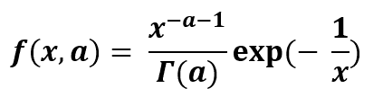

# Python 中的反伽马分布

> 原文:[https://www . geeksforgeeks . org/python 中的逆伽马分布/](https://www.geeksforgeeks.org/inverse-gamma-distribution-in-python/)

**逆伽马分布**是正实线上有两个参数的连续概率分布。它是根据伽玛分布分布的变量的往复分布。作为正态分布未知方差的边际分布，它在贝叶斯统计中非常有用。它用于根据精度考虑正态分布的替代参数，精度实际上是方差的倒数。



## `scipy . stat . inv gamma()：`

`它是一个倒伽马连续随机变量。这是`rv_continuous`类的一个实例。它继承自泛型方法的集合，并将它们与完整的分布规范相结合。`

`**代码#1:创建倒伽马连续随机变量**`

```py
from scipy.stats import invgamma  

numargs = invgamma.numargs
[a] = [0.3] * numargs
rv = invgamma (a)

print ("RV : \n", rv) 
```

`**输出:**`

> `RV:
> scipy . stats . _ distn _ infra structure . RV _ 冻结对象为 0x00000230B0B28748`

 `**代码#2:逆伽马连续变量和概率分布**`

```py
import numpy as np
quantile = np.arange (0.01, 1, 0.1)

# Random Variates
R = invgamma.rvs(a, scale = 2,  size = 10)
print ("Random Variates : \n", R)

# PDF
R = invgamma .pdf(a, quantile, loc = 0, scale = 1)
print ("\nProbability Distribution : \n", R)
```

`**输出:**`

```py
Random Variates : 
 [4.18816252e+00 2.02807957e+03 8.37914946e+01 1.94368997e+00
 3.78345091e+00 1.00496176e+06 3.42396458e+03 3.45520522e+00
 2.81037118e+00 1.72359706e+03]

Probability Distribution : 
 [0.0012104  0.0157619  0.03512042 0.05975504 0.09007126 0.12639944
 0.16898506 0.21798098 0.27344182 0.33532072]
```

 `**代码#3:图形表示。**`

```py
import numpy as np
import matplotlib.pyplot as plt

distribution = np.linspace(0, np.minimum(rv.dist.b, 3))
print("Distribution : \n", distribution)

plot = plt.plot(distribution, rv.pdf(distribution))
```

 `**输出:**`

```py
Distribution : 
 [0\.         0.06122449 0.12244898 0.18367347 0.24489796 0.30612245
 0.36734694 0.42857143 0.48979592 0.55102041 0.6122449  0.67346939
 0.73469388 0.79591837 0.85714286 0.91836735 0.97959184 1.04081633
 1.10204082 1.16326531 1.2244898  1.28571429 1.34693878 1.40816327
 1.46938776 1.53061224 1.59183673 1.65306122 1.71428571 1.7755102
 1.83673469 1.89795918 1.95918367 2.02040816 2.08163265 2.14285714
 2.20408163 2.26530612 2.32653061 2.3877551  2.44897959 2.51020408
 2.57142857 2.63265306 2.69387755 2.75510204 2.81632653 2.87755102
 2.93877551 3\.        ]
```

``

`**代码#4:变化的位置参数**`

```py
import matplotlib.pyplot as plt
import numpy as np

x = np.linspace(0, 5, 100)

# Varying positional arguments
y1 = invgamma .pdf(x, 1, 3)
y2 = invgamma .pdf(x, 1, 4)
plt.plot(x, y1, "*", x, y2, "r--")
```

 `**输出:**
`