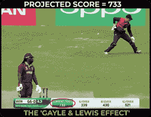
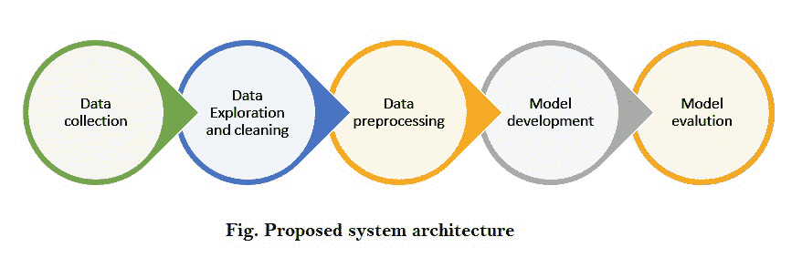
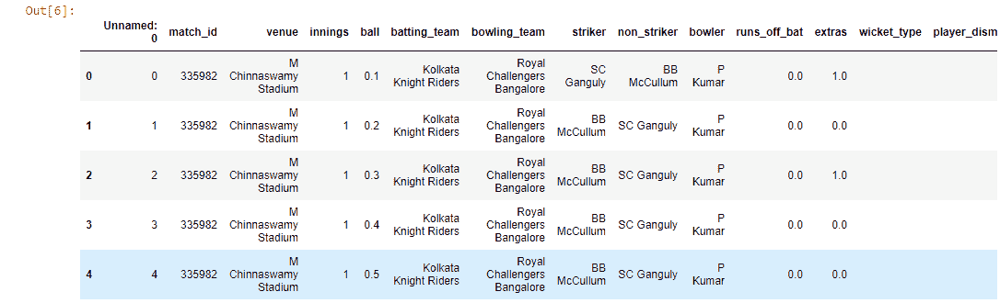
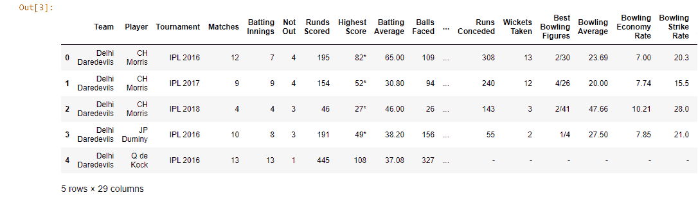
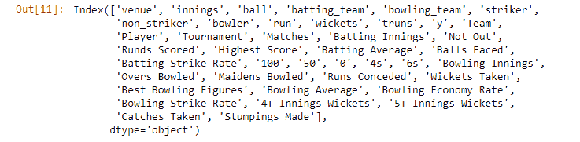

# 使用深度学习预测 IPL 分数

> 原文:[https://www . geesforgeks . org/IPL-score-prediction-use-deep-learning/](https://www.geeksforgeeks.org/ipl-score-prediction-using-deep-learning/)

自 2008 年 IPL 问世以来，它吸引了全球各地的观众。高度的不确定性和最后时刻的紧张刺激了球迷观看比赛。在很短的时间内，IPL 已经成为板球运动中收入最高的联赛。在板球比赛中，我们经常看到根据当前比赛情况显示球队获胜概率的分数线。这种预测通常在数据分析的帮助下完成。在机器学习没有进步之前，预测通常基于直觉或一些基本算法。上图清楚地告诉你，在一场有限回合的板球比赛中，把跑速作为预测最终得分的单一因素有多糟糕。



作为一个板球爱好者，想象板球的统计数据令人着迷。我们浏览了各种博客，发现了可以用来预测 IPL 比赛分数的模式。

### **为什么是深度学习？**

我们人类无法轻易从海量数据中识别模式，因此，机器学习和深度学习开始发挥作用。它学习球员和球队之前如何对抗对方球队，并相应地训练模型。仅使用机器学习算法给出了中等精度，因此我们使用了深度学习，其给出了比我们先前模型好得多的性能，并且考虑了能够给出准确结果的属性。

### **使用的工具:**

*   Jupyter 笔记本电脑/ Google colab
*   可视化工作室

### **使用的技术:**

*   机器学习。
*   深度学习
*   烧瓶(前端集成)。
*   为了项目的顺利进行，我们使用了一些库，比如 NumPy、Pandas、Scikit-learn、TensorFlow 和 Matplotlib。

### **模型的架构**



### **分步实施:**

首先，让我们导入所有必要的库:

## 蟒蛇 3

```
import pandas as pd
import numpy as np
import matplotlib.pyplot as plt
import seaborn as sns
from sklearn import preprocessing
```

**第一步:理解数据集！**

在处理板球数据时，板球数据表被认为是收集数据的合适平台，因此我们从[https://cricsheet.org/downloads/ipl.zip](https://cricsheet.org/downloads/ipl.zip)获取数据。它包含 2007 年至 2021 年的数据。为了提高模型的准确性，我们使用了 IPL 玩家的统计数据来分析他们在[这里](https://data.world/cclayford/cricinfo-statsguru-data/workspace/file?filename=IPL+Player+Stats+-+2016+till+2019.csv)的表现。该数据集包含了 2016-2019 年间每个 IPL 玩家的详细信息。

**第二步:数据清理和格式化**

我们使用*导入了这两个数据集。使用 pandas 将 read_csv()* 方法读入数据帧，并显示每个数据集的前 5 行。我们对数据集做了一些修改，比如增加了一个名为“y”的新列，该列记录了该局前 6 轮的得分。

## 蟒蛇 3

```
ipl = pd.read_csv('ipl_dataset.csv')
ipl.head()
```



## 蟒蛇 3

```
data = pd.read_csv('IPL Player Stats - 2016 till 2019.csv')
data.head()
```



现在，我们将合并这两个数据集。

## 蟒蛇 3

```
ipl= ipl.drop(['Unnamed: 0','extras','match_id', 'runs_off_bat'],axis = 1)
new_ipl = pd.merge(ipl,data,left_on='striker',right_on='Player',how='left')
new_ipl.drop(['wicket_type', 'player_dismissed'],axis=1,inplace=True)
new_ipl.columns
```

合并列并删除新的不需要的列后，我们剩下以下几列。这是修改后的[数据集](https://drive.google.com/file/d/1sFTD243O2eTkLLmlFkYq5eSLRSaM2YDf/view?usp=sharing)。



在我们的数据集中，有多种方法可以填充空值。在这里，我只是简单地用“.”替换了 nan 的分类值

## 蟒蛇 3

```
str_cols = new_ipl.columns[new_ipl.dtypes==object]
new_ipl[str_cols] = new_ipl[str_cols].fillna('.')
```