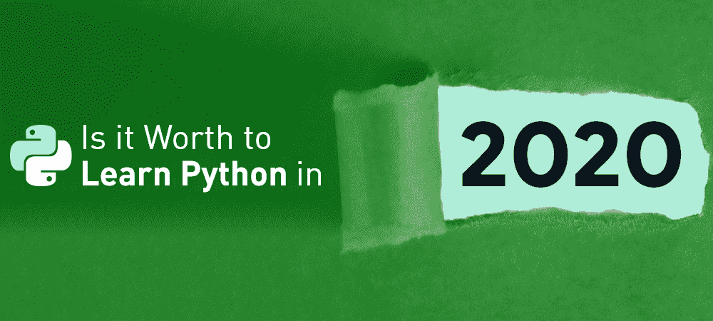

# 2020 年学 Python 值得吗？

> 原文:[https://www . geesforgeks . org/值得学习的 python-in-2020/](https://www.geeksforgeeks.org/is-it-worth-to-learn-python-in-2020/)

索隐&报道揭示 [巨蟒](https://www.geeksforgeeks.org/python-programming-language/) 是 21 世纪最受青睐的语言之一。它背后的原因是它的简单性、庞大的社区和简单的内置功能，有助于轻松学习曲线。虽然这个问题取决于谁在问，但对于初学者来说，学习 python 是有意义的，因为它很容易学习。

许多科技巨头公司将转向 Python 作为主要的编程语言，因为它易于实现，并且大型库包的能力已被证明为许多组织节省了资金。我们已经列出了 2020 年你应该了解 Python 的一些要点:

### **1。信息技术行业的高薪待遇**

随着信息技术行业的快速发展，现在与编程语言相关的每一项发展都在行业中占据一席之地。Python 就是这样一种语言。对于市场上的需求来说，它现在是开发人员使用和训练最多的语言。根据目前的研究，Python 开发人员的最高薪资包接近每年 82 到 85 万英镑。

### 2。易于学习和执行的复杂解决方案

Python 是一种高级脚本语言，同样具有解释和交互功能。Python 的设计非常有建设性，可读性很强。它使用英语关键词，使学生更容易学习，而其他语言使用语法、标点符号、大括号等。与其他语言相比，它很少使用句法结构。除了所有这些，python 还是一种开源语言。

在 python 中，你不需要在执行之前编译你的程序，它会在运行时自动处理。Python 是一种面向对象的语言，处理现实世界和对象内的精确代码。

### 3。数据行业的领先语言

学习 Python 是迈向数据产业的第一步。除了 [【机器学习】](https://www.geeksforgeeks.org/machine-learning/)[【数据科学】【ce】](https://www.geeksforgeeks.org/overview-of-data-science/)，以及 [【人工智能】](https://www.geeksforgeeks.org/artificial-intelligence-an-introduction/) 之外，Python 还被用于 IoT(物联网)、Web 开发、游戏开发，以及用于创建 GUI 应用程序。根据最近的研究，超过 85000 个 python 脚本和模块可供用户使用，并且它得到了 PyPI 的支持。

数据科学和机器学习是如今很多开发人员开始学习 python 的一个非常有力的理由。因为在前几年，机器学习和数据科学行业获得了非常高的惊人增长。Python 拥有最好的机器学习和人工智能库集合之一，如 TensorFlow、Pandas、PyTorch、Scikit-Learn、antao、Apache Spark、Keras、NumPy、Seaborn 等。

### **4。多功能性和职业发展**

Python 就是这样一种编程语言，它不局限于某些领域和学科。它被用在不同的领域，包括网络开发、统计学、ML、数据科学和人工智能。它支持各种框架，如 Flask 和 Django，任何人都可以通过它们非常容易地制作网络应用程序。Python 将被证明是最好的选择，因为它不仅可以帮助你非常容易地找到工作，还为我们未来的职业发展和自我成长提供了许多机会。

许多顶级组织都在使用 Python——比如 NASA、谷歌、诺基亚、IBM、雅虎以及更多。看看过去几年的基本工资和最近的工作趋势，我可以肯定地说，Python 将在未来几十年成为一种至关重要的语言。

### 5。应用和工作角色

除了上述提到的所有领域，Python 还被用于科学和数值应用，因为它的健壮特性和库函数和包。它还被用于软件开发、游戏和三维图形、大数据分析、人工智能(针对人工神经网络和美国有线电视新闻网)、计算机视觉、机器人、网络编程，以获得其框架和开源资源。python 的另一个重要特性是网页抓取和抓取。通过非常精通 Python，您可以在未来几天申请软件工程师、高级软件工程师、数据科学家、DevOps 工程师等职位。

### 6。可移植性和可扩展性:

Python 得到了 windows、Linux 等各种操作系统的支持。并且支持 Solaris、play station 等其他平台。它提供了可扩展的属性，帮助开发人员轻松地执行跨语言操作。Python 的可扩展特性允许我们调用 C 和 C++库，并集成 Java。Python 还可以帮助我们自动化无聊和重复的任务。

### 7.支持广泛的应用

python 支持广泛的应用，从文本处理(我们可以在几分钟内编写实用程序，使用 Python 模块拦截 UDP 消息)到万维网，再到游戏开发(Game Development)，也就是 Python 的“自动化”属性。python 最好的一点是它不仅仅局限于一件事。如果在这个现代时代，有人了解 python，并不断用 python 特性和应用程序更新自己，那么在接下来的几年里，随着 python 在这个技术世界中变得疯狂，他肯定会摇滚。

去学习一门新的语言或技术，总会让你担心它的前景，而说到学习一门新的编程语言，就会变得更加复杂。机器学习、深度学习、人工智能是 IT 行业的未来。Python 将是提升你知识水平的一个很好的开始。Python 也是研究目的的首选语言，因此您有很大的空间来进一步发现它的应用和效用。