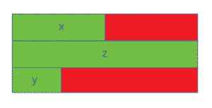
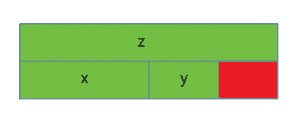

# 结构的 sizeof 是否等于每个成员的 sizeof 之和？

> 原文:[https://www . geesforgeks . org/is-sizeof-for-a-struct-等于每个成员的 sizeof-sum/](https://www.geeksforgeeks.org/is-sizeof-for-a-struct-equal-to-the-sum-of-sizeof-of-each-member/)

**先决条件:**[C 中的 sizeof 运算符](https://www.geeksforgeeks.org/sizeof-operator-c/)
结构的 sizeof 并不总是等于每个成员的 sizeof 之和。这是因为编译器添加了填充来避免对齐问题。只有在结构成员后面跟有更大尺寸的成员时，或者在结构的末尾，才会添加填充。

不同的编译器可能有不同的对齐约束，因为 C 标准规定结构的对齐完全取决于实现。

为了更好地理解，让我们来看看下面的例子:

*   **Case 1:**

    ```
    // C program to illustrate
    // size of struct
    #include <stdio.h>

    int main()
    {

        struct A {

            // sizeof(int) = 4
            int x;
            // Padding of 4 bytes

            // sizeof(double) = 8
            double z;

            // sizeof(short int) = 2
            short int y;
            // Padding of 6 bytes
        };

        printf("Size of struct: %ld", sizeof(struct A));

        return 0;
    }
    ```

    **输出:**

    ```
    Size of struct: 24

    ```

    
    红色部分表示为数据对齐添加的填充，绿色部分表示结构成员。在这种情况下， **x** (int)后面是 **z** (double)，与 **x** 相比尺寸更大。因此在 **x** 后增加了填充。此外，在数据对齐的末尾需要填充。

*   **Case 2:**

    ```
    // C program to illustrate
    // size of struct
    #include <stdio.h>

    int main()
    {

        struct B {
            // sizeof(double) = 8
            double z;

            // sizeof(int) = 4
            int x;

            // sizeof(short int) = 2
            short int y;
            // Padding of 2 bytes
        };

        printf("Size of struct: %ld", sizeof(struct B));

        return 0;
    }
    ```

    **输出:**

    ```
    Size of struct: 16

    ```

    

    在这种情况下，结构的成员按其大小的降序排序。因此，仅在末尾需要填充。

*   **Case 3:**

    ```
    // C program to illustrate
    // size of struct
    #include <stdio.h>

    int main()
    {

        struct C {
            // sizeof(double) = 8
            double z;

            // sizeof(short int) = 2
            short int y;
            // Padding of 2 bytes

            // sizeof(int) = 4
            int x;
        };

        printf("Size of struct: %ld", sizeof(struct C));

        return 0;
    }
    ```

    **输出:**

    ```
    Size of struct: 16

    ```

    
    在这种情况下， **y** (短 int)后跟 **x** (int)，因此在 **y** 后需要填充。在这种情况下，数据对齐不需要在末尾填充。

c 语言不允许编译器对结构成员重新排序以减少填充量。为了最小化填充量，结构成员必须按降序排序(类似于案例 2)。