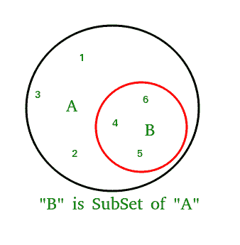

# python 中的 issubset()

> 原文:[https://www.geeksforgeeks.org/issubset-in-python/](https://www.geeksforgeeks.org/issubset-in-python/)

**Python set issubset()方法**如果一个集合 A 的所有元素都存在于作为参数传递的另一个集合 B 中，则返回 True，如果所有元素都不存在，则返回 false。

### **Python 集 issubset()语法:**

```py
A.issubset(B)
checks whether A is a subset of B or not.
```

### Python 集 isubset()返回:

```py
returns true if A is a subset of B otherwise false.
```



## Python 集 issubset() expample

### 示例 Python 集 issubset()是如何工作的

## 计算机编程语言

```py
# Python program to demonstrate working of
# issubset().

A = {4, 1, 3, 5}
B = {6, 0, 4, 1, 5, 0, 3, 5}

# Returns True
print(A.issubset(B))

# Returns False
# B is not subset of A
print(B.issubset(A))
```

**输出:**

```py
True
False
```

### 示例 2:使用 issubset()处理三集

## 计算机编程语言

```py
# Another Python program to demonstrate working
# of issubset().
A = {1, 2, 3}
B = {1, 2, 3, 4, 5}
C = {1, 2, 4, 5}

# Returns True
print(A.issubset(B))

# Returns False
# B is not subset of A
print(B.issubset(A))

# Returns False
print(A.issubset(C))

# Returns True
print(C.issubset(B))
```

**输出:**

```py
True
False
False
True
```