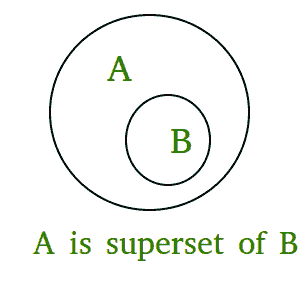

# python 中的 issuperset()

> 原文:[https://www.geeksforgeeks.org/issuperset-in-python/](https://www.geeksforgeeks.org/issuperset-in-python/)

**Python set issuperset()方法**如果集合 A 的所有元素都占据集合 B，则返回 True，集合 B 作为参数传递，如果集合 B 的所有元素都不在集合 A 中，则返回 false，这意味着如果 **A 是集合 B 的超集**，则返回 True；否则就是假的

### **Python** issuperset() **语法:**

```
A.issuperset(B)
checks whether A is a superset of B or not.
```

### **Python**issuperset()**Returns:**

```
True if A is a superset of B; otherwise false.
```



## **Python** issuperset()示例

### 示例 1:使用两套

## 计算机编程语言

```
# Python program to demonstrate working of
# issuperset().

A = {4, 1, 3, 5}
B = {6, 0, 4, 1, 5, 0, 3, 5}

print("A.issuperset(B) : ", A.issuperset(B))

# B is superset of A
print("B.issuperset(A) : ", B.issuperset(A))
```

**输出:**

```
A.issuperset(B) :  False
B.issuperset(A) :  True
```

### **例 2:** 三组 issubset()的工作

## 计算机编程语言

```
# Python program to demonstrate working
# of issuperset().

A = {1, 2, 3}
B = {1, 2, 3, 4, 5}
C = {1, 2, 4, 5}

print("A.issuperset(B) : ", A.issuperset(B))
print("B.issuperset(A) : ", B.issuperset(A))
print("A.issuperset(C) : ", A.issuperset(C))
print("C.issuperset(B) : ", C.issuperset(B))
```

**输出:**

```
A.issuperset(B) :  False
B.issuperset(A) :  True
A.issuperset(C) :  False
C.issuperset(B) :  False
```