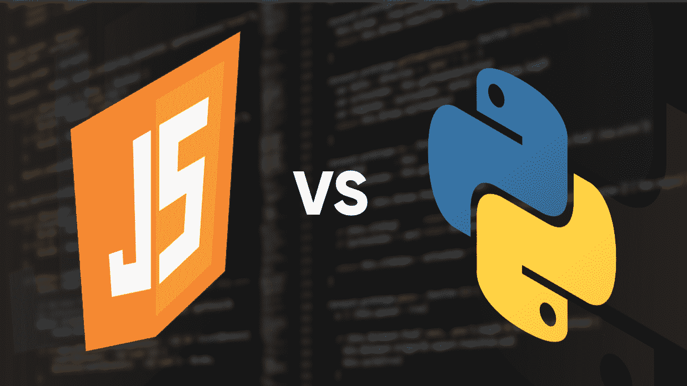
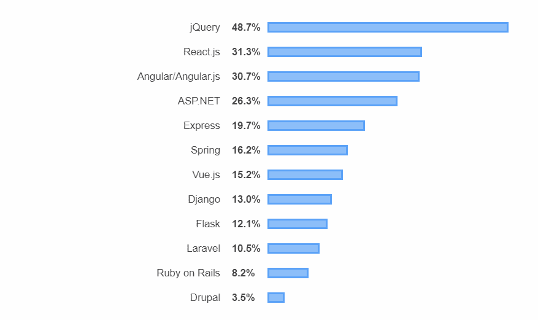
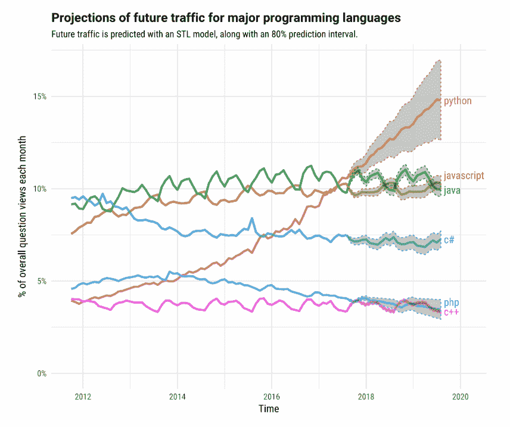

# JavaScript vs Python:到 2020 年 Python 能否超越 JavaScript？

> 原文:[https://www . geesforgeks . org/JavaScript-vs-python-can-python-over VP-JavaScript-by-2020/](https://www.geeksforgeeks.org/javascript-vs-python-can-python-overtop-javascript-by-2020/)

**这是泰坦之战！！**

不…我不是在说好莱坞电影(不用看了…太恐怖了！).我说的是 **JavaScript 和 Python** ，两种当今最流行的编程语言。

JavaScript 是目前最常用的编程语言(并且已经有相当一段时间了！)但现在 Python 给出了一些激烈的竞争。Python 的受欢迎程度一直在稳步增长，以至于它现在是增长最快的编程语言。那么现在的问题是……**Python 会在 2020 年取代 JavaScript 普及吗？**

要正确理解上述问题，重要的是要更多地了解 JavaScript 和 Python 以及它们流行的原因。所以我们先从 JavaScript 开始吧！

### JavaScript 为什么这么受欢迎？

JavaScript 是一种高级的解释编程语言，作为**网页**的脚本语言最受欢迎。这意味着，如果一个网页不只是坐在那里显示静态信息，那么 JavaScript 很可能就在后面。这还不是全部，甚至还有这种语言的高级版本，如用于服务器端脚本的 Node.js。

JavaScript 是一种非常流行的语言。如果我的话不能说服你，事实是这样的！！！

根据 StackOverflow [开发者调查结果 2019](https://insights.stackoverflow.com/survey/2019#technology-_-programming-scripting-and-markup-languages) 显示，JavaScript 是最常用的编程语言，有 69.7 %的专业开发者使用。这是它在过去七年里连续获得的一个头衔。

除此之外，最常用的 [Web 框架](https://insights.stackoverflow.com/survey/2019#technology-_-web-frameworks)是 **jQuery、Angular.js 和 React.js** (都附带使用了 JavaScript)。如果这不能证明 JavaScript 的受欢迎程度，那还有什么呢？！

源图像:Stackoverflow

那么现在问题来了……**为什么 JavaScript 这么受欢迎？**

其中一些原因是:

*   JavaScript 在客户端和服务器端都使用。这意味着从浏览器到功能强大的服务器，它几乎可以在任何地方运行。这使它比其他不那么通用的语言有优势。
*   JavaScript 实现了从 OOP 到过程化的多种范式。这让开发人员可以随心所欲地进行实验。
*   JavaScript 有一大群积极支持该语言的爱好者。如果没有这一点，JavaScript 将很难确立自己的第一地位。

### Python 在流行上能取代 JavaScript 吗？

Python 是一种解释的通用编程语言，有多种用途，从**网络应用到数据分析**。这意味着，在 YouTube 或 Instagram 等复杂网站，在 OpenStack 等云计算项目，在机器学习等，都可以看到 Python。(基本上到处都是！)

根据《2019 年 StackOverflow 开发者调查结果》，Python 的受欢迎程度一直在稳步上升，以至于它成为了当今发展最快的主要编程语言。

这一点在谷歌趋势图中得到了进一步的证明，该图显示了 Python 相对于 JavaScript 在过去 5 年中的增长:

如上述数据所示，与 JavaScript 相比，Python 在 2017 年 11 月左右首次记录了更高的搜索兴趣，此后一直保持领先地位。与 5 年前相比，这显示了 Python 的显著增长。

事实上，Stack Overflow 基于一个名为 **STL** 的模型创建了一个预测其未来流量的模型，你猜怎么着……这个预测是，Python 至少在 2020 年之前有可能在对抗 JavaScript 方面保持领先地位。

源图像:Stackoverflow

所有这些趋势表明 Python 非常受欢迎，并且随着时间的推移变得越来越受欢迎。Python 令人难以置信的性能的一些原因如下:

*   **Python 好用**
    没有人喜欢过于复杂的东西，这也是 Python 越来越受欢迎的原因之一。它简单，语法易读，因此深受经验丰富的开发人员和实验学生的喜爱。除此之外，Python 也非常高效。它允许开发人员用更少的代码完成更多的工作。有了这些优点，还有什么不爱呢？！！
*   **Python 有一个支持社区**
    Python 从 1990 年就已经存在了，这是创建支持社区的充足时间。因为有了这种支持，Python 学习者可以轻松提高知识，这只会导致越来越受欢迎。这还不是全部！网上有许多资源可以推广 Python，从官方文档到对学习者有很大帮助的 YouTube 教程。
*   **Python 有多个库和框架**
    Python 已经相当流行，因此，它有数百个不同的库和框架可供开发人员使用。这些库和框架在节省时间方面非常有用，这反过来又使 Python 更加流行。Python 的一些流行库有:用于科学计算的 NumPy 和 SciPy、用于 web 开发的 Django、用于 XML 和 HTML 解析的 BeautifulSoup、用于机器学习应用程序的 scikit-learn、用于自然语言处理的 nltk 等。

### 那么结论是什么呢？

虽然 JavaScript 是目前最流行的编程语言，但基于其惊人的增长速度，Python 可能很快会超过它。所以 **Python 完全有可能在 2020 年成为最流行的编程语言。**

然而，这只会影响这两种语言的相对流行度，而不会指明哪种语言更好。这种选择完全是主观的，可能取决于多个因素，如项目要求、可扩展性、学习便利性以及未来的增长前景。