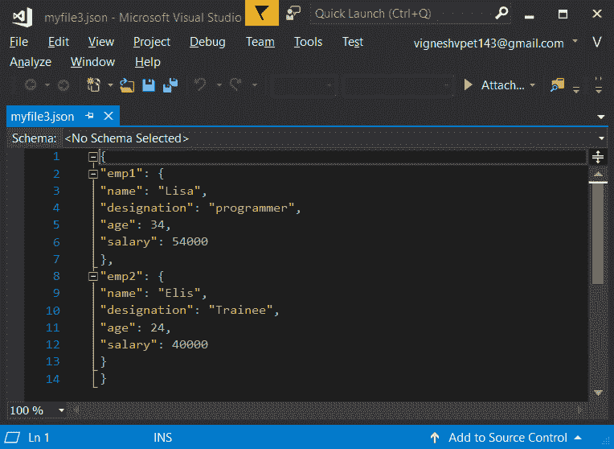
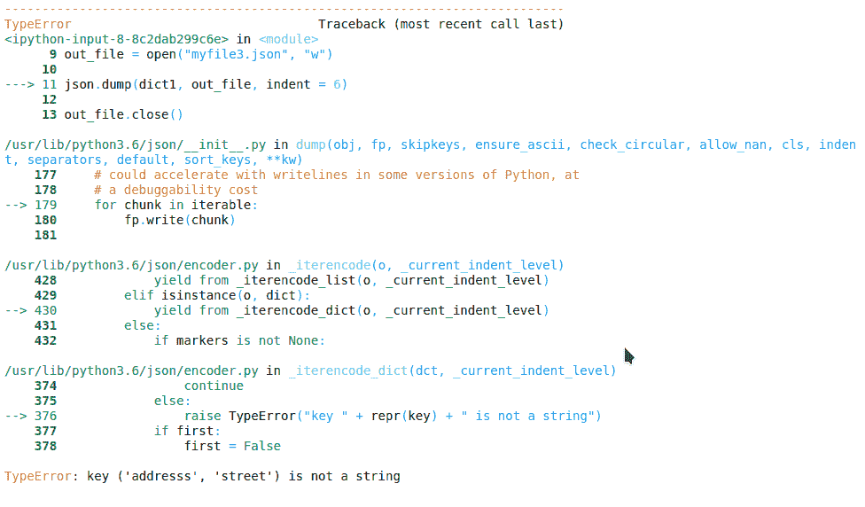
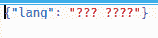
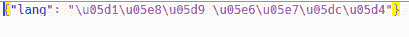
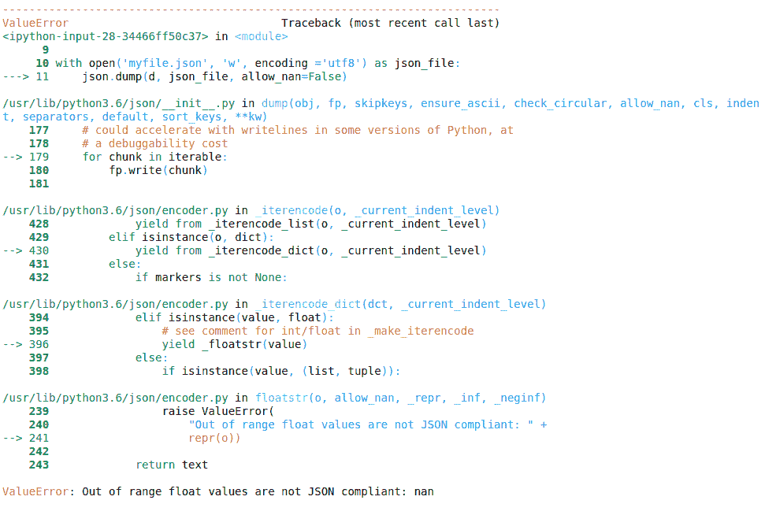
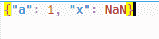

# Python 中的 json.dump()

> 原文:[https://www.geeksforgeeks.org/json-dump-in-python/](https://www.geeksforgeeks.org/json-dump-in-python/)

JSON 的完整形式是 JavaScript 对象符号。这意味着由编程语言中的文本组成的脚本(可执行)文件用于存储和传输数据。Python 通过一个名为`json`的内置包支持 JSON。为了使用这个特性，我们在 Python 脚本中导入 json 包。JSON 中的文本是通过引用字符串完成的，该字符串包含`{ }`内键值映射中的值。它类似于 Python 中的字典。

#### json.dump()

Python 模块中的`json`模块提供了一个名为`dump()`的方法，将 Python 对象转换成合适的 json 对象。这是`dumps()`方法的一个小变种。

#### 转储()和转储()之间的区别

| **垃圾场()** | **转储()** |
| --- | --- |
| 当 Python 对象必须存储在文件中时，使用 dump()方法。 | dumps()用于要求对象为字符串格式的情况，并用于解析、打印等。 |
| dump()需要 json 文件名，输出必须作为参数存储在其中。 | dumps()不需要传递任何这样的文件名。 |
| 此方法在内存中写入，然后单独执行写入磁盘的命令 | 此方法直接写入 json 文件 |
| 更快的方法 | 慢了两倍 |

#### dump()及其参数

> **语法:** json.dump(d，skipkeys=False，确保 _ascii=True，check_circular=True，allow_nan=True，cls =无，缩进=无，分隔符=无)

**参数:**

*   **indent :** It improves the readability of the json file. The possible values that can be passed to this parameter are simply double quotes(`""`), any integer values. Simple double quotes makes every key-value pair appear in new line.

    **示例:**

    ```py
    import json

    # python object(dictionary) to be dumped
    dict1 ={
        "emp1": {
            "name": "Lisa",
            "designation": "programmer",
            "age": "34",
            "salary": "54000"
        },
        "emp2": {
            "name": "Elis",
            "designation": "Trainee",
            "age": "24",
            "salary": "40000"
        },
    }

    # the json file where the output must be stored
    out_file = open("myfile.json", "w")

    json.dump(dict1, out_file, indent = 6)

    out_file.close()
    ```

    **输出:**

    

*   **skipkeys:** If the key is not of standard allowed types like int, float, string, None or bool, error will be generated while dumping them. To avoid that if this parameter is set to **true**.

    **示例:**

    ```py
    import json

    # python object(dictionary) to be dumped
    dict1 ={
        ('addresss', 'street'):'Brigade road',
    }

    # the json file where the output must be stored
    out_file = open("myfile.json", "w")

    json.dump(dict1, out_file, indent = 6)

    out_file.close()
    ```

    **输出:**

    如果 skipkeys 未设置为 true，则将生成以下错误:

    

*   **分隔符:**该参数取一个或两个值。第一个值指定将一个键值对与另一个键值对分开的符号。下一个指定将值与其键分开的符号。
*   **sort_keys:** 该参数取布尔值。如果设置为真，这些键将按升序设置，否则它们将显示在 Python 对象中
*   **ensure_ascii:** This parameter also takes only Boolean values. If it is not set to true the non-ASCII characters are dumped into the output file as it is. By default the value is **true**.

    请参见下面的两个代码以了解不同之处。

    **例 1:**

    ```py
    # dictionary to be dumped
    d ={'lang':'??? ????'}

    with open('myfile.json', 'w', encoding ='utf8') as json_file:
        json.dump(d, json_file, ensure_ascii = False)
    ```

    **输出:**

    

    **例 2:** 如果设置为真，那么 json 文件的内容为:

    ```py
    import json

    # dictionary to be dumped
    d ={'lang':'??? ????'}

    with open('myfile.json', 'w', encoding ='utf8') as json_file:
        json.dump(d, json_file, ensure_ascii = True)
    ```

    **输出:**

    

*   **allow_nan:** It helps to serialize the range of float values.

    **例 1:**

    ```py
    import json

    # dictionary to be dumped
    d ={
        'a':1,
        'x':float('nan')
    }

    with open('myfile.json', 'w', encoding ='utf8') as json_file:
        json.dump(d, json_file, allow_nan=False)
    ```

    **输出:**

    

    **例 2:** 如果设置为真，则不会产生错误。json 文件中的内容将是:

    ```py
    import json

    # dictionary to be dumped
    d ={
        'a':1,
        'x':float('nan')
    }

    with open('myfile.json', 'w', encoding ='utf8') as json_file:
        json.dump(d, json_file, allow_nan=True)
    ```

    **输出:**

    