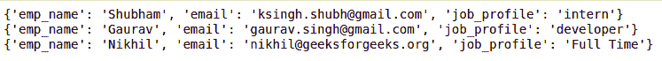

# Python 中的 json.load()

> 原文:[https://www.geeksforgeeks.org/json-load-in-python/](https://www.geeksforgeeks.org/json-load-in-python/)

[JSON](https://www.geeksforgeeks.org/javascript-json/) 的完整形式是 JavaScript 对象符号。这意味着由编程语言中的文本组成的脚本(可执行)文件用于存储和传输数据。Python 通过一个名为`json`的内置包支持 JSON。为了使用这个特性，我们在 Python 脚本中导入 json 包。JSON 中的文本是通过引用字符串完成的，该字符串包含`{ }`内键值映射中的值。它类似于 Python 中的字典。

**注:**更多信息请参考[使用 Python 中的 JSON 数据](https://www.geeksforgeeks.org/working-with-json-data-in-python/)

## json.load()

`json.load()`取一个文件对象，返回 json 对象。一个 **JSON 对象**包含键/值对形式的数据。键是字符串，值是 JSON 类型。键和值用冒号分隔。每个条目(键/值对)由逗号分隔。

**语法:**

```
json.load(file_object)
```

**参数:**以文件对象为参数。

**返回:**返回 json 对象。

**示例:**假设 JSON 是这样的。


我们想阅读这个文件的内容。下面是实现。

```
# Python program to read
# json file

import json

# Opening JSON file
f = open('data.json',)

# returns JSON object as 
# a dictionary
data = json.load(f)

# Iterating through the json
# list
for i in data['emp_details']:
    print(i)

# Closing file
f.close()
```

**输出:**



在这里，我们已经使用`open()`函数读取了 JSON 文件。然后，使用`json.load()`方法解析文件，该方法为我们提供了一个名为 data 的字典。