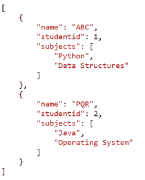

# 使用 Python 进行 JSON 漂亮打印

> 原文:[https://www . geesforgeks . org/JSON-俏丽-打印-使用-python/](https://www.geeksforgeeks.org/json-pretty-print-using-python/)

[JSON](https://www.geeksforgeeks.org/javascript-json/)(JavaScript Object notification)是一种基于文本的数据格式，可与许多编程语言互换。它通常用于客户端-服务器应用程序之间的数据传输。通常，传输 JSON 文本的缩小版本是为了节省带宽。然而，为了调试和分析，需要一个美化的版本或漂亮的 JSON 打印。本质上，漂亮的打印 JSON 意味着有适当的缩进、空格和分隔符。本文探讨了如何使用 Python 漂亮地打印 JSON。

## 方法

Python 有一个名为 json 的内置模块，它允许处理 JSON 数据，下面的步骤给出了如何将它用于输出功能:

*   导入 JSON 包。
*   然后视情况而定-

1.  从 JSON 文件中读取并打印出来，
2.  将漂亮的打印 JSON 写入文件，或者
3.  简单地打印 JSON 字符串数据。

以下是更好地理解这些案例的示例和步骤。

## 漂亮的打印 JSON 字符串

首先，使用 json.loads()方法将 JSON String 转换为 Python 对象。为了将这个对象转换成漂亮的打印 JSON 字符串，使用了 json.dumps()方法。

**语法:**

```py
json.dumps(indent,separator)
```

此方法具有指定空格数的参数缩进和指定键和值之间分隔符的分隔符参数。默认情况下，分隔符是键-值对之间的逗号，以及键和值之间的冒号。如果 json.dumps()的缩进参数是负数、0 或空字符串，则没有缩进，只插入换行符。默认情况下，缩进为“无”，数据以单行表示。

**示例:**

## 蟒蛇 3

```py
# Import required libraries
import json

# Initialize JSON data
json_data = '[ {"studentid": 1, "name": "ABC", "subjects": ["Python", "Data Structures"]}, \
                {"studentid": 2, "name": "PQR", "subjects": ["Java", "Operating System"]} ]'

# Create Python object from JSON string data
obj = json.loads(json_data)

# Pretty Print JSON
json_formatted_str = json.dumps(obj, indent=4)
print(json_formatted_str)
```

**输出:**

```py
[
   {
       "studentid": 1,
       "name": "ABC",
       "subjects": [
           "Python",
           "Data Structures"
       ]
   },
   {
       "studentid": 2,
       "name": "PQR",
       "subjects": [
           "Java",
           "Operating System"
       ]
   }
]
```

## 将漂亮的打印 JSON 数据写入文件

要将 Python 对象作为 JSON 格式的数据写入文件，需要使用 json.dump()方法。像 json.dumps()方法一样，它有缩进和分隔符参数来编写美化的 json。

**示例:**

## 蟒蛇 3

```py
# Import required libraries
import json

data = [{"studentid": 1, "name": "ABC", "subjects": ["Python", "Data Structures"]},
        {"studentid": 2, "name": "PQR", "subjects": ["Java", "Operating System"]}]

# Write pretty print JSON data to file
with open("filename.json", "w") as write_file:
    json.dump(data, write_file, indent=4)
```

**输出:**



filename.json

## 读取 JSON 数据并漂亮地打印出来

要从文件或网址中读取 JSON，请使用 json.load()。然后使用 json.dumps()将对象(从读取文件中获得)转换成漂亮的打印 json 字符串。

**示例:**

## 蟒蛇 3

```py
# Import required libraries
import json

# Read JSON data from file and pretty print it
with open("filename.json", "r") as read_file:
    # Convert JSON file to Python Types
    obj = json.load(read_file)

    # Pretty print JSON data
    pretty_json = json.dumps(obj, indent=4)
    print(pretty_json)
```

**输出:**

```py
[
   {
       "studentid": 1,
       "name": "ABC",
       "subjects": [
           "Python",
           "Data Structures"
       ]
   },
   {
       "studentid": 2,
       "name": "PQR",
       "subjects": [
           "Java",
           "Operating System"
       ]
   }
]
```