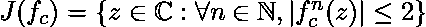
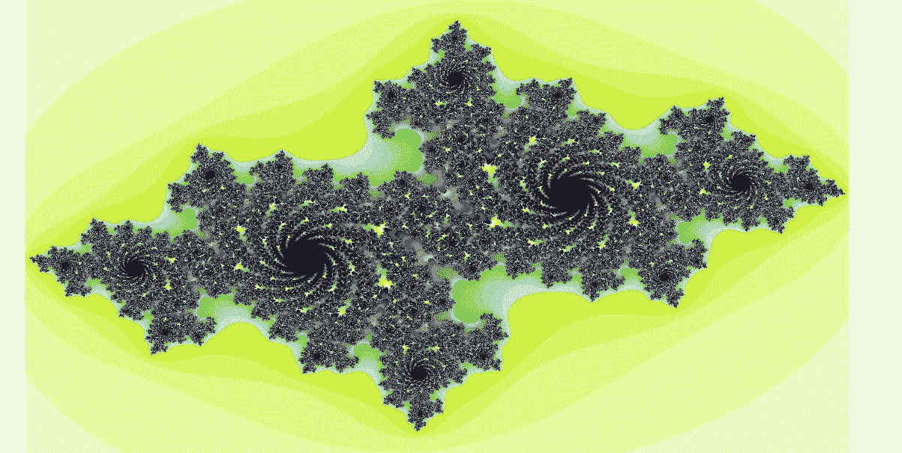

# Python 中的 Julia 分形

> 原文:[https://www.geeksforgeeks.org/julia-fractal-python/](https://www.geeksforgeeks.org/julia-fractal-python/)

**julia 集简介**
在复杂动力学这个数学话题的背景下，Julia 集和法图集是由一个函数定义的两个互补集(Julia‘鞋带’和法图‘灰尘’)。非正式地，函数的法图集由具有如下性质的值组成:在函数的重复迭代下，所有附近的值表现相似，而朱莉娅集由这样的值组成，即任意小的扰动都会导致迭代函数值序列的剧烈变化。因此，函数在法图集上的行为是“规则的”，而在 Julia 集上的行为是“混沌的”。
函数 F 的 Julia 集一般表示为 J(f)，Fatou 集表示为 F(f)。这些集合以法国数学家加斯顿·朱莉娅和皮埃尔·法图的名字命名，他们的工作在 20 世纪初开始了复杂动力学的研究。【来源[维基](https://en.wikipedia.org/wiki/Julia_set)

生成 Julia 分形的方程是:


其中 c 是一个复参数。该系统的 Julia 集是复平面的子集，由下式给出:



现在让我们试着在上面的图像中创建一个分形。

要做到这一点，我们需要 python 的[枕头](https://python-pillow.org/)模块，这使得处理图像和东西变得很容易。

要通过 pip 安装枕头，请在命令提示符下键入以下命令。

```py
pip install Pillow
```

现在使用这个库来创建分形图像。

```py
# Python code for Julia Fractal
from PIL import Image

# driver function
if __name__ == "__main__":

    # setting the width, height and zoom 
    # of the image to be created
    w, h, zoom = 1920,1080,1

    # creating the new image in RGB mode
    bitmap = Image.new("RGB", (w, h), "white")

    # Allocating the storage for the image and
    # loading the pixel data.
    pix = bitmap.load()

    # setting up the variables according to 
    # the equation to  create the fractal
    cX, cY = -0.7, 0.27015
    moveX, moveY = 0.0, 0.0
    maxIter = 255

    for x in range(w):
        for y in range(h):
            zx = 1.5*(x - w/2)/(0.5*zoom*w) + moveX
            zy = 1.0*(y - h/2)/(0.5*zoom*h) + moveY
            i = maxIter
            while zx*zx + zy*zy < 4 and i > 1:
                tmp = zx*zx - zy*zy + cX
                zy,zx = 2.0*zx*zy + cY, tmp
                i -= 1

            # convert byte to RGB (3 bytes), kinda 
            # magic to get nice colors
            pix[x,y] = (i << 21) + (i << 10) + i*8

    # to display the created fractal
    bitmap.show()
```

输出:


更多信息也请参考[数字爱好者](http://numberphile.com)的这段视频。

理解代码后，尝试通过改变变量的值来绘制其他分形，并将 github 链接发布到注释部分的代码中，如果出现任何错误，我很乐意帮助您。

本文由 [**Subhajit Saha**](https://www.linkedin.com/in/subhajit-saha-06aa29131/) 供稿。如果你喜欢 GeeksforGeeks 并想投稿，你也可以使用[contribute.geeksforgeeks.org](http://www.contribute.geeksforgeeks.org)写一篇文章或者把你的文章邮寄到 contribute@geeksforgeeks.org。看到你的文章出现在极客博客主页上，帮助其他极客。

如果你发现任何不正确的地方，或者你想分享更多关于上面讨论的话题的信息，请写评论。