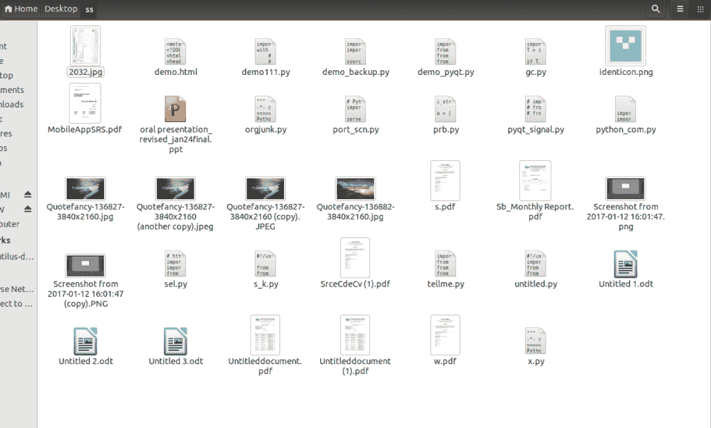
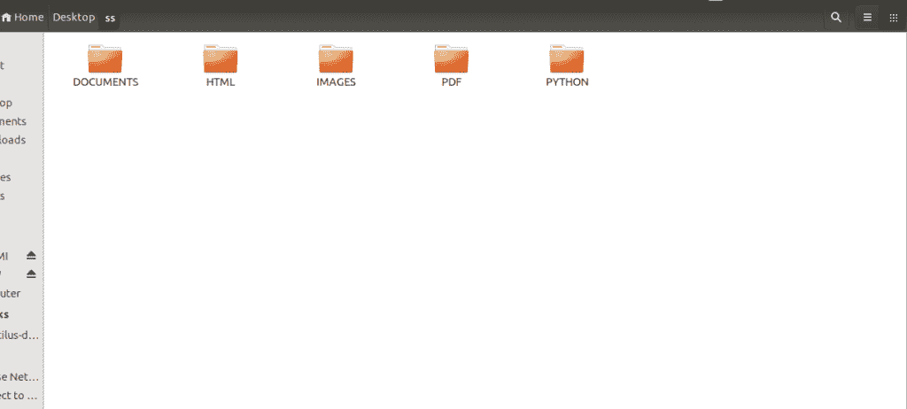

# Python 中的垃圾文件管理器

> 原文:[https://www.geeksforgeeks.org/junk-file-organizer-python/](https://www.geeksforgeeks.org/junk-file-organizer-python/)

基本上，作为一个懒惰的程序员，我的桌面上全是文件(垃圾文件)。由于有大量的文件，要坐下来整理每个文件是一项艰巨的任务。为了使这项任务变得简单，下面的 Python 脚本就派上了用场，所有的文件都在几秒钟内以良好的方式组织起来。

**运行脚本前截图**



以下是需要遵循的步骤:

*   **创建字典:**下面的代码将创建定义的目录。

```
DIRECTORIES = {
    "HTML": [".html5", ".html", ".htm", ".xhtml"],
    "IMAGES": [".jpeg", ".jpg", ".tiff", ".gif", ".bmp", ".png", ".bpg", "svg",
               ".heif", ".psd"],
    "VIDEOS": [".avi", ".flv", ".wmv", ".mov", ".mp4", ".webm", ".vob", ".mng",
               ".qt", ".mpg", ".mpeg", ".3gp"],
    "DOCUMENTS": [".oxps", ".epub", ".pages", ".docx", ".doc", ".fdf", ".ods",
                  ".odt", ".pwi", ".xsn", ".xps", ".dotx", ".docm", ".dox",
                  ".rvg", ".rtf", ".rtfd", ".wpd", ".xls", ".xlsx", ".ppt",
                  "pptx"],
    "ARCHIVES": [".a", ".ar", ".cpio", ".iso", ".tar", ".gz", ".rz", ".7z",
                 ".dmg", ".rar", ".xar", ".zip"],
    "AUDIO": [".aac", ".aa", ".aac", ".dvf", ".m4a", ".m4b", ".m4p", ".mp3",
              ".msv", "ogg", "oga", ".raw", ".vox", ".wav", ".wma"],
    "PLAINTEXT": [".txt", ".in", ".out"],
    "PDF": [".pdf"],
    "PYTHON": [".py"],
    "XML": [".xml"],
    "EXE": [".exe"],
    "SHELL": [".sh"]

}
```

*   **映射:**现在我们将文件格式与目录进行映射。

```
FILE_FORMATS = {file_format: directory
                for directory, file_formats in DIRECTORIES.items()
                for file_format in file_formats}
```

*   这里，我们将文件扩展名与目录进行映射。

```
def organize_junk():
    for entry in os.scandir():
        if entry.is_dir():
            continue
        file_path = Path(entry)
        file_format = file_path.suffix.lower()
        if file_format in FILE_FORMATS:
            directory_path = Path(FILE_FORMATS[file_format])
            directory_path.mkdir(exist_ok=True)
            file_path.rename(directory_path.joinpath(file_path))

        for dir in os.scandir():
            try:
                os.rmdir(dir)
            except:
                pass
```

*   上面的函数将检查与我们定义的名称相同的现有目录。如果找到了现有目录，那么它将继续，否则将创建一个新目录。它会根据相应文件夹中的扩展名对所有文件进行分类。
*   **整理:**下面是 Python 惰性垃圾文件整理器的代码。它将在一次操作中组织适当文件夹中的所有内容，并删除空目录。

## 大蟒

```
import os
from pathlib import Path

DIRECTORIES = {
    "HTML": [".html5", ".html", ".htm", ".xhtml"],
    "IMAGES": [".jpeg", ".jpg", ".tiff", ".gif", ".bmp", ".png", ".bpg", "svg",
               ".heif", ".psd"],
    "VIDEOS": [".avi", ".flv", ".wmv", ".mov", ".mp4", ".webm", ".vob", ".mng",
               ".qt", ".mpg", ".mpeg", ".3gp"],
    "DOCUMENTS": [".oxps", ".epub", ".pages", ".docx", ".doc", ".fdf", ".ods",
                  ".odt", ".pwi", ".xsn", ".xps", ".dotx", ".docm", ".dox",
                  ".rvg", ".rtf", ".rtfd", ".wpd", ".xls", ".xlsx", ".ppt",
                  "pptx"],
    "ARCHIVES": [".a", ".ar", ".cpio", ".iso", ".tar", ".gz", ".rz", ".7z",
                 ".dmg", ".rar", ".xar", ".zip"],
    "AUDIO": [".aac", ".aa", ".aac", ".dvf", ".m4a", ".m4b", ".m4p", ".mp3",
              ".msv", "ogg", "oga", ".raw", ".vox", ".wav", ".wma"],
    "PLAINTEXT": [".txt", ".in", ".out"],
    "PDF": [".pdf"],
    "PYTHON": [".py"],
    "XML": [".xml"],
    "EXE": [".exe"],
    "SHELL": [".sh"]

}

FILE_FORMATS = {file_format: directory
                for directory, file_formats in DIRECTORIES.items()
                for file_format in file_formats}

def organize_junk():
    for entry in os.scandir():
        if entry.is_dir():
            continue
        file_path = Path(entry)
        file_format = file_path.suffix.lower()
        if file_format in FILE_FORMATS:
            directory_path = Path(FILE_FORMATS[file_format])
            directory_path.mkdir(exist_ok=True)
            file_path.rename(directory_path.joinpath(file_path))

        for dir in os.scandir():
            try:
                os.rmdir(dir)
            except:
                pass

if __name__ == "__main__":
    organize_junk()
```

*   将以上脚本保存为 [**或**](https://github.com/srcecde/lazy-junk-organizer) 。例如，您想在桌面上组织文件，然后在桌面上复制并粘贴 org 垃圾副本并运行。



本文由 [**Srce Cde**](https://twitter.com/srcecde) 供稿。如果你喜欢极客博客并想投稿，你也可以用 contribute.geeksforgeeks.org 写一篇文章或者把你的文章邮寄到 contribute@geeksforgeeks.org。看到你的文章出现在极客博客主页上，帮助其他极客。
如果你发现任何不正确的地方，或者你想分享更多关于上面讨论的话题的信息，请写评论。