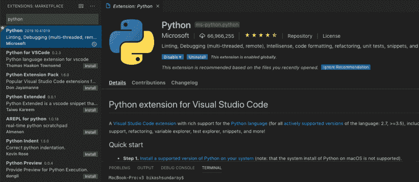

# Visual Studio 代码中的 Jupyter 笔记本扩展

> 原文:[https://www . geesforgeks . org/jupyter-notebook-extension-in-visual studio-code/](https://www.geeksforgeeks.org/jupyter-notebook-extension-in-visual-studio-code/)

在本文中，我们将看到如何在 Visual Studio 代码中使用 Jupyter Notebook。

Jupyter 笔记本已经成为一种流行的 IDE 选择。随着除了 IPython 之外的其他内核的可用性，Jupyter Notebooks 还可以支持 Java、R、Julia 和除 Python 之外的其他流行编程语言。该笔记本集成了 Markdown 文本和可执行源代码的大纲，以支持协作、可扩展和可重复的团队项目。

VS Code 是另一个开源 IDE，它在使用各种编程语言(如 JavaScript、C#和 Python)的开发人员中广受欢迎，并列出了支持的语言。随着更多与代码相关的 VS 插件的开发，这一数字还在继续增长。但是，创建和编辑 Jupyter 笔记本没有本机支持。

一切都变了！随着 VS Code Python 插件在 2019 年的最新发布，VS Code 提供了原生的 Jupyter Notebook 支持，允许我在不运行 Jupyter Notebook 的情况下在笔记本上工作。。在本文中，我们将讨论如何在 VS Code 中使用 Jupyter 笔记本的基础知识。

### **创建 Jupyter 项目笔记本:**

要创建一个新的笔记本，只需转到视图->命令面板(Mac 上的⇧⌘P)。调色板出现后，搜索“Jupyter”，选择“Python:创建空白新 Jupyter 笔记本”选项，将为您创建一个新笔记本。出于本教程的目的，我创建了一个名为 JupyterExample.ipynb 的笔记本，如下所示。

<video class="wp-video-shortcode" id="video-617708-1" width="640" height="360" preload="metadata" controls=""><source type="video/mp4" src="https://media.geeksforgeeks.org/wp-content/uploads/20210605185239/1.mp4?_=1">[https://media.geeksforgeeks.org/wp-content/uploads/20210605185239/1.mp4](https://media.geeksforgeeks.org/wp-content/uploads/20210605185239/1.mp4)</video>

### **插入和删除单元格:**

若要插入单元格，请单击工具栏上的加号或单元格左侧的加号。要删除单元格，请单击单元格右侧的删除符号(即垃圾桶符号)。

<video class="wp-video-shortcode" id="video-617708-2" width="640" height="360" preload="metadata" controls=""><source type="video/mp4" src="https://media.geeksforgeeks.org/wp-content/uploads/20210605185912/2.mp4?_=2">[https://media.geeksforgeeks.org/wp-content/uploads/20210605185912/2.mp4](https://media.geeksforgeeks.org/wp-content/uploads/20210605185912/2.mp4)</video>

### **切换单元格**内容类型**和状态:**

要更改内容类型，请单击单元格中的代码/标记区域。要更改状态，请单击文本输入框以将其置于编辑模式。单击单元格左侧的竖线切换到命令模式。当您单击另一个单元格时，先前选择的单元格将被取消选择。单元格的状态由单元格左侧的竖线指示。

<video class="wp-video-shortcode" id="video-617708-3" width="640" height="360" preload="metadata" controls=""><source type="video/mp4" src="https://media.geeksforgeeks.org/wp-content/uploads/20210605190221/3.mp4?_=3">[https://media.geeksforgeeks.org/wp-content/uploads/20210605190221/3.mp4](https://media.geeksforgeeks.org/wp-content/uploads/20210605190221/3.mp4)</video>

### **命令状态下的快捷键:**

当单元格处于命令状态时，如左侧的蓝色实线所示，可以使用以下快捷方式。

<figure class="table">

| 捷径 | 功能 |
| --- | --- |
| a | 在当前单元格上方插入一个单元格 |
| b | 在当前单元格下方插入一个单元格 |
| 截止日期（Deadline Date 的缩写） | 删除单元格 |
| l | 显示行号 |
| y | 将内容类型设置为代码 |
| m | 将内容类型设置为减价 |

</figure>

### **运行代码单元格:**

要运行代码单元，只需单击代码/标记区域中的三角形符号。要运行笔记本中的所有代码单元格，只需单击顶部工具栏中的双箭头。

<video class="wp-video-shortcode" id="video-617708-4" width="640" height="360" preload="metadata" controls=""><source type="video/mp4" src="https://media.geeksforgeeks.org/wp-content/uploads/20210605190507/4.mp4?_=4">[https://media.geeksforgeeks.org/wp-content/uploads/20210605190507/4.mp4](https://media.geeksforgeeks.org/wp-content/uploads/20210605190507/4.mp4)</video>

虽然上图没有显示，但是工具栏中带上箭头的三角形用于执行当前所在单元格上方的代码单元，带下箭头的三角形用于执行当前包含单元格下方的代码单元。

### **获取变量查看器:**

要查看已声明变量的列表，只需单击工具栏中的变量，就会出现一个显示所有已定义变量的表格。如果您声明一个新的，它将自动包含在表中。

<video class="wp-video-shortcode" id="video-617708-5" width="640" height="360" preload="metadata" controls=""><source type="video/mp4" src="https://media.geeksforgeeks.org/wp-content/uploads/20210605190920/5.mp4?_=5">[https://media.geeksforgeeks.org/wp-content/uploads/20210605190920/5.mp4](https://media.geeksforgeeks.org/wp-content/uploads/20210605190920/5.mp4)</video>

### **获取剧情查看器:**

对于生成的图，我们可以点击图表输出角落的图表图标，如下图所示。

<video class="wp-video-shortcode" id="video-617708-6" width="640" height="360" preload="metadata" controls=""><source type="video/mp4" src="https://media.geeksforgeeks.org/wp-content/uploads/20210605191344/6.mp4?_=6">[https://media.geeksforgeeks.org/wp-content/uploads/20210605191344/6.mp4](https://media.geeksforgeeks.org/wp-content/uploads/20210605191344/6.mp4)</video>

在绘图查看器中，您将在顶部看到一个工具栏，它具有一些常见的功能，例如放大和缩小以及保存图形。

### **保存 jupyter 笔记本:**

您可以使用 Ctrl + S 键盘组合或使用笔记本编辑器工具栏上的保存图标来保存 Jupyter 笔记本。

### **导出 Jupyter 笔记本:**

可以将 Jupyter 笔记本导出为 Python(。py)、PDF 或 HTML 文件。要导出，只需单击主工具栏上的转换图标。接下来，您将看到命令面板文件选项。

