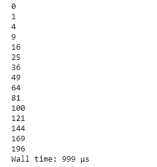
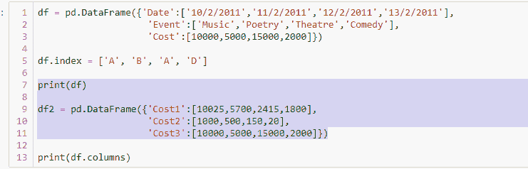
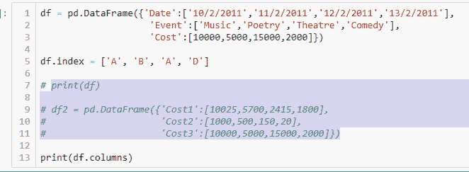

# Jupyter 笔记本提示和技巧

> 原文:[https://www . geesforgeks . org/jupyter-notebook-tips-and-ticks/](https://www.geeksforgeeks.org/jupyter-notebook-tips-and-tricks/)

先决条件:[开始使用 Jupyter 笔记本](https://www.geeksforgeeks.org/getting-started-with-jupyter-notebook-python/)

Python 是进行数据分析的优秀语言，主要是因为以数据为中心的 python 包的奇妙生态系统。让 Python 中的数据分析更加高效和高效的是 Jupyter 笔记本或以前称为 IPython 笔记本。

在这篇文章中，我们将讨论 Jupyter 笔记本的一些优秀特性，这些特性提高了数据分析师的工作效率。Jupyter 笔记本将基于控制台的交互式计算方法扩展到了一个全新的方向，提供了一个基于网络的应用程序，适用于捕获整个计算过程:开发、记录和执行代码，以及交流结果。简而言之，它是一个完整的包。

让我们看看 Jupyter 笔记本的一些功能，它在进行数据分析时非常方便。

### `%%timeit`和`%%time`:

对于数据科学家来说，在进行数据分析时，他们对给定的问题有不止一个解决方案并不罕见。他们想选择在最短的时间内完成任务的最佳方法。Jupyter 笔记本提供了一种非常有效的方法来检查特定代码块的运行时间。

我们可以使用`%%time`命令来检查特定细胞的运行时间。例如，让我们看看执行下面提到的代码所花费的时间。

```py
# For capturing the execution time
%%time 

# Find the squares of a number in the
# range from 0 to 14
for x in range(15):
    square = x**2
    print(square)
```

**输出:**

我们还可以使用命令`%%timeit`多次运行给定的代码片段，以找到该代码片段的平均运行时间。

### 注释/取消注释一段代码:

在处理代码时，我们经常添加新的代码行，并注释掉旧的代码段，以提高性能或调试性能。Jupyter 笔记本提供了一种非常有效的方法来实现这一点。

**注释掉一段代码–**

首先，我们需要选择所有我们想要注释掉的行。


接下来，在 Windows 电脑上，我们需要按下 **`ctrl + /`** 组合键来注释掉代码中高亮显示的部分。

这确实为数据分析师节省了很多时间。

**取消注释注释代码块–**

取消注释一段代码的步骤是相同的。首先，我们突出显示代码的注释区域。

接下来，在 Windows 电脑上，我们需要按下 **`ctrl + /`** 组合键来注释掉代码的高亮部分。
