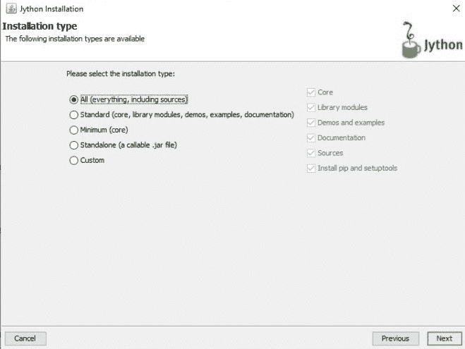
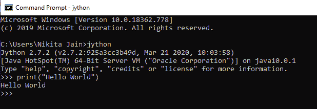
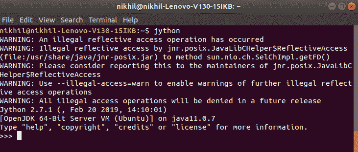

# Jython–介绍和安装

> 原文:[https://www . geesforgeks . org/jython-introduction-and-installation/](https://www.geeksforgeeks.org/jython-introduction-and-installation/)

Java 是一种强大的语言，Python 是一种简单易行的语言，这是不言而喻的。为了将它们结合在一起，引入了 Jython，因此它既强大又简单。是 Python 的纯 Java 实现。它使用 Python 的语法和 Java 的环境。它允许在 Java 环境中使用 Python 的特性，或者在 Python 代码中导入 Java 类，因此非常灵活。Jython 几乎可以在任何平台上运行，这为应用程序部署提供了灵活性，它还为许多库提供了更多的 API。

对于那些用 Java 创建应用程序并且不熟悉 Python 的人来说，这确实是有益的。Python 有三种实现:

*   Cpython(常用)
*   Jython
*   铁皮人

## 安装 Jython

### Windows 操作系统

*   从[www.jython.org](http://www.jython.org)T2T4
    下载你的副本
*   它将被组合成一个跨平台的可执行 JAR 文件
*   如果您的系统中没有安装 Java，您需要获取它的副本。可以从[www.java.com](http://www.java.com)下载安装。
*   双击 JAR 文件，安装“全部”功能
    
*   在安装 jython 的同一文件夹中找到 jython.bat(windows)或 jython.sh(Mac OS)文件
*   将此文件夹放在您的 PATH 环境变量中
*   After all this has done you will be able to open up the command prompt, type `jython` and then hit the “enter” key

    

### Linux 操作系统

要在 Linux 中安装 Jython，请在终端中键入以下命令。

```py
sudo apt install jython
```

输入这个命令后，提供你的 sudo 密码，就这样。剩下的将由 Linux 来处理。安装后，检查 Jython 安装是否正确。查看下图进行检查。

