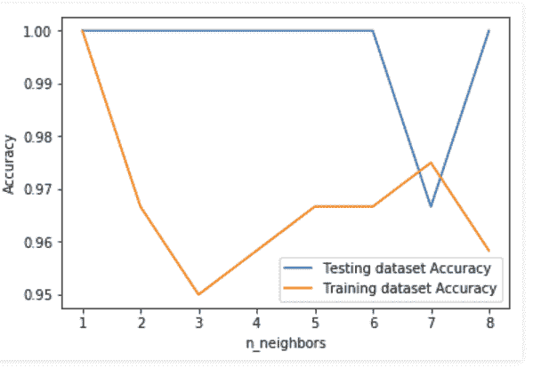

# Python 中的 k 近邻算法

> 原文:[https://www . geesforgeks . org/k-python 中最近邻算法/](https://www.geeksforgeeks.org/k-nearest-neighbor-algorithm-in-python/)

**监督学习:**
是指我们想要预测的值或结果在训练数据(标记数据)内，并且我们想要研究的数据中的值被称为目标或因变量或*响应变量*的学习。

数据集中的所有其他列都称为特征变量、预测变量或自变量。

监督学习分为两类:

1.  **分类**:这里我们的目标变量由类别组成。
2.  **回归**:这里我们的目标变量是连续的，我们通常尝试找出曲线的直线。

正如我们已经理解的那样，为了执行监督学习，我们需要有标签的数据。我们如何获得有标签的数据？有多种方法可以获取标记数据:

1.  历史标记数据
2.  实验获取数据:我们可以像 A/B Testing 一样进行实验来生成标记数据。
3.  众包

现在是时候了解可以用来解决监督机器学习问题的算法了。在这篇文章中，我们将使用流行的 **scikit-learn** 包。

> **注意:**很少有其他包像 TensorFlow、Keras 等一样执行监督学习。

## **k 近邻算法:**

该算法用于解决分类模型问题。K 近邻或 K-NN 算法基本上是创建一个假想的边界来对数据进行分类。当新的数据点进来时，算法将试图预测到最近的边界线。

因此，较大的 k 值意味着扼杀分离曲线，导致模型不太复杂。然而，较小的 k 值往往会过度拟合数据，导致模型复杂。

**注意:**分析数据集时有合适的 k 值非常重要，避免数据集过拟合和欠拟合。

使用 k 近邻算法，我们拟合历史数据(或训练模型)并预测未来。

#### **k-最近邻算法示例**

## 蟒蛇 3

```
# Import necessary modules
from sklearn.neighbors import KNeighborsClassifier
from sklearn.model_selection import train_test_split
from sklearn.datasets import load_iris

# Loading data
irisData = load_iris()

# Create feature and target arrays
X = irisData.data
y = irisData.target

# Split into training and test set
X_train, X_test, y_train, y_test = train_test_split(
             X, y, test_size = 0.2, random_state=42)

knn = KNeighborsClassifier(n_neighbors=7)

knn.fit(X_train, y_train)

# Predict on dataset which model has not seen before
print(knn.predict(X_test))
```

在上面显示的示例中，执行了以下步骤:

1.  k 近邻算法是从 scikit-learn 包中导入的。
2.  创建特征和目标变量。
3.  将数据分为训练数据和测试数据。
4.  使用邻居值生成 k-NN 模型。
5.  将数据训练或拟合到模型中。
6.  预测未来。

我们已经看到了如何使用 K-NN 算法来解决有监督的机器学习问题。但是如何衡量模型的准确性呢？

考虑下面显示的一个例子，其中我们预测了上述模型的性能:

## 蟒蛇 3

```
# Import necessary modules
from sklearn.neighbors import KNeighborsClassifier
from sklearn.model_selection import train_test_split
from sklearn.datasets import load_iris

# Loading data
irisData = load_iris()

# Create feature and target arrays
X = irisData.data
y = irisData.target

# Split into training and test set
X_train, X_test, y_train, y_test = train_test_split(
             X, y, test_size = 0.2, random_state=42)

knn = KNeighborsClassifier(n_neighbors=7)

knn.fit(X_train, y_train)

# Calculate the accuracy of the model
print(knn.score(X_test, y_test))
```

**模型精度:**
目前为止还不错。但是如何为数据集确定正确的 k 值呢？显然，我们需要熟悉数据以获得预期 k 值的范围，但是为了获得准确的 k 值，我们需要为每个预期 k 值测试模型。请参考下面显示的示例。

## 蟒蛇 3

```
# Import necessary modules
from sklearn.neighbors import KNeighborsClassifier
from sklearn.model_selection import train_test_split
from sklearn.datasets import load_iris
import numpy as np
import matplotlib.pyplot as plt

irisData = load_iris()

# Create feature and target arrays
X = irisData.data
y = irisData.target

# Split into training and test set
X_train, X_test, y_train, y_test = train_test_split(
             X, y, test_size = 0.2, random_state=42)

neighbors = np.arange(1, 9)
train_accuracy = np.empty(len(neighbors))
test_accuracy = np.empty(len(neighbors))

# Loop over K values
for i, k in enumerate(neighbors):
    knn = KNeighborsClassifier(n_neighbors=k)
    knn.fit(X_train, y_train)

    # Compute training and test data accuracy
    train_accuracy[i] = knn.score(X_train, y_train)
    test_accuracy[i] = knn.score(X_test, y_test)

# Generate plot
plt.plot(neighbors, test_accuracy, label = 'Testing dataset Accuracy')
plt.plot(neighbors, train_accuracy, label = 'Training dataset Accuracy')

plt.legend()
plt.xlabel('n_neighbors')
plt.ylabel('Accuracy')
plt.show()
```

**输出:**



在上面显示的示例中，我们创建了一个图来查看我们具有高精度的 k 值。

**注意:**这是一种没有在全行业范围内使用的技术，用于选择 n_neighbors 的正确值。相反，我们进行超参数调整来选择提供最佳性能的值。我们将在以后的文章中讨论这个问题。

**总结–**
在这篇帖子中，我们已经了解了什么是监督学习，它的类别是什么。在对监督学习有了基本的了解之后，我们探索了用于解决监督机器学习问题的 k 近邻算法。我们还探索了测量模型的准确性。