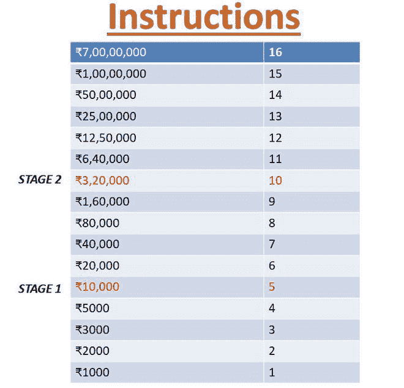

# KBC 游戏使用 Python

> 原文:[https://www.geeksforgeeks.org/kbc-game-using-python/](https://www.geeksforgeeks.org/kbc-game-using-python/)

在本文中，我们将使用 Python 在 CLI(命令行界面)模式下制作一个包含几乎所有功能的 KBC 游戏。

### **游戏特色:**

*   **每次随机**提问
*   **四条生命线**
    *   观众投票
    *   50:50
    *   双蘸
    *   翻转问题
*   借助 python 的 **Matplotlib** 和 **NumPy** 库制作。
*   **观众投票生命线条形图**

### **规则**玩游戏:

*   这个名为**的游戏有**四条生命线**观众投票，50:50，双底，翻转问题。**
*   **2** 阶段在 **₹10,000 和₹3,20,000.**
*   用户**在经历二次探底后无法使用** **另一条生命线** a **。**
*   **生命线**只能**使用一次。**
*   **双蘸后退出选项不可用。**
*   在进行受众调查后，用户还可以采取除二次探底之外的另一条生命线。50:50 和翻转问题也是如此。
*   **用户可以随时**从游戏**中退出**。
*   每个问题后都会显示总的中标价格。
*   如果用户选择了不正确的选项，将根据清除的阶段给出金额。



### 开始:

*   **创建**一个新的 python 文件。
*   制作**问题列表。**
*   还要列出答案、选项、对半选项、选项的观众投票百分比。
*   实现随机功能，这样每次用户玩游戏时，他/她都可以从问题列表中获得新的随机问题。
*   用户回答问题后，确保该问题不会再次出现。为此，请从列表中删除已回答的问题以及该问题中的相关选项。
*   如果用户需要任何帮助，那么他/她可以使用四条生命线中的一条，即观众投票、对半分、双底和翻转问题。
*   当用户给出问题的正确答案时，已回答的问题金额将被添加到总金额中。

### **接近**:

*   在带有选项的列表中添加了一些问题。
*   边循环边运行，检查条件。
    *   如果为真，则继续。之后，用选项向用户显示问题，并要求输入(1、2、3、4 或 9 表示生命线，0 表示退出)。随机功能是用来在用户每次玩游戏的时候洗牌的。
    *   如果用户能够给出正确的答案，那么他可以选择一个选项。如果给出的输入是正确的，那么中奖金额将增加，下一个问题将显示，并且前一个问题将从列表中删除，以避免问题重复。
    *   如果用户的输入不正确，那么他/她将获得总的获胜金额。记住游戏有两个阶段。如果用户给出了错误的答案，那么金额将根据清除的阶段给出。
    *   用户可以随时退出游戏，并给出当前的中奖金额。
    *   如果用户没有选择正确的答案，那么他/她可以采取生命线。

## 蟒蛇 3

```
while(wrong != True):

    ques_no += 1
    ran = random.randint(0, len(questions)-1)
    print("\n\nQ.", ques_no, ":-", end="")
    print(questions[ran])

    for num, option in enumerate(options):
        print(str(num+1)+"."+option[ran])

    print("Would you like to take lifeline, if yes, press 9\n\
    Choose any option:  or you can quit by pressing 0 \t\t")
    give_answer = int(input())

    if give_answer == 9:

      # condition variable is to count lifelines
      # used
      if condition <= 4:

            condition += 1
            great = lifeline(ran, opts, op)

            if great == 0:

                if total_amt < 10000:
                    total_amt = 0
                elif total_amt < 320000:
                    total_amt = 10000
                elif total_amt < 70000000:
                    total_amt = 320000
                break

            elif great == -1:
                ques_no -= 1
                pass

            elif great == None:
                print("Choose any option or press 0 to quit\t")
                give_ansr = int(input())

                if answer[ran] == give_ansr:
                    print("Correct answer, great")
                    correct += 1

            elif great == -2:
                break

            else:
                correct += 1
                print("You have won Rs=", end="")
                total_amt = amount(correct)

        else:
          print("You have used your all lifelines\t\n Choose any option: \
                or you can quit by pressing 0\t\t")

            give_ans = int(input())
            key = answer[ran]

            if give_ans == 0:
                total_amt = amount(correct)
                break

            elif key == give_ans:
                print("Correct, You have won Rs. =", end="")
                correct += 1
                total_amt = amount(correct)

            else:
                print("Wrong Answer....")
                print("Correct Answer is : ", options[answer[ran]-1][ran])

                if total_amt < 10000:
                    total_amt = 0
                elif total_amt < 320000:
                    total_amt = 10000
                elif total_amt < 70000000:
                    total_amt = 32000

                wrong = True
    else:
        key = answer[ran]

        if give_answer == 0:
            if correct != 0:
                total_amt = amount(correct)
            break

        elif key == give_answer:
            print("Correct answer.., You have won Rs.=", end="")
            correct += 1
            total_amt = amount(correct)

        else:
            print("Wrong Answer...Better luck next time...")
            print("Correct Answer is :", options[answer[ran]-1][ran])

            if total_amt < 10000:
                total_amt = 0
            elif total_amt < 320000:
                total_amt = 10000
            elif total_amt < 70000000:
                total_amt = 320000
            wrong = True

    # total questions are 16
    if correct == 16:
        break

    # delete previous question and its options from list
    del questions[ran]
    del option1[ran]
    del option2[ran]
    del option3[ran]
    del option4[ran]
    del answer[ran]
    del opts[0][ran]
    del opts[1][ran]
    del opts[2][ran]
    del opts[3][ran]
    del op[0][ran]
    del op[1][ran]
    del op[2][ran]
    del op[3][ran]
    options = [option1, option2, option3, option4]

print("Your winning amount is Rs. ", total_amt)
```

*   **观众投票**生命线:
    *   该图将显示分配给所有选项的正确百分比。[例如:甲- 32%，乙- 56%，丙-2%，丁-10%]。
    *   用户可以选择正确的答案，也可以选择另一条生命线。

## 蟒蛇 3

```
def audience(ran, opts):

    # graphical audience poll using pandas
    print("According to audience\n")

    s = pd.Series([opt1[ran], opt2[ran], opt3[ran], opt4[ran]],
                  index=['1', '2', '3', '4'])

    s.plot.bar(figsize=(20, 10))
    plt.xlabel('Options')
    plt.ylabel('%')
    plt.title("Audience Poll")
    plt.show()

    print('1.', opts[0][ran], "%", '\t', '2.', opts[1][ran],
          "%", '\t', '3.',opts[2][ran], "%", '\t', '4.',
          opts[3][ran], "%", '\nenter your choice\t')

    print("Would you like to take lifeline again,if yes then\
    press 9 or Press 0 to Quit\t")

    choice = int(input())

    if choice == 9:
        great = lifeline(ran, opts, op)
        return great
    elif choice == answer[ran]:
        great = 1
        print("Correct answer,well done!..")
    elif choice == 0:
        great = -2
    else:
        great = 0
        print("Incorrect")
        print("Correct Answer is :", options[answer[ran]-1][ran])

    return great
```

*   **五十**:
    *   两个不正确的选项将被删除。
    *   用户可以选择正确的答案，也可以选择另一条生命线。

## 蟒蛇 3

```
def fifty(ran, op):
    print("Q."+questions[ran])

    for num, option in enumerate(op):
        print(str(num+1)+"."+option[ran])

    choice_fifty = int(input("enter your choice \t"))

    if choice_fifty == answer[ran]:
        print("Correct Answer.....")
        great = 1
    else:
        great = 0
        print("wrong answer")
        print("Correct Answer is :", options[answer[ran]-1][ran])

    return great
```

*   **二次探底:**
    *   用户将有两次机会选择正确的选项。请记住，在进行双蘸之后，用户将无法使用任何其他生命线。他/她可以选择正确的选项，也可以退出游戏。

## 蟒蛇 3

```
def doubleDip(ran):

    # double dip gives 2 chances
    print("Select two options\n")
    trial1 = int(input())

    if answer[ran] == trial1:
        great = 1
        print("Correct Answer,well done....")
    else:
        print("Your first trial is wrong, choose another\t")
        trial2 = int(input())

        if answer[ran] == trial2:
            great = 1
            print("Correct Answer\t")
        else:
            print("Your second trial is also wrong..Better luck next time..\t")
            print("Correct Answer is :", options[answer[ran]-1][ran])
            great = 0

    return great
```