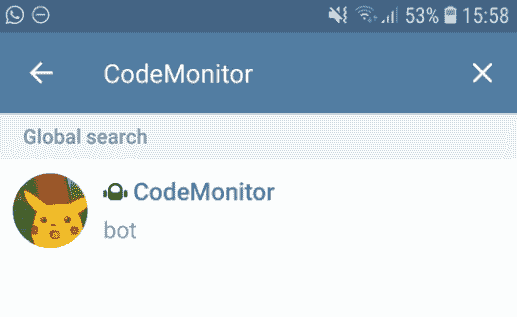
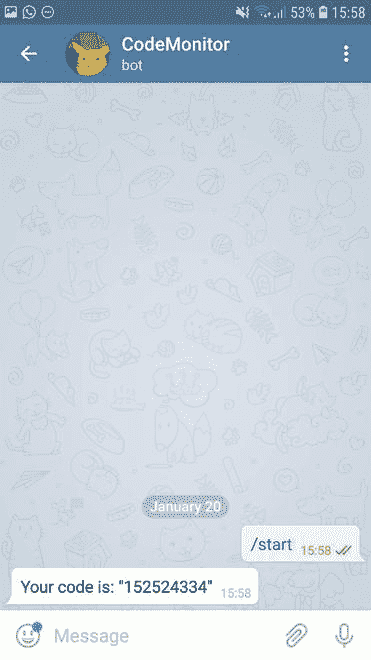

# 用 CodeMonitor 关注 Keras 车型

> 原文:[https://www . geeksforgeeks . org/keep-eye-on-keras-models-with-code monitor/](https://www.geeksforgeeks.org/keeping-the-eye-on-keras-models-with-codemonitor/)

如果你从事深度学习的工作，你可能会面临这样一种情况，你的模型学习时间太长，你必须不断观察它的进度，然而，呆在桌子前看着它学习并不完全是有史以来最令人兴奋的事情，因此，本文的目的是介绍 CodeMonitor，一个简单但非常有用的 python 库。它可以帮助你更好地利用你的时间，并通过以消息的形式将每个时期的报告直接发送到你的手机上，来保持对你的模型的关注，无论它在哪里被训练。

关于 CodeMonitor，您需要知道的第一件事是，它是由撰写本文的人发起的开源倡议，因此任何建议或问题反驳都非常受欢迎。该代码在[](https://github.com/Lucasfrota/CodeMonitor)上托管，任何报告请使用 [问题](https://github.com/Lucasfrota/CodeMonitor/issues) 部分。

目前，该库仅使用 Telegram 发送消息，有两种方法，您可以使用 Keras 回调，该回调将在每个时期结束时向您的 Telegram 聊天发送培训中生成的日志报告，这些日志可能是损失或准确性，例如，它可能根据您的项目而有所不同。你可以使用它的另一种方法是发送任何你喜欢的字符串，作为一条消息，这样你就可以在你想出的任何上下文中发送任何性质的消息。

在本文中，我们假设您已经有了一个 Keras 模型，如果不是您的情况，您可以通过这个 [教程](https://elitedatascience.com/keras-tutorial-deep-learning-in-python) 了解更多关于 Keras 的信息，该教程解决了图像上手写文本的分类问题，稍后再回来，或者只是阅读它而不完全实现代码。

## 建立

要使用这个库，您可以直接从 GitHub 下载源代码，或者使用 pip 获取源代码，在本教程中，为了简单起见，我们将使用第二个选项，为此，只需在您的终端上复制并粘贴以下代码行(我们假设您已经安装了 pip，要了解有关 pip 的更多信息，请访问他们的 [安装页面](https://pip.pypa.io/en/stable/installing/) )。

```py
pip install CodeMonitor
```

一旦你安装了它，你需要设置电报端，这很简单，如果你已经在你的手机上安装了应用程序，只需打开它，触摸右上角的搜索图标，搜索代码监视器，并在下图中选择它。



此时你只需要给它发送任何消息，作为回应，你会收到一个代码，这是聊天 id，我们是用它给这个聊天发送消息的，把这个代码保密，因为如果有谁拥有它就可以给你发送消息。



现在一切都在 Telegram 端设置好了，所以我们可以回到电脑上，从 python 发送我们的第一条消息！在 python 方面，我们有两个类负责前面讨论的功能，让我们导入它们。

```py
from CodeMonitor.telegram import Messenger, FitMonitor
```

请注意，在示例代码中，我们将使用“123456789”作为聊天 id，但是，您需要在代码中替换它

### **信使**

这个类允许你发送任何你想要的字符串到 Telegram 聊天，只需要 Telegram 端部分提到的聊天 id。

```py
messenger = Messenger("123456789")
```

当类被实例化时，它发送消息“一切就绪！”，发送您的消息要使用功能*发送 _ 消息*。

```py
messenger.send_message("your awesome message!")
```

### 植物监测仪

如上所述，该课程允许您根据培训中生成的日志发送报告，因为在第一节课中，您必须提供聊天 id 来识别您的聊天。要简单地发送训练中生成的所有日志，只需将 FitMonitor 类添加到回调列表中，如下所示。

```py
model.fit(X_train, Y_train,          
          epochs = 10,
          validation_data = (X_test, Y_test), 
          callbacks=[FitMonitor("123456789")])
```

要指定您想要发送的日志，您可以使用 *log_keys* 参数设置您想要包含在消息中的日志列表，如代码片段所示，该代码片段指定只有丢失才应该包含在消息中。

```py
model.fit(X_train, Y_train,          
          epochs = 10,
          validation_data = (X_test, Y_test), 
          callbacks=[FitMonitor("123456789", log_keys=["loss"])])
```

## 结论

在这篇文章中，你已经被介绍了一个简单但有用的工具，它可以帮助你用手机从任何地方监控你的模型，如上所述，这是一个开源项目，还在开发中，所以如果你有任何想法或建议，欢迎在评论中删除。