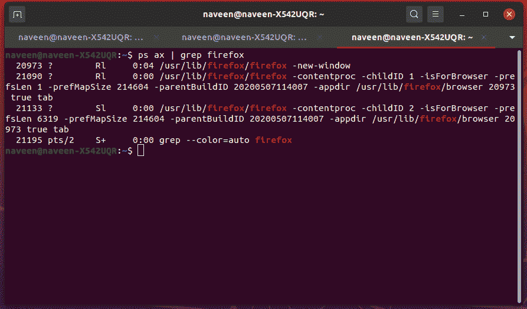
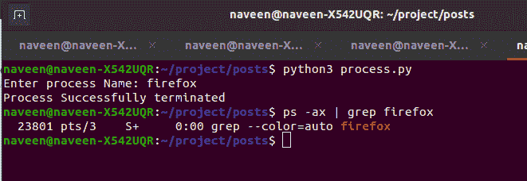

# 使用 Python 按名称杀死一个进程

> 原文:[https://www . geesforgeks . org/kill-a-process-by-name-using-python/](https://www.geeksforgeeks.org/kill-a-process-by-name-using-python/)

一个进程在系统上通过进程标识来标识，当第一个进程仍在运行时，其他任何进程都不能使用该编号作为其进程标识。假设你是一家公司的系统管理员，你从菜单中启动了一个应用程序，你开始使用这个应用程序，突然你注意到这个应用程序停止工作或者意外死亡。您再次尝试启动该应用程序，但结果是应用程序从未完全关闭。因为您是管理员，所以您可以向进程标识键入命令，并立即终止该进程。想象一下这个场景，你公司的员工每天都来找你抱怨同样的情况，因为他们不知道什么是 PID，如何杀死一个流程。所以你想出了用 Python 编写一个脚本的想法，这个脚本只输入应用程序或进程的名称，然后完全关闭它。你把这个脚本给了你的员工，所以每次发生这种情况，他们不需要向你抱怨，也不需要知道什么是流程 id，或者如何杀死流程，只需要输入名字，一切都会得到处理。

**使用的功能:**

*   **os.popen():** 此方法用于打开一个 pip 往返命令。
    在下图中，您可以看到火狐正在运行的进程
*   [**OS . kill():**](https://www.geeksforgeeks.org/python-os-kill-method/)Python 中的这个方法是用来给进程发送一个指定的信号，这个进程有指定的进程 id。

下面是实现。

在下图中，您可以看到 firefox 正在运行的进程。



## 蟒蛇 3

```
import os, signal

def process():

    # Ask user for the name of process
    name = input("Enter process Name: ")
    try:

        # iterating through each instance of the process
        for line in os.popen("ps ax | grep " + name + " | grep -v grep"):
            fields = line.split()

            # extracting Process ID from the output
            pid = fields[0]

            # terminating process
            os.kill(int(pid), signal.SIGKILL)
        print("Process Successfully terminated")

    except:
        print("Error Encountered while running script")

process()
```

**输出:**



在上图中，您可以看到 firefox 的所有实例都被终止了。您在图像中看到的是由 grep 命令调用的实例。你现在可以检查你的火狐浏览器已经完全关闭。