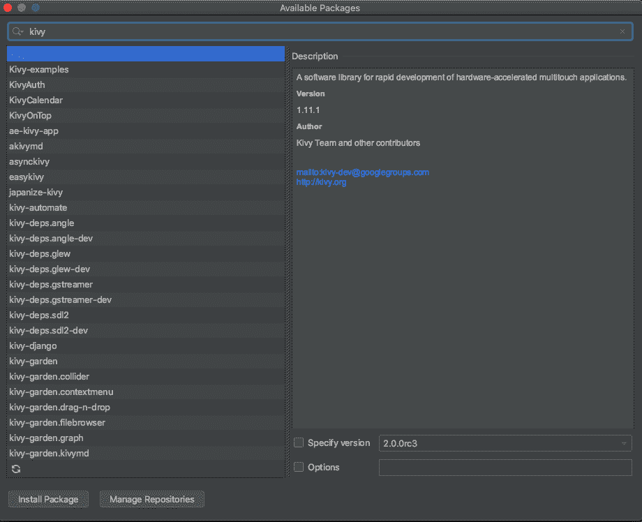
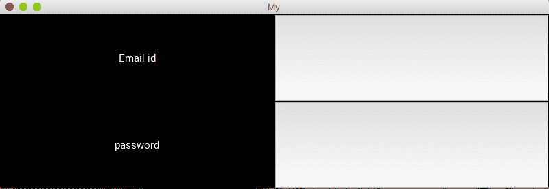

# Kivy——移动应用开发的 Python 框架

> 原文:[https://www . geesforgeks . org/kivy-python-framework-for-mobile-app-development/](https://www.geeksforgeeks.org/kivy-python-framework-for-mobile-app-development/)

Kivy 是一个免费的开源 Python 库，用于开发带有自然用户界面的移动应用程序和其他多点触控应用软件。

**安装**

我们可以从[这里](http://kivy.org/#download)下载最新版本的 Kivy。打开链接后，您可以选择您的平台，并按照特定于您的平台的说明进行操作。

**使用 PyCharm 安装**

1.  我们将打开 PyCharm 并创建一个新项目，并将其命名为“教程”(项目名称)，我们可以根据需要命名。
2.  我们将右键单击“教程”(项目名称)，并创建一个名为第一个应用程序的新目录。
3.  Inside this FirstApp We will create a Python file named as Main.

    要安装 Kivy，请遵循以下步骤:

    1.  转到文件->设置->项目:教程(项目名称)。
    2.  在“项目:教程(项目名称)”下，单击“项目解释器”。
    3.  然后点击右上角的“+”号，搜索 Kivy，你会看到如下画面:
        

    **安装基维依赖关系**

    同样，单击以下依赖项进行安装:

    *   kivy-自角度
    *   基维-德格勒夫
    *   kivy-自 gstreamer 以来
    *   kivy-SDL 2 部门

    **示例 1 :** 在 Kivy App 上打印欢迎信息

    ```
    # import the modules
    from kivy.app import App
    from kivy.uix.label import Label

    # defining the Base Class of our first Kivy App
    class MyApp(App):

        def build(self):

            # initializing a Label with text ‘Hello World’ 
            and return its instance
            return Label(text = 'welcome to GeeksforGeeks')

    if __name__ == '__main__':
        # MyApp is initialized and its run() method called
        MyApp().run()
    ```

    **输出:**
    

    **示例 2 :** 创建登录屏幕

    ```
    # importing the modules
    from kivy.app import App
    from kivy.uix.gridlayout import GridLayout
    from kivy.uix.label import Label
    from kivy.uix.textinput import TextInput

    # this class is used as a Base for our 
    # Root Widget which is LoginScreen 
    class LoginScreen(GridLayout):

        # overriding the method __init__() so as to 
        # add widgets and to define their behavior
        def __init__(self, **kwargs):
            super(LoginScreen, self).__init__(**kwargs)

            # GridLayout managing its children in two columns 
            # and add a Label and a TextInput for the Email id and password
            self.cols = 2
            self.add_widget(Label(text = 'Email id'))
            self.username = TextInput(multiline = False)
            self.add_widget(self.username)
            self.add_widget(Label(text = 'password'))
            self.password = TextInput(password = True, multiline = False)
            self.add_widget(self.password)

    class MyApp(App):
        def build(self):
            return LoginScreen()

    if __name__ == '__main__':

        # MyApp is initialized and 
        # its run() method called
        MyApp().run()
    ```

    **输出:**
    