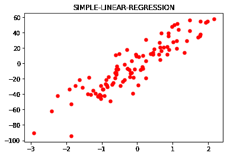
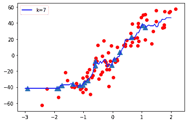
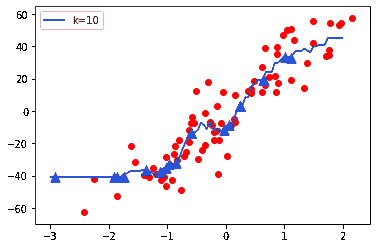
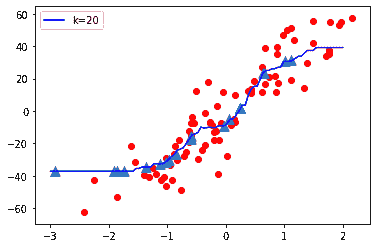
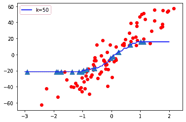
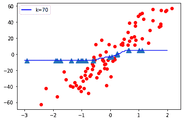
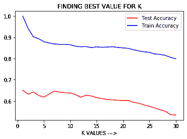

# KNN 模型复杂性

> 原文:[https://www.geeksforgeeks.org/knn-model-complexity/](https://www.geeksforgeeks.org/knn-model-complexity/)

KNN 是一种机器学习算法，用于分类(使用 KNearestClassifier)和回归(使用 KNearestRegressor)问题。在 KNN 算法中，K 是**超参数**。选择正确的 K 值很重要。如果建立的模型具有低偏差和高方差，则机器学习模型被认为具有高模型复杂度。

我们知道，

1.  高偏差和低方差=欠拟合模型。
2.  低偏差和高方差=过度拟合模型。[指示**高度复杂的模型**。
3.  低偏差和低方差=最佳拟合模型。[这是首选]。
4.  高训练精度和低测试精度(样本外精度)=高方差=过度拟合模型=更大的模型复杂性。
5.  低训练精度和低测试精度(样本外精度)=高偏差=欠拟合模型。

**代码:了解 KNN 算法中的 K 值如何影响模型复杂度。**

```py
# This code may not run on GFG ide
# As required modules are not found.

# Import required modules
import matplotlib.pyplot as plt
from sklearn.datasets import make_regression
from sklearn.neighbors import KNeighborsRegressor
from sklearn.model_selection import train_test_split
import numpy as np

# Synthetically Create Data Set
plt.figure()
plt.title('SIMPLE-LINEAR-REGRESSION')
x, y = make_regression(
    n_samples = 100, n_features = 1, 
    n_informative = 1, noise = 15, random_state = 3)
plt.scatter(x, y, color ='red', marker ='o', s = 30)

# Train the model.
knn = KNeighborsRegressor(n_neighbors = 7)
x_train, x_test, y_train, y_test = train_test_split(
    x, y, test_size = 0.2, random_state = 0)
knn.fit(x_train, y_train)
predict = knn.predict(x_test)
print('Test Accuracy:', knn.score(x_test, y_test))
print('Training Accuracy:', knn.score(x_train, y_train))

# Plot The Output
x_new = np.linspace(-3, 2, 100).reshape(100, 1)
predict_new = knn.predict(x_new)
plt.plot(
    x_new, predict_new, color ='blue', 
    label ="K = 7")
plt.scatter(x_train, y_train, color ='red' )
plt.scatter(x_test, predict, marker ='^', s = 90)
plt.legend()
```

**输出:**

<center></center>

```py
Test Accuracy: 0.6465919540035108
Training Accuracy: 0.8687977824212627

```

<center></center>

现在让我们将 K(超参数)的值从低变高，观察模型复杂度
**K = 1**

<center></center>

**K = 10**

<center></center>

**K = 20**

<center></center>

**K = 50**

<center></center>

**K = 70**

<center></center>

**观测值:**

*   当 K 值较小时，即 K=1，模型复杂度较高(过拟合或高方差)。
*   当 K 值非常大，即 K=70 时，模型复杂度降低(拟合不足或高偏差)。

**结论:**
随着 K 值变小模型复杂度增加，随着 K 值变大模型复杂度降低。

**代码:我们来考虑下图**

```py
# This code may not run on GFG
# As required modules are not found.

# To plot test accuracy and train accuracy Vs K value.
p = list(range(1, 31))
lst_test =[]
lst_train =[]
for i in p:
    knn = KNeighborsRegressor(n_neighbors = i)
    knn.fit(x_train, y_train)
    z = knn.score(x_test, y_test)
    t = knn.score(x_train, y_train)
    lst_test.append(z)
    lst_train.append(t)

plt.plot(p, lst_test, color ='red', label ='Test Accuracy')
plt.plot(p, lst_train, color ='b', label ='Train Accuracy')
plt.xlabel('K VALUES --->')
plt.title('FINDING BEST VALUE FOR K')
plt.legend()
```

**输出:**

<center></center>

**观察:**
从上图我们可以得出结论，当 K 较小时即 K=1，训练精度较高但测试精度较低，这意味着模型过拟合(高方差或**高模型复杂度**)。当 K 值较大，即 K=50 时，训练精度较低，测试精度较低，这意味着模型拟合不足(高偏差或低模型复杂度)。

因此**超参数** **调整**是必要的，即在 KNN 算法中选择 K 的最佳值，对于该算法，模型具有低偏差和低方差，并产生具有高样本外精度的好模型。

我们可以使用 **GridSearchCV** 或**randomsearccv**来寻找超参数 k 的最佳值